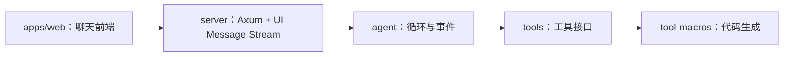

# comfy-agent

用于自然语言驱动 ComfyUI 工作流的 Rust Agent 工程。当前提供 Agent 核心库、工具运行接口、函数属性宏、兼容 Vercel AI SDK 的 Axum 聊天后端，以及 `apps/web` 下的聊天前端。

## 目录与职责

| 目录 | 职责 |
| --- | --- |
| `crates/agent` | Agent 循环、流式事件、工具注册表、模型客户端配置 |
| `crates/tools` | `AgentTool` trait 和 `#[agent_tool]` 宏入口 |
| `crates/tool-macros` | 函数属性过程宏实现 |
| `crates/server` | Axum HTTP 服务、UIMessage 历史转换与 SSE 协议适配 |
| `apps/web` | 聊天前端：Vite + React 19 + Tailwind v4 + shadcn + AI Elements + AI SDK |
| `workflows/` | ComfyUI 工作流与 API 格式样例 |
| `scripts/` | ComfyUI 验证脚本 |
| `docs/` | Agent Loop 博客与配图 |

根目录是虚拟 Cargo workspace，Rust 源码与测试均位于 `crates/`。依赖版本、edition 和 lint 在根目录集中管理。



## 开发与验证

```bash
cargo check --workspace
cargo test --workspace
cargo fmt --all -- --check
cargo clippy --workspace --all-targets -- -D warnings
```

`cargo run -p server` 启动 HTTP 后端。根目录默认 Cargo member 仍为 `agent`，检查所有 crate 时请使用 `--workspace`。

## 聊天后端

从根目录执行，按 `.env.example` 配置模型和 key（可复制为 `.env`），然后启动：

```bash
cargo run -p server
```

服务默认监听 `127.0.0.1:3001`。`GET /health` 返回存活状态，不检查模型连接。`POST /api/chat` 接收完整 UIMessage 历史，并返回 [UI Message Stream v1](https://ai-sdk.dev/docs/ai-sdk-ui/stream-protocol) SSE。

```bash
curl -N http://127.0.0.1:3001/api/chat \
  -H 'Content-Type: application/json' \
  -d '{"id":"demo","trigger":"submit-message","messages":[{"id":"u1","role":"user","parts":[{"type":"text","text":"使用 add 工具计算 3 + 5"}]}]}'
```

以上为 Bash 命令；PowerShell 可将 JSON 保存为文件后使用 `curl.exe -N -H "Content-Type: application/json" --data-binary "@request.json" http://127.0.0.1:3001/api/chat`。

前端连接示例（在 React 组件内调用 hook）：

```tsx
import { useChat } from '@ai-sdk/react';
import { DefaultChatTransport } from 'ai';

const { messages, sendMessage, stop, status, error } = useChat({
  transport: new DefaultChatTransport({
    api: 'http://127.0.0.1:3001/api/chat',
  }),
});
// sendMessage({ text: '使用 add 工具计算 3 + 5' });
```

通过 `messages[].parts` 渲染文本和工具卡片；AI Elements 可用于组件层。工具在后端自动执行，不需要前端再次回填结果或启动工具循环。

- 首版无状态、无鉴权，面向本地开发；每次发送完整历史，不持久化会话。`id` 和 `messageId` 接收但不用于服务端存储。
- 支持 user/system 文本和 assistant 文本、`step-start`、已完成的 `tool-*`/`dynamic-tool`。工具成功与错误结果均重建为模型工具交换；metadata 不参与模型上下文。
- 附件、推理/data parts、工具审批、未完成的工具交换及重新生成请求返回 400。只支持 `submit-message`，缺省 trigger 也按该方式处理。
- 若在工具执行中停止，前端可能留下未完成的工具 part；继续聊天前需移除该未完成的助手消息。首版不提供自动恢复。
- 默认提供 `add` 整数加法工具（检测溢出）。工具失败作为 `tool-output-error` 输出，并回填给模型继续执行；模型失败输出安全的 `error`，日志记录安全错误类别。
- 完成消息 metadata 为 `{ outcome: "finished" | "step-limit", steps: number, runId: string, traceId?: string }`。观测开启时包含 traceId；步数耗尽会正常结束，前端可据此显示提示。
- SSE 包含步骤边界、文本块边界、工具结果与 `[DONE]`，空闲 10 秒发送注释心跳。事件队列最多 128 项，溢出终止请求并报告错误。
- 前端 `stop()`、响应连接断开或服务 Ctrl+C（Unix 也支持 SIGTERM）时停止 Agent future；这不会撤销已经发生的外部副作用。不支持断线续传。
- 请求体上限 2 MiB。默认允许 `http://localhost:3000` 和 `http://localhost:5173` 跨域，通过 `CORS_ALLOWED_ORIGINS` 设置逗号分隔的明确来源。

协议验证脚本需要 Node.js 22+，固定使用 `ai@7.0.127`。模拟模式启动临时模型和 Rust 后端，验证官方 transport/parser、工具调用和第二轮历史，无需真实 key：

```bash
npm ci --prefix scripts/ai-sdk-check
npm run check:mock --prefix scripts/ai-sdk-check
```

对已启动的真实后端执行 `npm run check --prefix scripts/ai-sdk-check`；可通过 `CHAT_API_URL` 覆盖请求地址。

## 聊天前端

本地 Phoenix 观测与评测启动见 [观测与评测指南](docs/observability.md)。使用 `docker compose -f compose.phoenix.yaml up -d` 启动 Phoenix，设置 `OTEL_ENABLED=true` 后运行后端即可查看轨迹；原始内容采集默认关闭。`scripts/evals` 通过同一 Rust SSE 后端进行确定性评分和本地实验比较。

`apps/web` 是 pnpm 管理的 Vite + React 19 + TypeScript 工程（Tailwind v4、shadcn/ui、AI Elements、AI SDK v7），消费上述 `/api/chat` 协议端点。前置条件：Node 20+ 与 pnpm 10+。

```bash
pnpm -C apps/web install   # 安装依赖
pnpm -C apps/web dev       # 开发服务器（默认 http://localhost:5173）
pnpm -C apps/web build     # 生产构建（tsc 类型检查 + vite build，产出 dist/）
```

后端地址通过 `apps/web/.env` 的 `VITE_API_BASE` 配置（参考 `apps/web/.env.example`），未设置时默认 `http://localhost:3001`；开发期直连依赖后端 CORS 白名单（默认已含 5173）。工具渲染声明集中在 `apps/web/src/lib/tools.tsx`，后端新增工具时在前端补一条 zod schema 与渲染映射即可。

## 核心接口

`agent::run_agent` 接收模型客户端、模型名称、会话历史、工具注册表、最大请求步数和事件回调。回调可收到步骤开始、文本增量、工具开始和工具完成事件，核心库不直接输出到终端。

- `AgentOutcome::Finished` 返回最终回答和实际步数。
- `AgentOutcome::StepLimit` 表示用尽模型请求步数；本步工具结果已经回填到历史中。
- 工具执行错误作为结构化结果回填给模型；模型请求或流式协议错误返回给调用方。
- 每个会话独立持有 `ChatRequest`；每次请求携带注册表中的工具定义。

注册工具使用 `ToolRegistry::register`，重复工具名会被拒绝。工具函数通过 `#[agent_tool]` 生成 schema、参数解析、异步执行和返回值序列化。第二个参数声明为 `&Context` 时，工具实例通过 `XxxTool::new(Arc<Context>)` 创建。

工具用法见 [crates/tools/README.md](crates/tools/README.md)。核心调用与本地模拟流式模型测试见 [crates/agent/tests/agent.rs](crates/agent/tests/agent.rs)。

## 模型配置

`agent::AgentConfig::from_env()` 读取进程环境变量，`build_client()` 创建 genai 客户端。环境变量参考 [.env.example](.env.example)，核心库不会自动读取 `.env` 文件；server 入口会加载可选 `.env`，已设置的进程变量优先。

| 变量 | 说明 |
| --- | --- |
| `MODEL` | 默认 `bigmodel::glm-4.6`，前缀决定 genai 适配器 |
| `BIGMODEL_API_KEY` | 智谱适配器读取的 API key；其他厂商使用对应的 key 变量 |
| `API_BASE_URL` | 显式覆盖 API 地址；未设置时 `bigmodel::` 模型使用 Coding Plan 地址，其他模型使用适配器默认地址；设为空时均使用适配器默认地址 |
| `AGENT_MAX_STEPS` | 每回合最多模型请求次数，默认 6，必须为正整数 |
| `SERVER_ADDR` | 后端监听地址，默认 `127.0.0.1:3001` |
| `CORS_ALLOWED_ORIGINS` | 允许跨域的来源，逗号分隔，默认 `http://localhost:3000,http://localhost:5173` |
| `RUST_LOG` | 日志过滤器，默认 `server=info,tower_http=info` |

API 地址只覆盖 endpoint，不会自动切换模型适配器或认证方式。请让模型前缀、API 地址与 key 配套。

## ComfyUI 与文档

`workflows/` 与 `scripts/comfy-smoke.ps1` 保留已有的 ComfyUI 出图验证流程，尚未接入当前 Agent 工具集合。

推荐阅读独立入门博客 [从零用 Rust 和 genai 写一个 Agent Loop](docs/genai-agent-loop.md)，从新建项目开始，通过完整示例和 8 张示意图理解工具调用、历史回填、流式响应和循环控制。

文档入口见 [docs/README.md](docs/README.md)，当前接口以 `crates/` 源码为准。

工具宏原理见 [一个异步函数如何变成 Agent 工具](docs/agent-tool-macro.md)，从使用代码和展开结果理解 `#[agent_tool]` 的实现。
