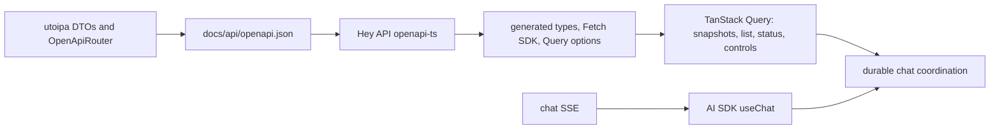

# Chat frontend

React + Vite + AI SDK UI, with utoipa-generated OpenAPI contracts and TanStack Query.
Requires Node 22.18+ and pnpm.

`src/api/` owns the API address, client initialization, and generated contracts; `src/hooks/` coordinates queries and chat streams; `src/lib/` contains chat/session rules. `vite.config.ts` configures both development/build and Vitest. Registry components are kept with their imported UI dependencies; add packages only when used.

Run these from the repository root:

```sh
pnpm -C apps/web install
pnpm -C apps/web dev
pnpm -C apps/web build
pnpm -C apps/web test
pnpm -C apps/web api:generate
pnpm -C apps/web api:check
```

`VITE_API_BASE` selects the backend (default `http://localhost:3001`). The backend must have PostgreSQL and explicit migrations configured; see the root README.

## API ownership



`api:generate` exports the contract offline, then generates `src/api/generated/`. Commit both outputs; do not edit them manually. `api:check` regenerates in a temporary directory and detects drift without changing repository files. TypeScript 5.9.3 is pinned because the current generator requires its compiler API.

`src/api/client.ts` configures the backend address, safe error conversion, and Query defaults. Generated query keys isolate conversations/runs. Polling is disabled during selection/controls and after terminal states; automatic query and mutation retries are disabled. Chat replay uses the SDK validator for the extensible UIMessage parts envelope.

`use-durable-chat` coordinates selection, replay, run identity/version fences and controls. Query cancellation handles HTTP requests; a selection lifetime guard prevents obsolete results from affecting chat state. AI SDK `stop()` disconnects the subscription; explicit pause/cancel commands control the durable worker. Generated SSE client functions are not used for AI SDK message parsing.

## Tests

Node tests cover submission/replay invariants. Vitest + React Testing Library tests run the actual durable hook with generated clients and a real QueryClient, including delayed old-conversation responses, stale lists and command conflicts. PostgreSQL and process recovery tests remain in the Rust workspace and `scripts/durable-check`.
