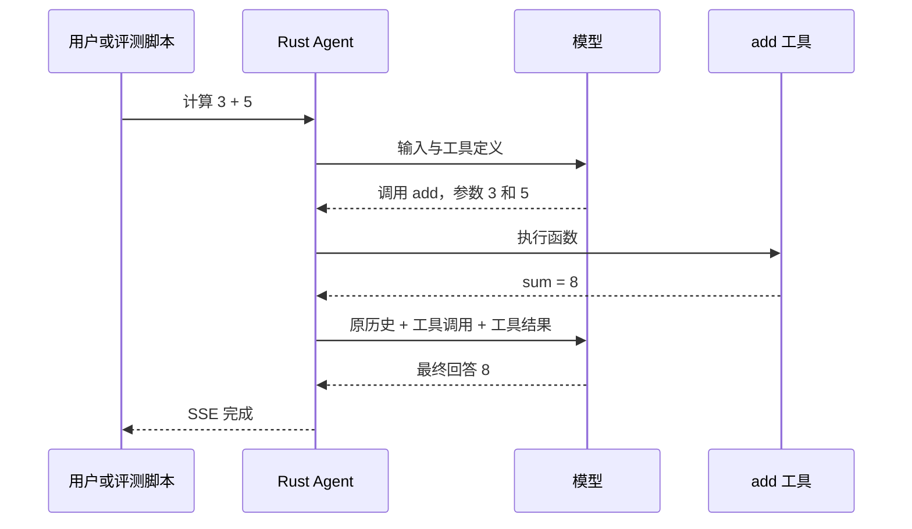
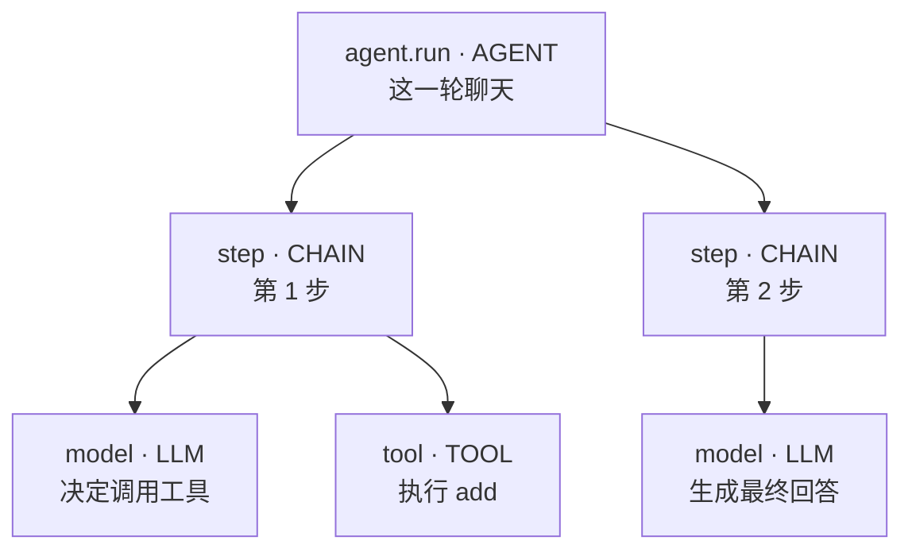
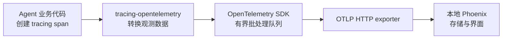
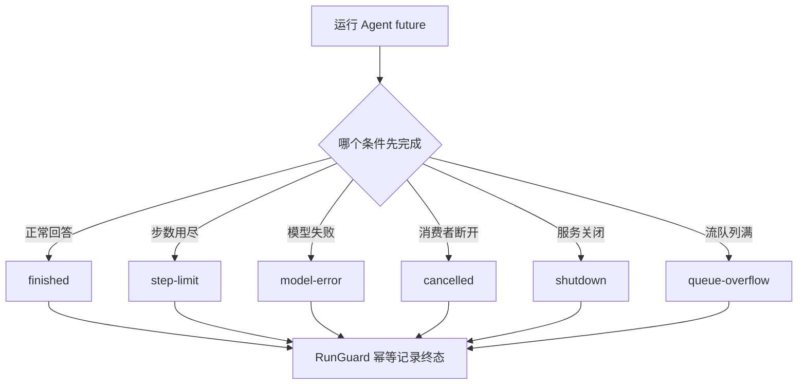
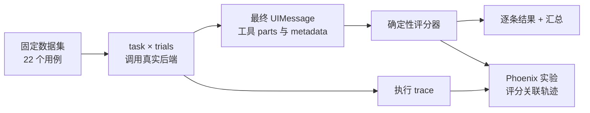
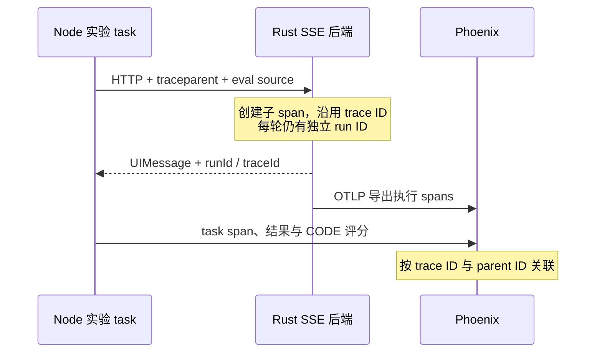

# 从零理解 Agent 观测与评测：为什么需要，以及如何接入 Phoenix

> 持久化版本更新：本文保留从零学习观测与评测的讲解；当前聊天已改为服务端会话 + 增量消息。SSE 断开只停止订阅，后台继续；暂停/终止需要控制接口。执行根按 attempt 产生，通过 runId 关联恢复，最终 metadata 增加 attemptId。最新可执行请求、数据库启动与重放例子见 [持久化会话运行指南](durable-sessions.md)，评测超时现在显式 cancel 并记录 cleanup 确认。下文旧的整段 messages 请求示例应改用该指南的新合约。


Agent Loop 跑起来之后，程序已经能请求模型、执行工具、回填历史，再继续下一步。但当它给出一个错误答案时，我们会遇到新的问题：究竟是模型选错了工具，程序传错了参数，工具执行失败，还是历史没有正确交给下一次模型请求？

另一个问题发生在修改之后。换了模型、调整了提示词，或者新增了一个工具，看起来效果变好了。这个判断可靠吗？原来能完成的任务有没有退步？多花了几秒和多少 token？

这篇文章从这两个问题出发，介绍观测和评测的基本概念，再带你使用本仓库的 Rust 后端与本地 Phoenix。你不需要了解 OpenTelemetry，也不需要先学 Python。了解 HTTP、JSON 和基本的 Rust `async/await` 就能开始。

本文对应 2026-10-04 的仓库实现，Phoenix 固定为 20.19.0。代码片段用于解释现有工程；运行步骤直接使用仓库，不另建一套 Agent。阅读时可以分三次进行：先理解第 1–4 节，再完成第 5–6 节实验，最后阅读集成细节与评测。

## 1. 从一个“回答错了”的问题开始

假设用户说：

> 使用 add 工具计算 3 + 5，只返回结果。

Agent 正常执行时，会先请求模型，收到 `add({a: 3, b: 5})`，执行工具得到 `{"sum": 8}`，再请求一次模型，最终输出 `8`。



如果最后输出 `9`，只知道 HTTP 返回了 200，无法判断问题在哪里。即使终端打印了“模型调用成功”，也只能证明请求完成了。

我们需要两类证据：

- **观测（observability）**：记录这次执行发生了什么，用于定位问题。
- **评测（evaluation，常简称 eval）**：按明确规则判断任务完成得怎样，用于验证质量。

观测可以告诉我们工具实际返回了 `8`；评测可以告诉我们最终回答 `9` 不符合期望。把两者关联起来，才能从“答案错了”进一步找到“工具正确，但模型整理答案时出错”。

为什么从一开始就做？因为第一次改提示词之前就有记录，之后才有参照。只有上线后的坏结果，没有旧版本、用例和评分规则，就很难判断哪次修改引入了问题。

## 2. 日志、trace、span 和指标分别是什么

### 日志：某一时刻发生了一件事

日志通常是一条记录，例如：

```text
agent execution ended outcome=finished
```

它适合发现异常、查看启动配置和导出失败。并发请求多起来之后，许多日志交错出现，单靠时间顺序很难还原完整执行过程。

### Span：一段有开始和结束的工作

一个 span 可以表示“一次模型请求”或者“一次工具执行”。它包含名字、开始与结束时间、状态，以及附加属性。

例如，工具 span 可以有这些属性：

```text
name: tool
openinference.span.kind: TOOL
tool.name: add
agent.tool_call_id: call_abc
```

有了开始与结束时间，就能算出工具花了多久；有了调用 ID，就能把这次执行与模型返回的工具调用对应起来。

### Trace：属于同一次操作的一组 span

Trace 是把相关工作组织起来的执行轨迹。每个 span 有自己的 span ID，同一条 trace 中的 span 共享 trace ID，并通过 parent span ID 表达层级关系。这些概念遵循 [OpenTelemetry 的 trace 模型](https://opentelemetry.io/docs/concepts/signals/traces/)。

在本仓库，一次普通聊天可能产生下面的结构：



这里的 `CHAIN` 表示应用流程中的步骤分类。它没有记录模型内部的完整思考过程；trace 展示的是程序能够观测到的请求、工具和流程。

Span 的包含关系也决定了耗时不能随便相加。`agent.run` 已经包含模型和工具耗时，不能再把所有子 span 的时间加一次，当作总耗时。

### 指标：把许多次运行放在一起看

一次模型请求用了 2 秒，是单次测量；最近 100 次请求的 p95 延迟为 6 秒，是汇总指标。p50 是排序后约一半样本不超过的值；p95 表示约 95% 的样本不超过该值，适合观察较慢的请求。

[OpenTelemetry 对 metrics 的定义](https://opentelemetry.io/docs/concepts/signals/metrics/)强调统计聚合。本仓库目前主要把测量写进 span，再由评测脚本汇总；没有接入独立的 OTel Metrics exporter、Prometheus 或告警系统。

| 你想回答的问题 | 主要看什么 |
| --- | --- |
| 服务为什么启动失败 | 日志 |
| 这次回答为什么花了 10 秒 | Trace 中各 span 的耗时 |
| 最近是不是普遍变慢了 | 多次运行的延迟分布 |
| 换模型后任务是否更容易做对 | 同一批用例的评测结果 |

## 3. OpenTelemetry、OpenInference、OTLP 和 Phoenix 怎么配合

第一次接触时，这些名字看起来像四套系统。可以按职责理解：

| 名称 | 负责什么 | 在本项目中的作用 |
| --- | --- | --- |
| Rust `tracing` | 在程序里声明 span 和事件 | 给 Agent、步骤、模型、工具加观测点 |
| OpenTelemetry（OTel） | 生成、处理和导出标准观测数据 | 管理 trace 上下文、批处理与导出 |
| OpenInference | 约定 AI 应用属性的含义 | 标记 AGENT、LLM、TOOL 以及 token 字段 |
| OTLP | 传输 OpenTelemetry 数据的协议 | 把完成的 span 发到 `/v1/traces` |
| Phoenix | 接收、保存和查看数据，管理数据集与实验 | 本地轨迹界面和评测结果平台 |

OpenTelemetry 的职责见[官方介绍](https://opentelemetry.io/docs/)；OpenInference 的字段约定见[语义规范](https://github.com/Arize-ai/openinference/blob/main/spec/semantic_conventions.md)。Phoenix 是支持这套标准的 AI 观测与评测平台，能力见[官方项目说明](https://github.com/Arize-ai/phoenix)。



为什么没有让 Agent 直接调用 Phoenix API 上报每一步？这样分层后，核心代码只表达“发生了什么”，服务入口负责“发到哪里”。关闭观测或以后更换兼容的存储平台，不需要重写 Agent Loop。

当前 exporter 直接连接 Phoenix，不经过独立的 OpenTelemetry Collector。规模变大后，Collector 可以承担集中处理和转发，但入门实验不需要再部署一层服务。

## 4. 四种 ID，分别关联什么

这里值得先记住，后面排查数据会经常用到。

| ID | 标识的对象 | 生命周期 |
| --- | --- | --- |
| `session.id` | 客户端聊天会话 | 同一聊天多轮复用 |
| `agent.run_id` / SSE `runId` | 一次后端 Agent 执行 | 每个有效聊天请求新建 |
| `traceId` | 一条观测轨迹 | 可跨语言、跨请求传播 |
| 工具 `call_id` / UI `toolCallId` | 一次模型工具调用 | 与该次工具结果配对 |

同一会话说两句话，会产生两个 run ID。普通聊天通常各自创建 trace；评测脚本会提供父上下文，一个多轮 trial 的多个 run 可以属于同一条 trace。因此，“一条 trace 等于一次 HTTP 请求”不是始终成立的。

关闭观测后仍有 runId，但不会伪造 traceId。服务也不会把客户端历史 metadata 里的 runId 当作新执行身份。这避免了第二轮请求把上一轮标识误用到当前执行。

## 5. 实验一：启动本地 Phoenix

以下命令都从仓库根目录执行，使用 PowerShell。需要 Rust 工具链、运行中的 Docker 引擎；评测部分另需 Node.js 22 或以上。

先检查引擎，再启动服务：

```powershell
docker info
docker compose -f compose.phoenix.yaml config
docker compose -f compose.phoenix.yaml up -d
docker compose -f compose.phoenix.yaml ps
```

打开 [http://localhost:6006](http://localhost:6006)。看到页面说明 Phoenix 可访问；这还不能证明 Rust 已经向它发送了轨迹，下一节会验证这一点。

仓库固定了镜像版本和 digest，并将端口绑定到 `127.0.0.1`。数据存入 named volume。这样容器重建之后，轨迹和实验仍然保留。

```powershell
# 停止并移除容器，保留数据卷
docker compose -f compose.phoenix.yaml down

# 再次启动，继续使用原数据
docker compose -f compose.phoenix.yaml up -d
```

`down -v` 会删除数据卷，仅在确定要清空环境时使用。默认配置关闭 Phoenix 自身遥测和自动加载外部资源；你配置的远程模型仍会收到模型请求。本地保存 trace 不会改变模型提供商的数据边界。

## 6. 实验二：观察一次真实聊天

### 6.1 启用后端观测

保留现有模型配置；没有 `.env` 时，先参考 `.env.example` 创建文件并填入自己的配置。不要用模板覆盖已有 key。

在终端 A 执行：

```powershell
$env:OTEL_ENABLED='true'
$env:OTEL_EXPORTER_OTLP_TRACES_ENDPOINT='http://localhost:6006/v1/traces'
$env:OBS_CAPTURE_CONTENT='false'
$env:RUST_LOG='info'
New-Item outputs -ItemType Directory -Force | Out-Null
$env:AGENT_CONFIG_MANIFEST='outputs/agent-config.json'
cargo run -p server
```

这几个变量分别决定是否导出、接收地址、是否采集原始内容，以及启动日志级别。`AGENT_CONFIG_MANIFEST` 会输出实际模型和工具 schema 的指纹，供后续评测记录配置；它不包含 API key。

PowerShell 的 `$env:` 变量只影响当前终端及它启动的进程。修改变量后需要重新启动后端；dotenvy 不覆盖已经设置的进程环境变量。

### 6.2 提交请求

在终端 B 执行。这次请求会调用你配置的模型：

```powershell
$body = @{
    id = 'learn-phoenix-chat'
    trigger = 'submit-message'
    messages = @(
        @{
            id = 'user-1'
            role = 'user'
            parts = @(
                @{ type = 'text'; text = 'Use the add tool to compute 3 + 5. Reply only with the decimal result.' }
            )
        }
    )
} | ConvertTo-Json -Depth 10

$requestFile = Join-Path (Get-Location) 'outputs/chat-request.json'
[System.IO.File]::WriteAllText($requestFile, $body, [System.Text.UTF8Encoding]::new($false))
curl.exe -N -H 'Content-Type: application/json' --data-binary "@$requestFile" http://127.0.0.1:3001/api/chat
```

`-N` 让 curl 不缓存流式输出。请求体通过 UTF-8 文件提交，避免 Windows 命令行直接传 JSON 时的引号问题。

如果模型按要求使用了工具，你会看到工具输入、输出、文本增量，以及最后的 `finish` 事件。下面是结束事件的结构示意，ID 已省略：

```json
{
  "type": "finish",
  "finishReason": "stop",
  "messageMetadata": {
    "outcome": "finished",
    "steps": 2,
    "runId": "<本次执行 UUID>",
    "traceId": "<32 位十六进制 trace ID>"
  }
}
```

### 6.3 在 Phoenix 中读懂这条轨迹

等待批处理导出片刻，在 Phoenix 的项目列表进入 `comfy-agent-local`，找到刚才的 trace。界面名称可能随版本变化，但观察顺序相同：

1. 看 `agent.run` 的 `session.id` 和 `agent.run_id`，确认属于刚才的请求。
2. 展开两个 step，查看第一次模型请求、add 工具和第二次模型请求。
3. 看每个 span 的持续时间，确认时间主要花在哪里。
4. 看 root 的 `agent.outcome`、`agent.steps`、`agent.tool_calls`。
5. 看 LLM span 的 `llm.model_name` 与 `llm.token_count.*`。

具体步骤数量由模型实际行为决定。模型直接作答时可能只有一步；模型没有按要求使用工具，轨迹仍可能正常结束，后面的质量评分会发现这种情况。

默认看不到原始输入输出，这是内容策略的结果。结构、时间、模型和终态仍可用于排查。如果只用合成数据练习，可在终端 A 设置 `OBS_CAPTURE_CONTENT=true` 后重启，再发一条请求。该模式会尝试脱敏并截断内容，但无法保证识别自由文本中的每一个秘密。

## 7. 这套观测如何接进 Rust 代码

先按这张表找文件，不必一次读完所有源码：

| 文件 | 先关注什么 |
| --- | --- |
| [`crates/telemetry/src/lib.rs`](../crates/telemetry/src/lib.rs) | 配置、导出、字段、内容策略、终态 guard |
| [`crates/server/src/main.rs`](../crates/server/src/main.rs) | 初始化和关闭 provider |
| [`crates/runtime/src/execution.rs`](../crates/runtime/src/execution.rs) | 请求身份、后台任务上下文、取消 |
| [`crates/agent/src/agent.rs`](../crates/agent/src/agent.rs) | step 与 tool span、累计统计 |
| [`crates/agent/src/llm.rs`](../crates/agent/src/llm.rs) | LLM span、首文本时间与 usage |

### 7.1 在服务入口初始化一次

下面摘录的是现有入口的关键调用，省略了 HTTP 服务和 AppState 的构造：

```rust
let telemetry_config = Arc::new(telemetry::Config::from_env()?);
let provider = telemetry::init(&telemetry_config)?;

// 将配置放进 AppState，启动 HTTP 服务。
// 服务关闭时，先让活动的 Agent 任务退出。
tasks.close();
tasks.wait().await;
telemetry::shutdown(provider).await;
```

Provider 管理 span 的处理与导出；subscriber 把 `tracing` 产生的数据交给它。它们属于进程级基础设施，不应该在每次请求中重新初始化。

核心 Agent 库不会自行加载 `.env` 或启动 exporter。这样同一个 Agent 可以用于 HTTP 服务，也可以用于测试或其他宿主。只有宿主决定观测配置。

### 7.2 在真正的工作边界创建 span

这是工具执行的简化摘录：

```rust
use tracing::Instrument;

let tool_span = tracing::info_span!("tool");
telemetry::attribute(&tool_span, "openinference.span.kind", "TOOL");
telemetry::attribute(&tool_span, "tool.name", tc.fn_name.clone());
telemetry::attribute(&tool_span, "agent.tool_call_id", tc.call_id.clone());

let result = registry.execute(tc)
    .instrument(tool_span.clone())
    .await;
```

`tc` 和 `registry` 来自 Agent Loop；这是集成模式，不是可单独编译的完整程序。现有工具统一经过 registry，新增工具通常自动获得这一层 TOOL span。如果新工具内部有提交任务、轮询任务等独立阶段，可以再增加子 span，帮助解释长时间等待。

为什么使用 `.instrument(...)`？异步 future 会挂起并在之后再次被 poll；instrument 会在它被 poll 时进入正确的 span。把同步 `span.enter()` guard 一直持有到 `.await` 之后，可能让上下文附着到无关任务上。后台任务也必须显式携带上下文，而不能依赖创建任务时恰好存在的线程状态。

### 7.3 区分数据约定与业务字段

`openinference.span.kind=LLM` 告诉 Phoenix“这是模型调用”；`llm.token_count.total` 使用标准字段。`agent.steps` 等是本项目定义的字段，用来表达 Agent Loop 的业务含义。

Rust 本身不认识“任务做对了”这个概念。创建一个 span 并设置状态，只记录技术运行事实。业务质量仍需要评分器判断。

## 8. 流式响应为什么要特别处理终态

普通函数可以在 return 时记录结果。SSE 请求的 HTTP 响应却会在生成完成前就开始发送；收到 HTTP 200 后，模型仍可能失败，用户也可能点击停止。

本项目把这些终态分开：

| `agent.outcome` | 含义 |
| --- | --- |
| `finished` | Agent 正常生成最终回答 |
| `step-limit` | 达到步数上限 |
| `model-error` | 模型或模型流协议失败 |
| `cancelled` | 响应消费者关闭，例如用户停止 |
| `shutdown` | 服务关闭而停止执行 |
| `queue-overflow` | SSE 事件队列无法继续容纳事件 |
| `internal-error` | 未按预期收尾，由 guard 兜底 |



Guard 的意义是保证执行终态只记录一次，防止多个错误路径重复计数。取消通过丢弃 Agent future 停止仍在等待的模型和工具；已经完成的外部操作不会因此撤销。

另一个重要区别是两个队列的行为：

- SSE 事件队列容量为 128。溢出后必须结束本次请求，因为已经不能可靠交付完整消息。
- 观测批处理队列容量为 2048 spans。溢出会丢观测数据并给出诊断，聊天本身继续运行。

观测是 best effort。后台按约一秒批处理，网络导出超时为 2 秒；关闭时有限等待刷新。Phoenix 故障不能拖垮聊天，但强杀进程可能丢失最后一批轨迹。因此不能把它当成保证不丢的财务审计记录。

## 9. Agent 指标应该怎么理解

### 首文本延迟与完整耗时

`agent.request_ttft_ms` 从有效请求建立运行上下文开始，计到后端首次产生可见文本增量。`agent.model_ttft_ms` 从当前模型调用开始，计到该调用的第一个文本增量。

如果第一步只调用工具，第二步才输出文字，用户要等待整个第一步，所以两个值会不同。它们测的是后端事件时间，不包含浏览器接收、解析和绘制开销，也不等于“第一个工具参数 token”的时间。

用户在首个文本之前取消时，这个值保持缺失。写成 0 会让平均值看起来更快，掩盖真实情况。

### Token：每次调用计一次

本项目使用提供商返回的 usage。假设第一次模型调用 total 为 120，第二次为 80，root 的 `agent.tokens.known_total` 是 200。不要把 root 小计再与两个 LLM total 相加。

Cache 和 reasoning 是提供商返回的明细，可能已经包含在对应总数中，不能再加一遍。提供商只返回部分 usage 或在流结束前出错时，`agent.tokens.complete=false`；此时已知小计不能代表完整消耗，也不能自动视为零消耗。

### 步数与工具错误

本项目一步对应一次模型请求。一次模型响应可以包含多个工具调用，所以工具次数不一定等于步骤数。`agent.steps` 记录完成的步骤，`agent.tool_calls` 记录开始执行的工具次数。

工具错误也不必然导致任务失败。加法溢出可以作为结果回填给模型，模型识别并解释溢出后，root 仍可 `finished`。是否完成用户要求，需要结合用例评分。

### 从哪些指标开始看

首先看任务成功率、执行错误与超时、步骤数、p50/p95 延迟、工具错误与恢复、usage 缺失。等这些定义稳定后，再决定是否加成本、重试、告警和服务级指标。

当前没有 token 到订阅账单的可靠换算规则。Phoenix 界面可能根据模型价格表显示估计费用，那也不是 Coding Plan 的实际账单。小规模合成数据的 p95 只反映这次实验，不能当作生产承诺。

## 10. 评测由哪些东西组成

可以把评测理解为一组有明确规则的练习：

| 概念 | 含义 | 本仓库对应内容 |
| --- | --- | --- |
| Dataset | 一批固定用例 | `scripts/evals/cases.jsonl` |
| Example / fixture | 一个输入及其期望 | `add-3-5` 等稳定 ID |
| Task | 对每个用例实际执行的程序 | 调 Rust `/api/chat` |
| Trial | 同一用例的一次独立尝试 | 默认每例 3 次 |
| Evaluator / scorer | 判断结果的规则 | 答案、工具、参数、输出、步骤 |
| Experiment | 一次固定配置的整批执行 | 某模型与某代码版本的一组结果 |
| Baseline | 作为参照的既有实验 | 之后修改所比较的旧报告 |

Phoenix 用 task 执行 dataset 中的 examples，再用 evaluator 检查结果。这种关系可以在其[实验示例](https://arize.com/docs/phoenix/prompt-engineering/use-cases-prompts/prompt-optimization)中看到。本项目 task 不直接另调模型，而是调用真实 Rust 服务，确保历史转换、SSE 和工具执行也进入评测范围。



### 用例为什么要写清楚期望

下面是现有 `add-3-5` 用例的排版版；真实文件为每行一个 JSON，也就是 JSONL：

```json
{
  "id": "add-3-5",
  "messages": [{
    "id": "u1",
    "role": "user",
    "parts": [{
      "type": "text",
      "text": "ADD 3 5. Use the add tool. Reply only with the decimal result."
    }]
  }],
  "expected": {
    "answer": "8",
    "tools": [{
      "name": "add",
      "input": {"a": 3, "b": 5},
      "output": {"sum": 8}
    }],
    "maxSteps": 3
  }
}
```

它要求使用 add 工具、参数正确、结果正确、最终文本是 `8`，并在限定步骤内正常结束。模型心算得到 `8` 却没有调用工具，答案评分可以通过，工具选择评分会失败。

当前 `task` 总分要求所有适用质量项通过。没有工具的用例，参数和输出评分为 `null`，不纳入这两项分母。错误和超时记为任务失败；预算跳过单独列出，不能冒充成功。部分多轮完成后预算耗尽的 trial 也会标记跳过。

## 11. 测试、mock 评测和真实模型评测各验证什么

Rust 单元与集成测试验证程序行为，比如历史回填、取消和 SSE 边界。Mock 评测用本地模型替身返回确定响应，验证整条评测链路。真实模型评测才观察模型面对这些输入时的实际表现。

| 检查方式 | 主要验证 | 限制 |
| --- | --- | --- |
| Rust / Node 测试 | 代码、协议与评分逻辑 | 不能证明真实模型表现 |
| Mock 完整实验 | 后端到评分、发布、trace 关联 | 模型行为是人为设定的 |
| 真实模型多 trial | 实际质量与波动 | 调用提供商，结果可能变化 |

为什么重复三次？模型对同一输入可能表现不同，多次执行比单次成功更有信息。但 3 trials 只是入门配置，不能保证统计结论充分，也不能覆盖真实用户的输入分布。

当前答案采用 trim 后的精确文本比较，区分大小写，不理解语义。这样的 CODE scorer 快、规则明确、没有额外模型费用。开放式任务可以使用人工评分或 LLM judge，但后者也需要规则、人工校验，并带来费用和不稳定性。Phoenix 的[评分器说明](https://arize.com/docs/phoenix/evaluation/server-evals/builtin-evaluators)区分了 code 与 LLM evaluator；本仓库首版只使用本地代码评分。

## 12. 实验三：不调用真实模型，跑完整评测

先构建后端，再安装并运行独立的 Node 包：

```powershell
cargo build -p server
npm ci --prefix scripts/evals
npm run check --prefix scripts/evals
npm test --prefix scripts/evals
npm run eval:mock --prefix scripts/evals -- --output outputs/evals/learn-mock
```

`eval:mock` 会启动临时端口上的本地模型替身与真实 Rust 后端，跑完后关闭。无需手动启动模型服务，也不会使用生产 key。无 Phoenix 参数时，观测导出关闭，仅保存本地报告。

查看结果：

```powershell
Get-Content outputs/evals/learn-mock/summary.json
Get-Content outputs/evals/learn-mock/results.jsonl -TotalCount 1
```

现在让同一套评测发布到 Phoenix：

```powershell
npm run eval:mock --prefix scripts/evals -- --phoenix --output outputs/evals/learn-mock-phoenix
```

默认是 22 个用例 × 3 trials，即 66 条结果。两轮命令分别产生实验产物；这里不是同一批执行的重复上传。可以用 `--trials 1` 先跑一轮熟悉界面。

在 Phoenix 查看新数据集和 `mock-*` 实验，挑一个加法用例阅读：输入是什么、每个分数为什么通过、关联 trace 中有没有模型和工具 span。稳定 ID 让同一个用例可以跨实验对齐。

产物中 `results.jsonl` 保存逐条最终消息与评分；`summary.json` 保存配置和汇总；`summary.md` 提供汇总查看入口。目录被 Git 忽略。**关闭 span 原始内容采集，不会删除评测报告中的输入输出，也不会阻止 Phoenix dataset/experiment 保存合成用例和 task 结果。** 所以默认用合成数据，使用真实用户数据前必须另外设计采集规则。

## 13. 为什么 Node 评测可以关联 Rust trace

评测时，Phoenix SDK 为实验 task 建立父 span。Node 脚本取出当前上下文，把它放进 HTTP `traceparent`：

```text
00-<trace ID>-<父 span ID>-01
```

Rust 读取并提取上下文，把 `agent.run` 设为这个 task 的子 span。这种跨进程关联是[上下文传播](https://opentelemetry.io/docs/concepts/context-propagation/)，数据实际通过请求头传递，不靠程序语言相同。



`X-Agent-Run-Source: eval` 只用于选择服务端固定的评测项目；不是认证，也不能让客户端任意指定项目。浏览器跨域传递这些头时需要 CORS 允许，后端已经加入相应配置。

本项目还会查询已持久化的 span，核对 run ID、父 span ID 和父 span 是否存在。仅看到实验总分，不足以证明关联成功。

Phoenix 20.19.0 的实测有一个细节：实验返回 `Experiment-*` 项目，而同一 trace 的实际项目取决于最先写入的 span。慢模型运行时，Rust span 可能先进入 `comfy-agent-evals`，task span 后到并合并进去；快速 mock 更常进入实验项目。runner 查询两处，并在结果记录 `traceProject`。实验项目列表为空时，先看实际项目和 trace ID，不要直接认为导出丢了。

## 14. 实验四：建立真实模型基线，再比较修改

这一节会调用你配置的真实模型。默认 100 是整批聊天请求预算，不是 token 或金额预算；每个请求还可能发生多次模型调用。

先用自动启动模式建立自己的基线，确保根目录 `.env` 中的模型与凭据正确：

```powershell
cargo build -p server
npm run eval --prefix scripts/evals -- --real --phoenix --start-server --output outputs/evals/baseline-v1
```

这个模式负责在临时端口启动后端、生成 manifest 和正常关闭。若想使用已经在终端 A 运行的后端，则运行：

```powershell
npm run eval --prefix scripts/evals -- --real --phoenix --manifest outputs/agent-config.json --output outputs/evals/baseline-manual
```

manifest 应来自正在评测的后端。修改模型配置后需要重启后端并重新生成清单，不能用旧清单标记新运行。

实验保存 Git SHA、dirty 状态、实际模型、数据集 hash、评分器版本、提示词和工具 schema 指纹。为什么要记这些？否则两次结果不同，你可能分不清是模型变了、代码变了，还是期望答案改了。

建立基线之后，只改一个因素，例如模型配置，再运行：

```powershell
npm run eval --prefix scripts/evals -- --real --phoenix --start-server --output outputs/evals/candidate-v2 --baseline outputs/evals/baseline-v1/summary.json
```

当前比较要求 `datasetHash` 和 `graderVersion` 相同，否则拒绝直接比较。它展示两份汇总，不自动做统计显著性分析，也不把“变化”直接判为“改进”。若改了 fixtures 或评分规则，要增加评分器版本并重建基线；修改打分算法却沿用版本会破坏可比性。

### 我们实际跑出的基线说明了什么

2026-10-04，模型 `bigmodel::glm-5.3-flash` 的 66 条执行全部完成，工具选择 66/66，参数和输出各 54/54，但任务成功只有 57/66。

9 次失败来自三类精确文本用例：`hello` 与 `你好` 被添加了问候内容，`ready` 被输出成 `Ready`，各发生 3 次。这说明执行完成、工具做对和严格输出约束是不同维度。详细数据见[验收基线样例](evaluation-baseline.md)。

不应因为这个分数就把“普通聊天质量”说成 86.36%。这是当前 22 个合成用例和当前规则下的通过率。下一步可以分别研究输出约束提示是否明确、用户任务是否真的需要精确大小写；修改规则时要有任务理由，不能只为了提高分数。

## 15. 将来接入 ComfyUI，应该怎样扩展

目前的加法工具主要用于验证闭环，不能代表图像生成质量。ComfyUI 集成可沿着已有结构增加可观测的工作阶段和领域用例：

| 层次 | 可以观察或评分什么 |
| --- | --- |
| 协议与执行 | workflow 是否有效、提交是否成功、job 是否结束、是否超时 |
| 工具行为 | 是否选对工具、模型与参数是否符合要求、是否重复提交 |
| 产物 | 图片是否存在、尺寸与数量是否正确 |
| 任务质量 | 是否符合描述、主体是否完整、风格是否符合要求 |

前面几层通常适合代码评分；主观画面质量需要人工 rubric，必要时再加入经过校准的模型评分。固定 seed、workflow 和模型版本有助于控制变化，但不保证所有运行环境生成完全一致的图片。

例如，一次 ComfyUI 工具执行可以包含“提交”“等待”“获取产物”三个子 span，属性记录 job ID、workflow hash 和输出路径。不要把大图 base64 放进 trace；保存文件或产物引用，更方便控制存储大小和权限。

新用例应来自真实需求与失败案例，并保留一部分没有用于调提示词的测试用例。否则可能只是越来越适应这批练习，实际任务并没有变好。

## 16. 遇到问题时，从哪一层检查

| 现象 | 检查顺序 |
| --- | --- |
| Phoenix 页面打不开 | `docker info` → Compose `ps` → 容器日志 → 6006 端口 |
| 聊天正常，但没 trace | 确认后端重启后启用 OTEL → 日志导出错误 → 等待批处理 → 检查项目 |
| 有结构，但没有原始内容 | 默认 `OBS_CAPTURE_CONTENT=false`，属于预期 |
| 根 span 正常，任务分数为 0 | 查看各项 explanation，检查最终文本、工具选择与参数 |
| 没有 token | 看提供商 usage 与完整性，不把缺失当零 |
| 实验上传失败 | 看本地 publicationError；已有结果仍在报告中 |
| 实验项目没 trace | 看 results 的 traceProject，查 `comfy-agent-evals` |
| 重启后数据消失 | 检查是否删除卷、是否使用了不同 Compose 项目或工作目录 |

对于已经完成发布的实验，可以只重新核验轨迹，不重新调用模型：

```powershell
npm run inspect --prefix scripts/evals -- outputs/evals/baseline-v1
```

它生成 `baseline-v1-verified`，保留原报告；缺少已发布执行记录时会失败。Phoenix 关闭时，本地不带 `--phoenix` 的 mock 评测仍可使用。

## 17. 三个练习，把概念变成经验

1. **观察一次两步调用。** 提交加法请求，找到模型、工具与第二次模型调用。说明为什么 root 时间包含子 span 时间，以及为什么最终耗时不能把所有 span 相加。
2. **识别“完成但没做对”。** 打开真实基线中的 `text-ready`，对照 `finished` 和答案分数 0，写清这个评分约束是否符合目标任务。
3. **做一次受控比较。** 建立自己的基线，保持数据集和评分器不变，只改一个因素。比较失败用例、成功率、延迟和 token；找出收益与代价，而不只看总分。

之后再回到源码读 `RunContext`、`.instrument(...)`、usage 汇总和 `grade()`，这些名字就会对应你亲手看到的运行事实。日常操作可以查[简明观测指南](observability.md)，理解 Agent Loop 本身可以读[从零用 Rust 和 genai 写一个 Agent Loop](genai-agent-loop.md)。
