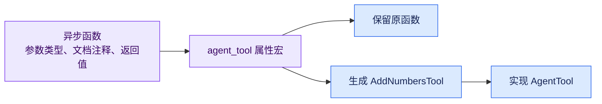
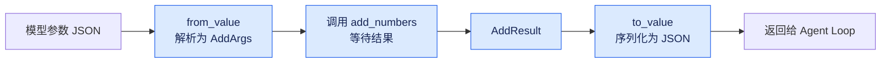
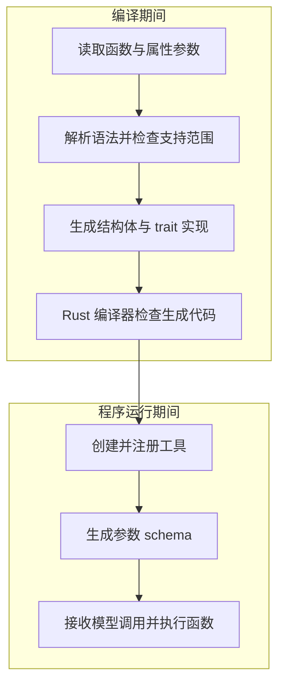
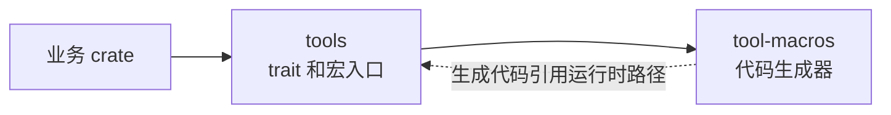
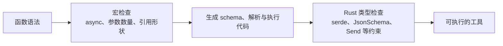
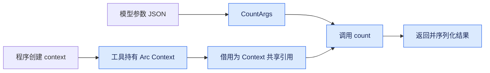
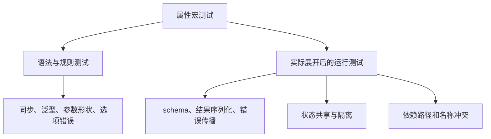

# 一个异步函数如何变成 Agent 工具

给 Agent 增加一个加法工具，业务代码可能只需要几行。但为了让模型认识它、让程序执行它，还要写名称、描述、参数 schema、JSON 解析和结果序列化。

当工具越来越多，这些接线代码会反复出现。我们的 `#[agent_tool]` 属性宏把这部分工作交给编译器：开发者写一个普通异步函数，宏生成实现 `AgentTool` 的工具结构体，供注册表统一调用。

这篇文章沿着一次展开过程讲解它的原理。你会看到宏收到什么、从函数里读取什么，以及最后生成什么。只需要了解 Rust 的结构体、trait 和异步函数；过程宏的基础概念会在文中解释。

## 先看开发者实际写什么

下面是一个完整的工具定义：

```rust
use schemars::JsonSchema;
use serde::{Deserialize, Serialize};
use tools::agent_tool;

#[derive(Deserialize, JsonSchema)]
#[serde(deny_unknown_fields)]
pub struct AddArgs {
    /// 第一个加数。
    pub a: i64,
    /// 第二个加数。
    pub b: i64,
}

#[derive(Serialize)]
pub struct AddResult {
    pub sum: i64,
}

/// 计算两个整数的和。
#[agent_tool]
pub async fn add_numbers(args: AddArgs) -> anyhow::Result<AddResult> {
    let sum = args.a.checked_add(args.b)
        .ok_or_else(|| anyhow::anyhow!("加法溢出"))?;
    Ok(AddResult { sum })
}
```

编译之后，除了原来的 `add_numbers` 函数，还会得到一个 `AddNumbersTool`。生成类型的可见性与函数相同，因此这里也是 `pub`。

工具名称默认是 `add_numbers`，描述来自函数的文档注释，参数 schema 来自 `AddArgs`，执行逻辑最终调用原函数。



*图 1：宏同时保留业务函数和生成工具适配层，两者有不同的调用入口。*

原函数仍能直接调用，方便业务测试；工具入口则接收 JSON，适合 Agent 的统一分派接口。

这里选择函数属性宏，是因为需要读取的元数据本来就属于函数：名称、文档注释、参数类型和异步返回值。`#[agent_tool]` 直接标在业务函数上，工具定义和业务实现可以一起维护。

```rust
use tools::AgentTool;

// 在异步函数中：
let direct = add_numbers(AddArgs { a: 12, b: 8 }).await?;
assert_eq!(direct.sum, 20);

let tool = AddNumbersTool;
let value = tool.execute(serde_json::json!({ "a": 12, "b": 8 })).await?;
assert_eq!(value, serde_json::json!({ "sum": 20 }));
```

## 宏生成的代码长什么样

先忽略宏内部如何工作，直接看生成结果更容易理解。

我们的工具接口位于 [tools crate](../crates/tools/src/lib.rs)：

```rust
use futures::future::BoxFuture;
use serde_json::Value;

pub trait AgentTool: Send + Sync {
    fn name(&self) -> &'static str;
    fn description(&self) -> &'static str;
    fn schema(&self) -> Value;
    fn execute(&self, arguments: Value)
        -> BoxFuture<'_, anyhow::Result<Value>>;
}
```

宏为前面的函数补上的代码，等价于下面的实现。这里保留核心行为，简化了实际展开使用的依赖路径；`AddArgs`、`AddResult` 和原函数使用前面的定义：

```rust
pub struct AddNumbersTool;

impl tools::AgentTool for AddNumbersTool {
    fn name(&self) -> &'static str {
        "add_numbers"
    }

    fn description(&self) -> &'static str {
        "计算两个整数的和。"
    }

    fn schema(&self) -> serde_json::Value {
        schemars::schema_for!(AddArgs).to_value()
    }

    fn execute(&self, arguments: serde_json::Value)
        -> futures::future::BoxFuture<'_, anyhow::Result<serde_json::Value>>
    {
        Box::pin(async move {
            let __agent_tool_function = add_numbers;
            let args: AddArgs = serde_json::from_value(arguments)
                .map_err(|error| anyhow::anyhow!(
                    "invalid arguments for {}: {}", "add_numbers", error
                ))?;
            let result = __agent_tool_function(args).await?;
            Ok(serde_json::to_value(result)?)
        })
    }
}
```

执行过程有三步：JSON 转成参数类型，调用原函数，返回值转成 JSON。参数解析错误、业务函数错误和序列化错误都通过 `Result` 返回给调用方。



*图 2：这条运行时流水线就是宏省掉的重复代码。*

`BoxFuture` 包装异步执行结果，使不同工具通过同一个 trait 对象接口被调用。注册表因此可以存放不同的 `Box<dyn AgentTool>`，不必知道每个业务函数的具体类型。

宏没有消除这些运行时操作。反序列化、Future 包装、业务执行和序列化仍然存在，省掉的是开发者手写它们的工作。

## 属性宏在什么时候运行

属性宏在编译期间处理 Rust 语法，输入和输出都是 token 流。它返回的新代码替换被标注的代码项；如果想保留原函数，就必须把原函数也放进输出。[Rust Reference 的属性宏说明](https://doc.rust-lang.org/reference/procedural-macros.html#attribute-macros)

这解释了为什么我们的生成模板里包含 `#function`：它把原函数重新输出，然后接上结构体和 trait 实现。



*图 3：编译期产生代码，运行期才接收模型请求。*

一个容易混淆的细节是 schema：宏生成的是 `schema_for!(AddArgs).to_value()` 这段代码。实际调用 `schema()` 时才构造 JSON schema；当前注册表在注册工具时调用它并缓存工具定义。

宏不会在编译期间执行加法、请求模型，也不会自动注册工具。

## 为什么拆成两个 crate

当前实现分为 `tool-macros` 和 `tools`：

| crate | 职责 |
| --- | --- |
| `tool-macros` | 编译期解析函数并生成代码 |
| `tools` | 提供运行时 trait，重新导出宏，以及生成代码使用的依赖入口 |

`tool-macros` 的 manifest 声明：

```toml
[lib]
proc-macro = true
```

过程宏需要在专门的 proc-macro crate 中定义，并从其他 crate 使用。把运行时接口放进普通库，可以让业务代码通过 `tools` 同时取得宏和 trait。[Rust Reference 的过程宏定义规则](https://doc.rust-lang.org/reference/procedural-macros.html)



*图 4：实线是 Cargo 依赖，虚线是生成代码中的引用，不是反向 Cargo 依赖。*

`tool-macros` 自身不需要依赖 `tools`。生成 `::tools::AgentTool` 这样的 token，不等于宏 crate 在自己的代码中调用这个 trait；名称最终在使用宏的 crate 中解析。

## 宏入口收到两份 token 流

看 [实际入口](../crates/tool-macros/src/lib.rs)：

```rust
#[proc_macro_attribute]
pub fn agent_tool(attributes: TokenStream, item: TokenStream) -> TokenStream {
    expand(attributes.into(), item.into())
        .unwrap_or_else(syn::Error::into_compile_error)
        .into()
}
```

当用户写下：

```rust
#[agent_tool(name = "plus", description = "计算整数之和。")]
async fn add_numbers(args: AddArgs) -> anyhow::Result<AddResult> {
    // 业务函数体
}
```

宏接收的两份输入分别是：

| 输入 | 内容 |
| --- | --- |
| `attributes` | `name = "plus", description = "计算整数之和。"` |
| `item` | 被标注的函数，包括函数签名、函数体和其他属性 |

token 流不是普通字符串。它保留标识符、标点、字面量和位置等语法信息。我们通过 syn 把它解析为容易检查的 Rust 数据结构，再用 quote 输出代码。

| 库 | 在本宏中的用途 |
| --- | --- |
| `syn` | 解析函数、参数类型、属性选项和文档注释 |
| `quote` | 用 Rust 风格的模板生成 token |
| `proc-macro2` | 提供内部展开逻辑和测试使用的 token、Span 类型 |
| `proc-macro-crate` | 查找使用方给运行时依赖取的实际名字 |

`expand` 返回 `syn::Result`，入口把语法错误转换为 `compile_error!`，交给编译器报告，而不是用 `panic!` 中断解析。

## 从函数语法中读取信息

展开逻辑首先解析函数：

```rust
let function: syn::ItemFn = syn::parse2(item)?;
let signature = &function.sig;
```

`ItemFn` 可以理解为函数的语法记录。宏用到的主要字段有：

| 字段 | 用途 |
| --- | --- |
| `function.sig.ident` | 函数名，决定默认工具名和结构体名 |
| `function.sig.inputs` | 第一个参数类型与可选的 context 类型 |
| `function.sig.output` | 检查返回类型的语法形状 |
| `function.attrs` | 读取文档注释，转发条件编译属性 |
| `function.vis` | 让生成类型继承函数可见性 |

宏不分析业务函数体，原函数体会原样输出。

### 先限制支持的函数形状

当前约定支持两种函数：

```rust
async fn tool(args: Args) -> anyhow::Result<Output>
async fn tool(args: Args, ctx: &Context) -> anyhow::Result<Output>
```

它们必须是安全的、非泛型的普通异步函数。宏拒绝同步函数、`unsafe`、显式 ABI、可变参数、泛型参数和 where 子句。

第一个参数必须是 owned 参数类型，不能写成 `&Args` 或 `self`。这与 `from_value` 的工作方式对应：它从一个拥有的 JSON 值构造参数。

第二个参数如果存在，必须是没有显式生命周期的共享引用 `&Context`。`&mut Context`、owned context 和 `self` 都不在当前支持范围内。

宏按参数的位置和类型识别它们，不要求变量一定命名为 args 或 ctx。生成代码用自己的局部变量，再按顺序调用原函数。

### 宏看到类型名称但不能证明 trait 已实现

我们的返回类型检查只确认：它是一个路径类型，且最后一段名称是 `Result`。因此 `anyhow::Result<Output>` 和 `Result<Output, Error>` 都能通过这层检查。

这属于语法检查。宏没有解析 Result 别名的真实含义，也没有证明错误类型能转成 `anyhow::Error`。一个名称恰好叫 Result 的自定义类型，可能通过初步检查，随后在生成代码处编译失败。

参数的 `DeserializeOwned`、`JsonSchema`，返回值的 `Serialize`，以及异步执行所需的 Send 等约束，最终通过生成代码里的调用由 Rust 编译器检查。



*图 5：宏检查自己能从语法判断的约定，编译器检查真正的类型关系。*

## 名称和描述从哪里来

显式属性选项按逗号分隔解析：

```rust
let options =
    syn::punctuated::Punctuated::<syn::Meta, syn::Token![,]>
        ::parse_terminated
        .parse2(attributes)?;
```

每个选项必须是 `name = "..."` 或 `description = "..."`。值必须是字符串字面量；未知选项、重复选项和其他写法会产生编译错误。

名称与描述分别决定是否使用默认值：

| 项目 | 默认值 | 覆盖方式 |
| --- | --- | --- |
| 工具名称 | 函数名，移除 raw identifier 的 `r#` 前缀 | `name = "plus"` |
| 工具描述 | 函数上的字面量文档注释，按行整理后拼接 | `description = "计算整数之和。"` |
| 结构体名称 | 函数名按下划线分段，首字母大写，再加 Tool | 不随工具名覆盖而变化 |

例如，`add_numbers` 生成 `AddNumbersTool`。即使工具名改成 `plus`，结构体仍叫 `AddNumbersTool`。

### 文档注释如何变成描述

函数上的 `///` 注释会以 `#[doc = "..."]` 属性的形式进入语法树。宏读取这些字符串，去掉每行两端空白，按换行拼起来：

```rust
/// 计算两个整数的和。
/// 需要精确的整数加法时使用。
#[agent_tool]
async fn add_numbers(args: AddArgs) -> anyhow::Result<AddResult> {
    // 业务函数体
}
```

得到的描述是两行文本。函数注释决定工具描述，参数类型的字段注释则由 schemars 用于参数说明，两者各有位置。

当前实现读取的是字面量形式的 doc 属性，不会自行执行 `include_str!` 等表达式。没有可用文档注释时，需要显式提供非空描述。

名称的约束也会在展开时检查：最长 64 个 ASCII 字节；首字符是字母或下划线，其他字符可以是字母、数字、下划线或连字符。

## quote 如何把信息写进代码

解析并验证后，宏已经掌握函数名、参数类型、工具名、描述和可见性。接下来用 `quote!` 填入模板。

```rust
quote! {
    #visibility struct #wrapper;

    impl #runtime::AgentTool for #wrapper {
        fn name(&self) -> &'static str { #name }
        fn description(&self) -> &'static str { #description }
        // schema 和 execute 也在这里生成。
    }
}
```

`#wrapper` 表示插入名为 wrapper 的 token，`#visibility` 插入 `pub` 等可见性信息。它们是语法对象插入，不是简单地替换字符串。

结构体名称由 `format_ident!` 创建。`#(#cfg)*` 则表示重复插入筛选出的条件编译属性。当前宏会转发 `cfg` 与 `cfg_attr`，避免原函数被条件编译关闭后，生成类型仍无条件引用它。`cfg_attr` 内部属性也需要适用于被转发的代码项。

最外层输出包含三个部分：

```rust
quote! {
    #function
    #structure
    // 生成的 AgentTool 实现
}
```

属性宏的输出替换输入，所以把 `#function` 放进去是保留原函数的必要步骤。

## 有状态函数怎样生成工具实例

数据库查询或 HTTP 工具通常需要客户端和配置。这些依赖由程序创建，不应成为每次模型调用都要填写的业务参数。

我们的约定是：第一个参数来自模型 JSON，第二个可选参数来自工具持有的 context。

```rust
use std::sync::{Arc, atomic::{AtomicUsize, Ordering}};
use schemars::JsonSchema;
use serde::Deserialize;
use tools::agent_tool;

#[derive(Deserialize, JsonSchema)]
struct CountArgs {
    /// 本次增加的数量。
    amount: usize,
}

struct CounterContext {
    total: AtomicUsize,
}

/// 增加计数器并返回新值。
#[agent_tool]
async fn count(args: CountArgs, ctx: &CounterContext) -> anyhow::Result<usize> {
    let previous = ctx.total.fetch_update(
        Ordering::SeqCst, Ordering::SeqCst,
        |value| value.checked_add(args.amount),
    ).map_err(|_| anyhow::anyhow!("计数器溢出"))?;
    Ok(previous + args.amount)
}
```

宏检测到第二个共享引用参数后，生成的结构体就有状态了。其核心形状是：

```rust
struct CountTool {
    context: std::sync::Arc<CounterContext>,
}

impl CountTool {
    fn new(context: std::sync::Arc<CounterContext>) -> Self {
        Self { context }
    }
}

// execute 中的业务调用等价于：
// count(args, self.context.as_ref()).await?
```

创建实例时注入 context：

```rust
let context = Arc::new(CounterContext {
    total: AtomicUsize::new(0),
});
let tool = CountTool::new(context.clone());
```



*图 6：模型参数与程序依赖在函数调用处汇合，schema 只描述第一个参数。*

`Arc` 提供共享所有权，本身不提供任意可变访问。需要修改状态时，由 context 中的原子类型或锁承担同步职责。共享同一个 Arc 的工具共享状态；各自创建 context，则可以隔离状态。

工具需要满足 `Send + Sync`，context 因而也要满足相应约束。当前注册表要求工具为 `'static`，所以不能借用一个稍后会被释放的局部依赖。持有同步锁跨 `.await` 还可能让返回 Future 不满足 Send，应按实际访问方式选择锁和临界区。

## 生成代码的依赖路径如何解析

如果用户只依赖 `tools`，为什么宏生成的代码还能调用 serde_json、schemars 和 anyhow？关键在于 `tools` 提供了一个供生成代码使用的依赖入口：

```rust
#[doc(hidden)]
pub mod __private {
    pub use anyhow;
    pub use futures;
    pub use schemars;
    pub use serde_json;
}
```

实际生成代码使用类似 `::tools::__private::serde_json::from_value` 的路径，避免要求调用方为了宏内部实现额外导入这些名字。

`__private` 只是约定名称，模块是 public；`doc(hidden)` 隐藏常规文档展示，不会让它具有语言层面的私有访问权限。

使用方如果自己写 `#[derive(serde::Deserialize)]` 和 `#[derive(schemars::JsonSchema)]`，仍需按这些源码中的路径配置自己的依赖。隐藏入口解决的是生成代码内部路径，不会改变用户源码的名字解析。

### 依赖改名也要工作

Cargo 允许使用方为依赖设置别名：

```toml
[dependencies]
toolkit = { package = "tools", path = "../tools" }
```

此时可用的 crate 路径是 `::toolkit`。宏不能一律写死 `::tools`，否则正常的依赖别名会让生成代码找不到运行时库。

我们用 `proc_macro_crate::crate_name("tools")` 查找实际名字：`FoundCrate::Name(name)` 时生成对应路径；在运行时库内部使用时，`FoundCrate::Itself` 分支使用库声明的 `extern crate self as tools` 别名。[proc-macro-crate 文档](https://docs.rs/proc-macro-crate/latest/proc_macro_crate/)

### 内部变量也可能遮蔽函数名

假如某个合法的业务函数就叫 `args`，生成 `let args = ...; args(args).await` 就会把函数名遮蔽成参数变量。

当前模板在创建参数变量前，先保存原函数：

```rust
let __agent_tool_function = args;
let args: Args = serde_json::from_value(arguments)?;
let result = __agent_tool_function(args).await?;
```

绝对路径、较少冲突的内部标识符，以及调用前的函数绑定，都是减少生成代码名称冲突的办法。它们不代表过程宏自动获得了完全的名字隔离能力。[Rust Reference 的过程宏卫生说明](https://doc.rust-lang.org/reference/procedural-macros.html#procedural-macro-hygiene)

## 错误在哪个阶段出现

理解错误发生的位置，能减少排查范围：

| 阶段 | 示例 | 谁报告 |
| --- | --- | --- |
| 宏解析与规则检查 | 同步函数、`&mut Context`、重复 name、缺少描述 | 宏生成编译错误 |
| 生成代码的类型检查 | 缺少 Deserialize、JsonSchema、Serialize，Future 无法 Send | Rust 编译器 |
| 工具执行 | JSON 字段类型错误、业务错误、序列化失败 | execute 返回 Err |
| Agent 调用 | 未注册工具或调用结果如何回填 | 注册表与 Agent Loop |

宏用 `syn::Error::new_spanned` 将错误关联到有问题的语法，再由入口输出 `compile_error!`。例如把 context 写成 `&mut Context` 时，应该在编译时看到“context must be a shared reference”，无需等到模型真的提出调用。

业务错误则在运行时发生。宏只传播它，不决定要不要重试、要不要向模型回填错误 JSON；这些策略属于循环和调用方。

## 当前实现的边界

理解实现，也要清楚它目前没有承诺哪些能力：

- 支持一个 owned 参数和可选的 `&Context`，要求安全、非泛型的普通 `async fn`。
- 参数类型需要支持反序列化和 schema 生成，成功返回值需要支持序列化；可以返回结构体或 `serde_json::Value`。
- 返回类型使用末段名称为 Result 的路径形式；自定义的其他名称别名不会被解析展开。
- 结构体名由函数名按下划线简单转换，并非通用命名库；转换后同名的函数应放在不同模块中。
- 生成类型与原函数具有相同可见性；公开函数的参数和返回类型也应具备合适的可见性。
- 工具仍需显式注册，宏不创建全局注册表，也不负责模型请求、会话历史或并发执行策略。

这些规则让展开模板保持明确。增加泛型、方法或更多注入参数时，需要重新考虑类型、生命周期和构造方式，不能只增加一个字符串替换分支。

## 怎样验证宏确实生成了正确工具

测试可以分成两层：检查不合法输入是否被拒绝，再检查实际生成类型的行为。



*图 7：解析测试和生成代码测试互相补充，不能只检查 token 长得像正确代码。*

仓库中的 [宏解析测试](../crates/tool-macros/src/lib.rs)检查不支持的函数签名和属性选项；[工具集成测试](../crates/tools/tests/agent_tool.rs)实际调用生成类型，验证默认名称和描述、schema、结构化输出、Value 输出、原函数保留、共享状态、独立状态和错误传播，也覆盖了函数名为 args 的情况。

在仓库根目录运行：

```bash
cargo test -p tool-macros -p tools
```

依赖别名也适合用一个小的下游 crate 验证：只把 tools 依赖命名为 toolkit，通过 `toolkit::agent_tool` 声明工具，再编译并执行它。这样可以直接检查宏是否生成了正确的运行时路径。

如果你想阅读真实展开结果，可以使用 `cargo-expand`。展开输出便于检查生成的结构体和 impl，但行为与类型约束仍应通过编译和测试验证。

理解到这里，`#[agent_tool]` 的工作已经可以分解为普通步骤：读取函数语法，验证约定，提取元数据，再生成一层 JSON 与业务函数之间的适配代码。调用时执行的仍然是你写的 Rust 函数，所有状态和错误也沿着生成的接口流动。

## 源码阅读顺序

| 先看什么 | 文件 |
| --- | --- |
| 工具接口与宏导出 | [tools/src/lib.rs](../crates/tools/src/lib.rs) |
| 使用方式和支持范围 | [tools README](../crates/tools/README.md) |
| 宏入口与展开逻辑 | [tool-macros/src/lib.rs](../crates/tool-macros/src/lib.rs) |
| 生成类型的行为测试 | [tools/tests/agent_tool.rs](../crates/tools/tests/agent_tool.rs) |
| 工具如何注册和分派 | [tool_registry.rs](../crates/agent/src/tool_registry.rs) |

需要先了解工具往返和循环，可以阅读 [从零用 Rust 和 genai 写一个 Agent Loop](genai-agent-loop.md)。本文只解释工具适配层的生成，不要求修改那篇文章的独立示例。
