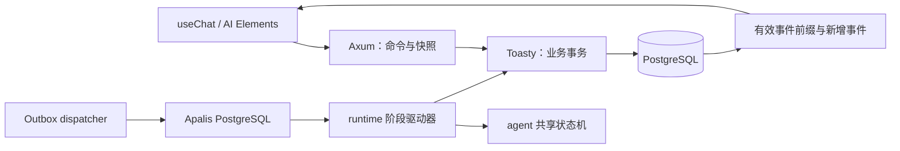
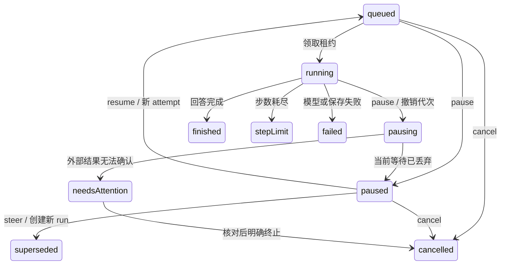
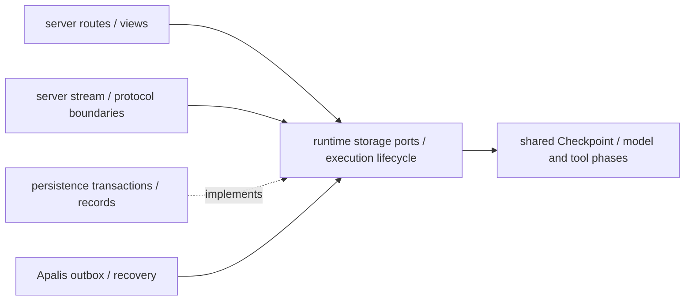

# 持久化会话与后台任务运行指南

会话保存用户看到的消息和模型需要的上下文；run 表示一次生成任务，attempt 表示一次取得执行权的尝试。网页只是订阅者。关闭网页后，后台 worker 仍执行原任务；重新打开同一 URL 会从数据库恢复显示。



`runtime` 定义语义存储端口和执行业务，`persistence` 实现事务与队列，`server` 装配 HTTP。Agent 的内存入口 `run_agent` 和持久入口使用同一个阶段状态机，不维护两份工具循环。

## 本地启动与迁移

复制 `.env.example` 为 `.env`，配置模型和业务 `DATABASE_URL`：

```powershell
docker compose -f compose.postgres.yaml up -d --wait
cargo run -p persistence --bin migrate
cargo run -p server
pnpm -C apps/web dev
```

数据库镜像固定 PostgreSQL 17.6 与 digest；数据卷独立于 Phoenix，端口只监听本机。`docker compose -f compose.postgres.yaml stop` 保留数据。启动不会隐式迁移，升级时停 worker、备份、显式迁移，再启动。仅空业务库允许 `migrate -- --rollback-empty`；有会话时拒绝清空。应用依赖 Toasty 0.11.0、Apalis 1.0.0-rc.10、apalis-postgres 1.0.0-rc.9；使用 Rust 1.95+，本次验证环境为 1.98.1。

## 请求与并发规则

创建会话：`POST /api/conversations`，body `{}`。可通过 `messages` 导入完整、合法的文本和已完成工具历史，附件、重复 ID、悬空工具交换会返回 400。

读取 `GET /api/conversations/{id}` 后，提交：

```json
{"id":"<conversationId>","expectedRevision":0,"requestId":"send-1","message":{"id":"u1","role":"user","parts":[{"type":"text","text":"计算 3 + 5"}]}}
```

向 `POST /api/chat` 发送上述 body。服务端保存新消息、run、command receipt 和 outbox 后才返回流。不要提交完整历史覆盖数据库。同 requestId 与同输入返回原 run；同键异内容或过期版本返回 409。响应丢失时，可通过 `GET /api/conversations/{id}/commands/{requestId}` 查回 runId。

`GET /api/runs/{runId}` 提供 status、version、generation、attempts、steps 和统计。控制接口为 `POST /api/runs/{runId}/{action}`，body：

```json
{"conversationId":"<conversationId>","expectedVersion":4,"requestId":"pause-1"}
```

action 为 pause、resume、cancel、steer。steer 额外需要 `expectedRevision` 和新 user `message`。命令重试复用 requestId；409 后加载权威快照，不自动覆盖另一页面的决定。404 表示资源不存在或指定会话与 run 不匹配；数据库不可用返回 503。`/health` 仅检查存活。

## 暂停、继续与转向



resume 保留 run ID、逻辑预算和工具调用 ID，新增 attempt，重做安全且未完成的阶段。steer 保存追加指令，旧 run 成为 superseded、新 run 重新规划。已完成结果和提供商专用字段沿用；未执行调用回填显式错误，已启动但未确认的外部动作标记 outcome unknown，不能伪造成功或声称副作用撤销。

模型流的未提交片段是展示草稿，不进入模型上下文。恢复会使旧草稿事件失效，新的答案替换这一段。工具决策完整保存后才开始执行，每项结果提交后才开始下一项；两个工具之间恢复不会重做第一项。

## 工具副作用策略

| 策略 | 恢复行为 |
| --- | --- |
| SafeToRetry | 纯计算等可安全重做的未完成操作 |
| Idempotent | 复用 `ExecutionContext.operation_key`；外部系统必须实际去重 |
| Reconcilable | 先保存 external ID，再等待；恢复查询原任务 |
| Conservative（默认） | 未知结果进入 needs-attention，不自动重提交 |

加法注册为 `SafeToRetry(AddTool)`。查询外部结果失败也进入 needs-attention，不能把查询错误当作外部任务已失败。任务终止只能保证本地停止等待和迟到写入被拒绝。重新发送指令前应自行核对外部任务状态；当前没有人工结果回填接口。

## 队列、租约和重启

Outbox 和业务输入同事务提交，dispatcher 才发布 Apalis 任务。发布后确认失败可能重复投递；领取时检查业务状态、dispatch 和 generation，所以重复任务不能取得第二份有效执行权。每次领取新增 attempt 和代次；阶段提交、事件、外部 ID 均检查代次和未过期租约。

`RUN_LEASE_SECONDS=30`、`RUN_HEARTBEAT_SECONDS=5`；租约失效后恢复扫描接管，最多自动恢复 `RUN_MAX_RECOVERIES=5` 次。pausing 的失联任务恢复为 paused 或 needs-attention，不自动续跑。模型业务错误终结为 failed，即使队列再次投递也不再次调用模型。恢复发现模型或工具 schema 变化时停在 needs-attention。

Ctrl+C / Unix SIGTERM 给服务最多 10 秒关闭：本地等待丢弃，安全任务重新排队，未知外部动作停待核对。强制杀进程没有这一保存机会，需要等租约到期；attempt 由扫描标为 interrupted。进程骤停最后一批 Phoenix span 可能丢失，以数据库事实为准。

## SSE、前端与观测

订阅 `GET /api/chat/{runId}/stream` 从头重放有效事件，再按序号读取新增事件；数据库事务固定每次批次的状态与事件高水位，250ms 轮询补偿丢失唤醒或跨进程通知。每订阅最多读取 256 个事件，慢消费超过 30 秒时脱离；执行不受影响。10 秒注释心跳不生成消息 part。

前端重连先移除当前 assistant ID 的旧显示，再交给官方 parser 重建前缀。暂停/取消发送 `data-run-state` 和 `abort`，正常结束才发送 finish。SDK `stop()` 只关闭订阅。每 run 的事件默认限 16 MiB；保存失败或 128 项回调队列溢出停止执行，避免继续产生无法恢复的外部操作。

Phoenix 每 attempt 产生一个 `agent.run` 执行根和 `agent.attempt` 子 span，步骤、模型、工具继续组成父子关系。各尝试通过 runId、attemptId、session 和原 traceparent 关联，转向记录 supersedes。订阅 span 独立统计 `agent.subscription_ms` / `agent.subscription_ttft_ms`；执行用 `agent.execution_ms` / `agent.execution_ttft_ms`，模型用 `agent.model_ttft_ms`。重放只增加订阅观测，不增加模型次数和 usage。

run 统计累计各 attempt 的实际调用和已知 token，`usageComplete=false` 代表存在未知 usage，不代表零成本。缓存、reasoning 明细不重复加入 total。内容采集默认关闭；OTLP 故障不阻塞业务。评测每 trial 独立会话，超时用独立清理时限查回 receipt 并显式 cancel，报告 cleanup 是否确认，以及 run/attempt/trace 标识。

## 验证

创建独立 `_test` 库并设置 `TEST_DATABASE_URL`；事务/HTTP 测试默认 ignored，以免误连接业务数据。迁移和执行场景创建随机子库，测试只清理自身子库或随机会话。

```powershell
cargo test -p persistence -p server -- --ignored --test-threads=1
node --experimental-strip-types scripts/durable-check/check.mjs
npm ci --prefix scripts/ai-sdk-check
npm run check:mock --prefix scripts/ai-sdk-check
npm test --prefix scripts/evals
pnpm -C apps/web test
```

进程级模拟门禁覆盖网页断开、模型暂停重做、原样继续/追加指令、正常关闭、强制退出后租约恢复以及官方 UIMessage 重放。所有这些验证使用本机模型替身，不使用生产 key 或付费模型。


## 模块边界与维护约定



HTTP 模块只负责请求验证、状态码和响应投影；SSE 模块集中处理重放与文本/步骤闭合。runtime 的生命周期负责取消、租约监测与 attempt 观测，模型和工具各自驱动单个阶段，仍由唯一 `Checkpoint::next()` 决定下一步。persistence 将语义事务保留在同一位置，SQL/codec 辅助函数为私有子模块，不能在拆分中改变锁顺序或原子提交边界。

这样划分遵循 [Rust 的模块与可见性机制](https://doc.rust-lang.org/stable/book/ch07-02-defining-modules-to-control-scope-and-privacy.html) 和 [Axum 的 State/Router 组合方式](https://docs.rs/axum/latest/axum/extract/struct.State.html)：按职责隐藏实现，保留现有公共 API，避免为每个函数再添加一层接口。

前端切换会话会取消旧查询，并通过选择代次校验返回结果；轮询和 stream 数据还验证 run 身份与版本。测试夹具的模型替身、服务进程和数据库生命周期分离，启动失败与正常关闭走同一清理路径。

可恢复的外部动作不等于可放弃的动作：Idempotent / Reconcilable 工具尚未确认结果时，暂停后可以原样继续，但 steer 返回 409。先继续并查询原操作结果，或人工核对后明确终止；系统不会代替外部服务撤销动作。


## 接口契约与前端查询

资源路由通过 utoipa-axum 的 `OpenApiRouter` 注册，Rust 公共 DTO 是接口契约的唯一来源。`GET /api/openapi.json` 与离线导出使用同一个 Router；会话视图不包含模型 SDK history，run 视图不包含 checkpoint 或 lease。修改接口后运行 `pnpm -C apps/web api:generate` 和 `api:check`，提交 OpenAPI 与生成客户端。

前端使用 Hey API 生成的 Fetch SDK 和 TanStack Query options 管理普通查询、轮询及 mutation。AI SDK 仍负责 UIMessage Stream 解析；会话切换、流重放与 generation/version 栅栏属于业务协调，保留在 durable hook 中。HTTP 查询按会话/run 身份隔离缓存，终结任务停止轮询，控制期间停止状态轮询。

服务器配置在入口用 envy 解析和验证，再注入基础设施。Toasty 与 Apalis 各有独立连接池；部署预算按两者连接数之和乘实例数计算，预留迁移和管理连接。池获取和连接创建均设置超时，不依赖外层 SSE/HTTP 超时来释放数据库等待。
