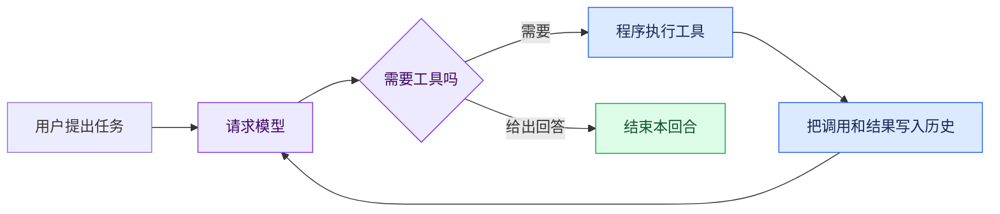
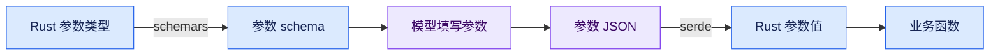
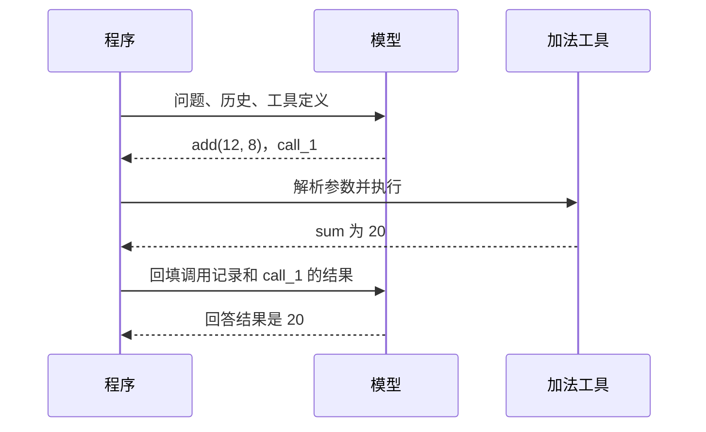
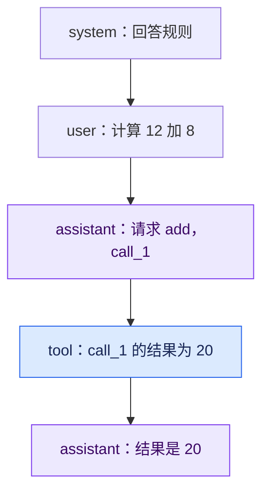
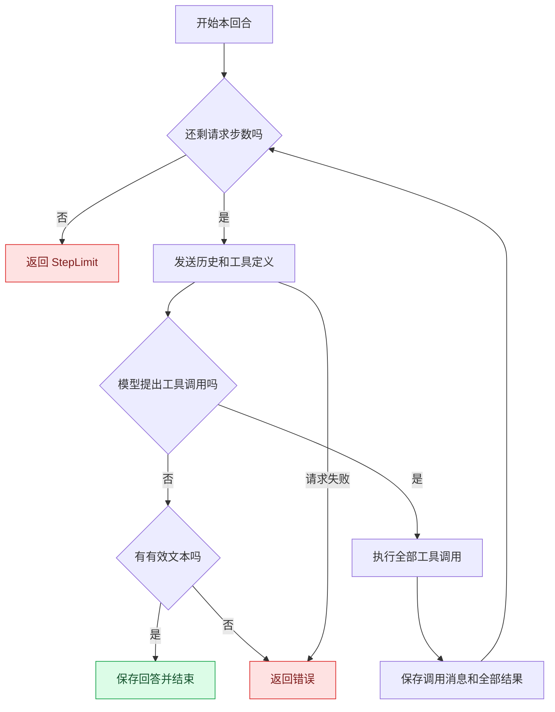
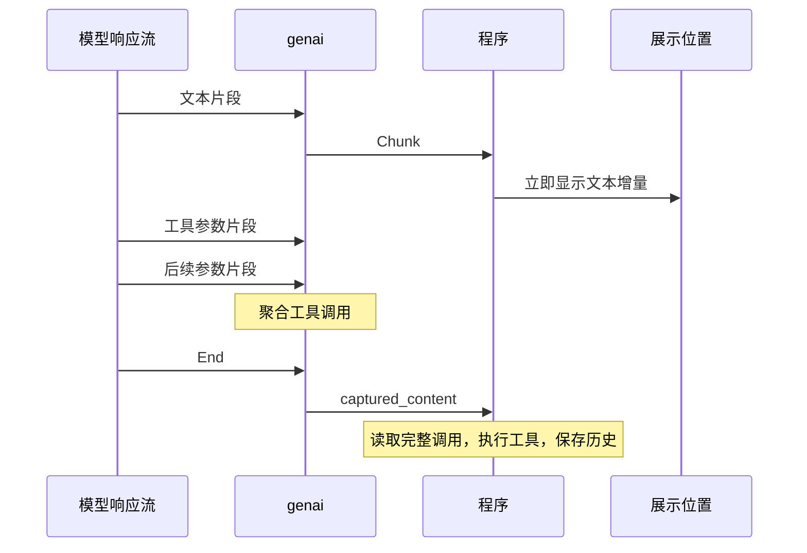
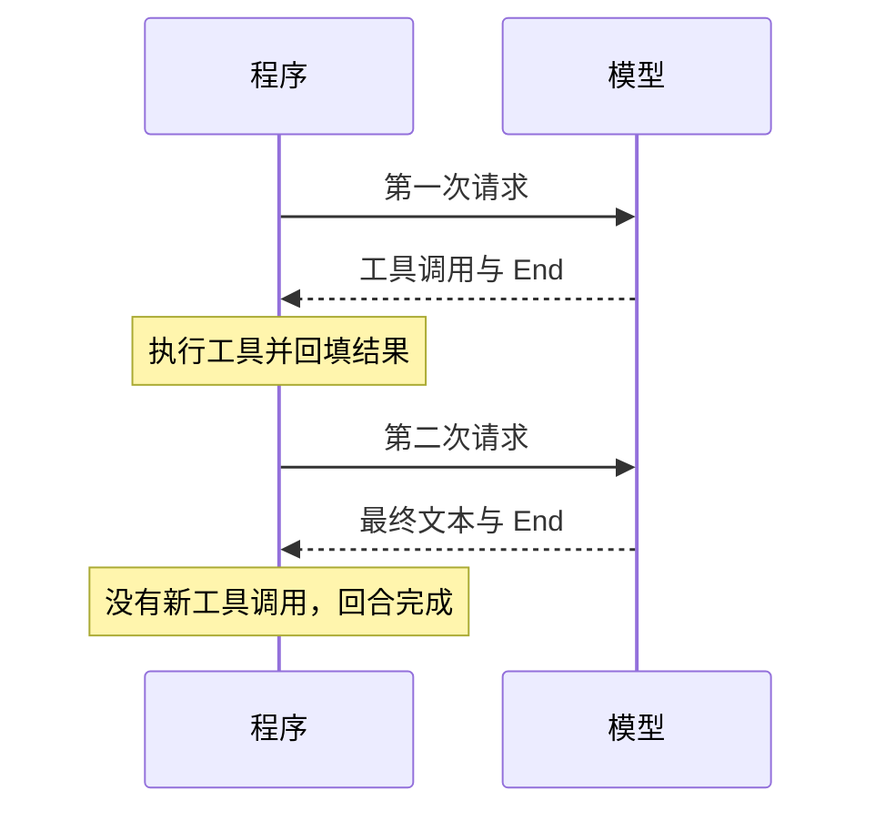
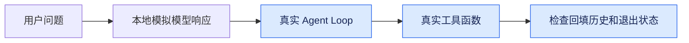

# 从零用 Rust 和 genai 写一个 Agent Loop

你想做一个能使用工具的 AI 助手。用户提出任务，模型判断需要做什么，程序执行相应操作，再把结果交给模型。问题是：模型的回答怎么变成函数调用？函数返回后怎么继续？什么时候才算完成？

这篇文章用一个小计算器回答这些问题。我们从新建 Rust 项目开始，让助手完成“先计算 12 加 8，再把结果乘以 3”，最后得到一个支持流式输出、工具调用和步数限制的 Agent Loop。

你只需要了解 Rust 的函数、结构体、`Result` 和基本的 `async/await`。文中的示例是一个独立项目，不依赖其他教程，也不需要额外的 Agent 框架。

## 我们要做的程序是什么

先看最终目标：



*图 1：工具结果成为下一次模型请求的输入，流程因此形成循环。*

模型负责选择下一步，Rust 程序负责执行。模型返回“调用加法工具，参数是 12 和 8”时，它并没有执行你的函数。真正的加法发生在程序中。

**Agent Loop 就是反复请求模型，执行它提出的工具调用，再把结果送回去，直到得到回答或触发退出条件。**

genai 提供统一的模型客户端、消息类型和流式接口。我们用它处理与模型服务的通信，循环和工具执行由自己实现。[genai 上游项目](https://github.com/jeremychone/rust-genai)

## 创建一个独立项目

安装 Rust stable，然后新建项目：

```bash
cargo new agent-loop-demo
cd agent-loop-demo
```

本文固定使用 `genai 0.7.0-rc.1`，完整示例在 Rust 1.98.1 下验证。固定版本能避免你读文章时，预发布版本的 API 已经变化。

把 `Cargo.toml` 替换为：

```toml
[package]
name = "agent-loop-demo"
version = "0.1.0"
edition = "2024"

[dependencies]
anyhow = "1"
dotenvy = "0.15"
futures = "0.3"
genai = "=0.7.0-rc.1"
schemars = "1"
serde = { version = "1", features = ["derive"] }
serde_json = "1"
tokio = { version = "1", features = ["macros", "rt-multi-thread"] }
```

这些依赖分别负责：

| 依赖 | 用途 |
| --- | --- |
| genai | 请求模型，接收消息和响应流 |
| tokio | 运行异步代码 |
| serde 与 serde_json | 解析模型给出的参数，构造工具结果 |
| schemars | 从 Rust 参数类型生成 JSON Schema |
| futures | 逐个消费流式事件 |
| anyhow | 传播错误并添加上下文 |
| dotenvy | 将 `.env` 中的配置加载到进程环境 |

在项目根目录新建 `.env`。下面以国内智谱适配器为例：

```dotenv
BIGMODEL_API_KEY=填入你自己的密钥
MODEL=bigmodel::glm-4.6
```

把 `.env` 加入 `.gitignore`。你也可以换成其他支持工具调用的模型，同时修改模型名与对应厂商的 key。

`bigmodel::` 明确指定适配器；它决定请求格式、默认地址和认证方式。不要只换 API 地址，却保留一套不匹配的模型前缀和 key。

## 先发出一次普通请求

暂时不考虑工具。把 `src/main.rs` 替换成下面的完整代码：

```rust
use anyhow::Result;
use genai::{Client, chat::ChatRequest};

#[tokio::main]
async fn main() -> Result<()> {
    dotenvy::dotenv().ok();
    let model = std::env::var("MODEL")?;
    let client = Client::new()?;

    let request = ChatRequest::from_user("用一句话解释什么是 Agent Loop")
        .with_system("请用中文回答，尽量通俗。");
    let response = client.exec_chat(&model, request, None).await?;

    println!("{}", response.first_text().unwrap_or("没有文本回答"));
    Ok(())
}
```

运行：

```bash
cargo run
```

先确认这一步能拿到回答。连接或认证尚未成功时，继续增加工具代码只会让问题更难定位。

这段代码只需要三个东西：一个可复用的 `Client`、一个模型名，以及装着消息的 `ChatRequest`。在本文版本中，`Client::new()` 返回 `Result`，因此需要 `?`。

### 需要自定义 API 地址时

如果你的服务要求使用特定地址，可以在 `.env` 中增加一个与模型适配器兼容的 base URL：

```dotenv
API_BASE_URL=https://your-provider.example/v1/
```

这是占位示例，应换成服务实际要求的地址。下面的函数会在配置该变量时覆盖 endpoint；未配置时保留 genai 默认地址：

```rust
fn build_client() -> anyhow::Result<genai::Client> {
    use genai::resolver::{Endpoint, ServiceTargetResolver};

    let mut builder = genai::Client::builder();
    if let Ok(base_url) = std::env::var("API_BASE_URL") {
        let resolver = ServiceTargetResolver::from_resolver_fn(
            move |mut target: genai::ServiceTarget| {
                target.endpoint = Endpoint::from_owned(base_url.clone());
                Ok(target)
            },
        );
        builder = builder.with_service_target_resolver(resolver);
    }
    Ok(builder.build()?)
}
```

把 `Client::new()?` 改成 `build_client()?` 即可。这个覆盖会作用于该客户端的所有请求；本文只用一个模型，因此不需要额外的厂商路由逻辑。

## 给模型一份工具说明

现在为程序增加两种能力：加法和乘法。模型要知道工具叫什么、什么时候用，以及应该填写哪些参数。

这份说明由工具名称、描述和参数 schema 组成。schema 可以理解为一张表单的填写规则：有什么字段，字段是什么类型，哪些必须填写。

我们先定义参数类型：

```rust
use schemars::JsonSchema;
use serde::Deserialize;

#[derive(Deserialize, JsonSchema)]
#[serde(deny_unknown_fields)]
struct Numbers {
    /// 第一个整数。
    a: i64,
    /// 第二个整数。
    b: i64,
}
```

`Deserialize` 让 serde 能把 JSON 转成 `Numbers`；`JsonSchema` 让 schemars 能从同一个类型生成参数说明。字段注释还可以作为参数描述。

创建加法工具定义：

```rust
use genai::chat::Tool;

let add = Tool::new("add")
    .with_description("计算两个整数的和。")
    .with_schema(schemars::schema_for!(Numbers).to_value());
```

下面是 schema 中与参数形状相关的部分，省略了标题和 schema 版本等字段：

```json
{
  "type": "object",
  "properties": {
    "a": { "type": "integer", "description": "第一个整数。" },
    "b": { "type": "integer", "description": "第二个整数。" }
  },
  "required": ["a", "b"],
  "additionalProperties": false
}
```

模型看到这份定义，就能请求 `add` 并提供参数。它不会看到或执行你的 Rust 函数体。



*图 2：同一个类型用于生成说明和解析输入，减少两份定义不一致的机会。*

schema 是给模型看的约束，程序仍要检查真实输入。比如字段类型能否解析、是否有多余字段，以及算术结果是否溢出，都需要在程序中处理。

## 理解一次完整的工具往返

发请求时，把工具定义随消息一起送给模型：

```rust
let request = history.clone().with_tools(definitions.clone());
let response = client.exec_chat(model, request, None).await?;
```

模型可以直接回答，也可以返回工具调用。一个调用包含三个关键字段：

```json
{
  "call_id": "call_1",
  "fn_name": "add",
  "fn_arguments": { "a": 12, "b": 8 }
}
```

| 字段 | 用途 |
| --- | --- |
| `fn_name` | 找到应该执行的工具 |
| `fn_arguments` | 提供本次调用的参数 |
| `call_id` | 将执行结果对应到这次调用 |

在本文的 genai 版本中，`fn_arguments` 是 `serde_json::Value`。解析它使用 `from_value`：

```rust
let args: Numbers = serde_json::from_value(call.fn_arguments.clone())?;
let sum = args.a.checked_add(args.b)
    .ok_or_else(|| anyhow::anyhow!("加法溢出"))?;
```

执行结果需要包装成 `ToolResponse`，原样保留调用 ID：

```rust
use genai::chat::ToolResponse;

let result = ToolResponse::new(
    call.call_id.clone(),
    serde_json::json!({ "sum": sum }).to_string(),
);
```

模型可以连续调用两次 `add`，所以只用工具名关联结果不够。`call_id` 区分的是每一次具体调用。



*图 3：工具执行发生在程序中。结果回填后，模型才得到继续处理所需的信息。*

## 把发生过的事情写入历史

在本文使用的消息调用模式里，多轮上下文由程序维护。每次请求把需要的历史送给模型，客户端不会自动替你积累一份聊天记录。

普通对话记录用户问题和模型回答。工具往返还要记录模型发起的调用和程序给出的结果：



*图 4：工具调用属于模型的 assistant 消息，执行结果属于 tool 消息。*

这里的顺序很重要。先保存模型发起调用的 assistant 消息，再保存对应的 tool 结果，下一次请求才能看到完整的往返。

```rust
history.messages.push(ChatMessage::assistant(content));
for result in results {
    history.messages.push(ChatMessage::from(result));
}
```

`content` 是模型响应的完整 `MessageContent`。保存它，可以同时保留模型的文本说明和工具调用，而不是只留下工具名和参数。

如果一次响应里有多个工具调用，应该为每个调用生成结果。未知工具或非法参数也可以生成错误结果，而不能直接漏掉这次调用。

本文先收集所有工具结果，再统一写入历史。也可以先追加 assistant 消息，再每执行一个工具就追加一个结果；两种方式都需要保证消息顺序、调用配对，以及下一次请求看到的历史完整。

## 从一次往返走到 Agent Loop

考虑这个稍复杂的任务：“先计算 12 加 8，再把结果乘以 3。”

第一次工具执行得到 20，模型读到结果后，还可能要求乘法。如果程序只固定请求两次，遇到新的工具调用就无法继续。

解决方法是把这个往返放进循环：



*图 5：是否继续取决于响应内容；最多请求多少次由程序限制。*

一次循环对应一次模型请求，工具数量可以是零个、一个或多个。下面是一条可能的执行轨迹：

| 步数 | 模型输出 | 程序执行 |
| --- | --- | --- |
| 1 | 请求 `add(12, 8)` | 得到 20，写入历史 |
| 2 | 请求 `multiply(20, 3)` | 得到 60，写入历史 |
| 3 | 文本回答“结果是 60” | 保存回答，结束 |

这是示意轨迹，不是模型行为保证。真实模型可能自己计算、一次提出多个调用，或者选择不同步骤。最终应检查调用记录，而不只看答案。

### 步数上限控制什么

`max_steps = 6` 表示本回合最多请求模型六次，不表示最多执行六个工具。

如果把上面的轨迹限制为两步，程序会完成乘法并保存结果，然后停下来；它尚未发出第三次请求来获得最终回答。因此需要区分“得到最终回答”和“用完预算”。

```rust
#[derive(Debug)]
pub enum Outcome {
    Finished { answer: String, steps: usize },
    StepLimit { steps: usize },
}
```

### 每次请求里的工具定义

工具定义可以提前创建一次，再随需要使用工具的请求发送。缓存定义不等于模型下一次自动知道有哪些工具。

本文使用 `history.clone().with_tools(definitions.clone())` 构造每次请求，工具只加到请求副本里。如果一开始就把工具存在 history 中，后续克隆完整保留它们，也可以只设置一次。关键是实际发出的请求包含所需定义。

### 工具失败后怎么处理

加法溢出、参数无法解析、工具名不存在，都属于工具执行阶段的错误。本文把这些错误转成带有 `error` 字段的工具结果，再交给模型：

```json
{ "error": "加法溢出" }
```

模型可以据此调整参数或向用户解释失败，但能否正确恢复仍需要验证。模型请求失败则直接返回错误，交给外层处理。

## 为回答增加流式输出

非流式请求要等整次响应完成才能拿到内容。流式接口把内容拆成事件，文本到达后就可以显示。

工具参数也可能分片到达。程序刚收到 `{"a":` 时，显然还不能执行加法；多调用时，还需要区分片段属于哪个调用。

我们让 genai 聚合内容，等 `End` 后读取完整响应：

```rust
let options = ChatOptions::default()
    .with_capture_content(true)
    .with_capture_tool_calls(true);
```

| 选项 | 在本文中的作用 |
| --- | --- |
| `with_capture_content(true)` | 捕获文本等内容，用于保存完整 assistant 消息 |
| `with_capture_tool_calls(true)` | 聚合工具调用，供响应结束后读取完整参数 |



*图 6：文本增量用于展示，完整内容用于执行工具和维护历史。*

`End` 只表示这次模型响应结束。如果内容里有工具调用，整个用户回合还没有结束。



*图 7：一个回合可以经过多次响应结束，才能真正完成。*

展示过的文本片段不需要在 `End` 时再打印一遍。结束时得到的完整文本主要用于保存历史和返回结果。

## 完整实现

现在把这些概念组合起来。最终项目包含三个源文件；下面的三个代码块都是完整文件，可以直接复制。请替换前面试验用的 `main.rs`，同时新建 `tools.rs` 和 `agent.rs`。

| 文件 | 职责 |
| --- | --- |
| `src/tools.rs` | 提供工具定义，解析参数并执行算术 |
| `src/agent.rs` | 消费模型响应流，执行循环并保存历史 |
| `src/main.rs` | 加载配置、提出任务、显示输出 |

### 工具定义和执行

创建 `src/tools.rs`：

```rust
use anyhow::{Context, Result, bail};
use genai::chat::{Tool, ToolCall};
use schemars::JsonSchema;
use serde::Deserialize;
use serde_json::{Value, json};

#[derive(Deserialize, JsonSchema)]
#[serde(deny_unknown_fields)]
struct Numbers {
    /// 第一个整数。
    a: i64,
    /// 第二个整数。
    b: i64,
}

pub fn definitions() -> Vec<Tool> {
    let schema = schemars::schema_for!(Numbers).to_value();
    vec![
        Tool::new("add")
            .with_description("计算两个整数的和。")
            .with_schema(schema.clone()),
        Tool::new("multiply")
            .with_description("计算两个整数的乘积。")
            .with_schema(schema),
    ]
}

pub async fn execute(call: &ToolCall) -> Result<Value> {
    if !matches!(call.fn_name.as_str(), "add" | "multiply") {
        bail!("未知工具：{}", call.fn_name);
    }
    let args: Numbers = serde_json::from_value(call.fn_arguments.clone())
        .with_context(|| format!("{} 的参数无效", call.fn_name))?;

    match call.fn_name.as_str() {
        "add" => {
            let sum = args.a.checked_add(args.b)
                .ok_or_else(|| anyhow::anyhow!("加法溢出"))?;
            Ok(json!({ "sum": sum }))
        }
        "multiply" => {
            let product = args.a.checked_mul(args.b)
                .ok_or_else(|| anyhow::anyhow!("乘法溢出"))?;
            Ok(json!({ "product": product }))
        }
        _ => bail!("未知工具：{}", call.fn_name),
    }
}
```

`definitions()` 是给模型看的说明，`execute()` 是程序真正执行的逻辑。名称必须对应，否则模型提出的请求找不到实现。

这里用 `match` 分派两个工具，便于理解。工具变多后再抽象注册表也不迟。`execute` 保留异步接口，之后加入 HTTP 或数据库操作时，可以在其中 `.await`。

### 响应流和循环

创建 `src/agent.rs`：

```rust
use anyhow::{Context, Result, bail};
use futures::StreamExt;
use genai::{
    Client,
    chat::{ChatMessage, ChatOptions, ChatRequest, ChatStreamEvent,
        MessageContent, ToolResponse},
};

use crate::tools;

#[derive(Debug)]
pub enum Outcome {
    Finished { answer: String, steps: usize },
    StepLimit { steps: usize },
}

async fn request_once(
    client: &Client,
    model: &str,
    request: ChatRequest,
    on_text: &mut (impl FnMut(&str) -> Result<()> + Send),
) -> Result<MessageContent> {
    let options = ChatOptions::default()
        .with_capture_content(true)
        .with_capture_tool_calls(true);
    let mut response = client
        .exec_chat_stream(model, request, Some(&options))
        .await?;

    while let Some(event) = response.stream.next().await {
        match event? {
            ChatStreamEvent::Chunk(chunk) => on_text(&chunk.content)?,
            ChatStreamEvent::End(end) => {
                if end.captured_stop_reason.as_ref()
                    .is_some_and(|reason| reason.is_max_tokens())
                {
                    bail!("模型输出达到 token 上限，本次响应被截断");
                }
                return end.captured_content
                    .ok_or_else(|| anyhow::anyhow!("没有捕获到完整响应"));
            }
            _ => {}
        }
    }
    bail!("响应流没有返回 End 事件")
}

pub async fn run_agent(
    client: &Client,
    model: &str,
    history: &mut ChatRequest,
    max_steps: usize,
    mut on_text: impl FnMut(&str) -> Result<()> + Send,
) -> Result<Outcome> {
    if max_steps == 0 {
        bail!("max_steps 必须大于 0");
    }
    let definitions = tools::definitions();

    for step in 1..=max_steps {
        eprintln!("\n[模型请求 {step}/{max_steps}]");
        let request = history.clone().with_tools(definitions.clone());
        let content = request_once(client, model, request, &mut on_text)
            .await
            .with_context(|| format!("第 {step} 次模型请求失败"))?;
        let calls = content.tool_calls();

        if calls.is_empty() {
            let answer = content.texts().join("");
            if answer.trim().is_empty() {
                bail!("模型没有返回有效文本");
            }
            history.messages.push(ChatMessage::assistant(content));
            return Ok(Outcome::Finished { answer, steps: step });
        }

        let mut results = Vec::new();
        for call in calls {
            eprintln!("[工具 {}] {}({})",
                call.call_id, call.fn_name, call.fn_arguments);
            let value = match tools::execute(call).await {
                Ok(value) => value,
                Err(error) => serde_json::json!({ "error": format!("{error:#}") }),
            };
            eprintln!("[结果 {}] {value}", call.call_id);
            results.push(ToolResponse::new(call.call_id.clone(), value.to_string()));
        }

        history.messages.push(ChatMessage::assistant(content));
        for result in results {
            history.messages.push(ChatMessage::from(result));
        }
    }
    Ok(Outcome::StepLimit { steps: max_steps })
}
```

这份代码分成两层：`request_once` 只处理一次模型响应，`run_agent` 决定是否继续请求。把这两个职责分开，工具执行与流式细节就不会全部挤在同一段代码里。

`on_text` 是文本到达时调用的回调。它接收一段增量文本，可以打印到终端，也可以转发给其他展示方式。返回 `Result`，让展示阶段的错误也能传播出来。

工具调用按顺序执行。异步接口允许等待，不会自动让这些调用并发。本文也拒绝把明确因 token 上限而截断的响应当作成功；更完整的应用还需要处理其他结束原因和恢复策略。

### 程序入口

将 `src/main.rs` 替换为：

```rust
mod agent;
mod tools;

use std::io::Write;
use anyhow::Result;
use genai::{Client, chat::{ChatMessage, ChatRequest}};

fn build_client() -> Result<Client> {
    use genai::resolver::{Endpoint, ServiceTargetResolver};

    let mut builder = Client::builder();
    if let Ok(base_url) = std::env::var("API_BASE_URL") {
        let resolver = ServiceTargetResolver::from_resolver_fn(
            move |mut target: genai::ServiceTarget| {
                target.endpoint = Endpoint::from_owned(base_url.clone());
                Ok(target)
            },
        );
        builder = builder.with_service_target_resolver(resolver);
    }
    Ok(builder.build()?)
}

#[tokio::main]
async fn main() -> Result<()> {
    dotenvy::dotenv().ok();
    let model = std::env::var("MODEL")?;
    let client = build_client()?;
    let mut history = ChatRequest::default().with_system(
        "你是计算助手。请使用提供的工具完成算术任务，\
         后续计算使用工具返回的结果。完成后用中文说明答案。",
    );
    history.messages.push(ChatMessage::user(
        "请先用加法工具计算 12 加 8，再用乘法工具把结果乘以 3。",
    ));

    let outcome = agent::run_agent(&client, &model, &mut history, 6, |text| {
        print!("{text}");
        std::io::stdout().flush()?;
        Ok(())
    }).await?;
    println!();

    match outcome {
        agent::Outcome::Finished { answer, steps } => {
            // answer 可保存或返回给调用方，文本已经流式显示过。
            eprintln!("[完成] 模型请求 {steps} 次，最终回答 {} 个字符", answer.chars().count());
        }
        agent::Outcome::StepLimit { steps } => {
            eprintln!("[停止] 已请求模型 {steps} 次，尚未得到最终回答");
        }
    }
    Ok(())
}
```

现在运行 `cargo run`。如果模型选择了前面那条任务链，日志中会依次出现加法调用、结果 20、乘法调用和结果 60，最后显示回答。

提示词要求使用工具，可以引导模型行为，但不能作为保证。日志能帮你确认工具是否真的执行；`answer` 仅保存最终那次响应的文本，前面各步的完整内容仍在 history 中。

## 亲手验证几个边界

先运行 `cargo check` 确认代码可以编译，再观察真实调用。除了看最终数字，还可以主动验证以下情况：

| 修改或输入 | 应该观察什么 |
| --- | --- |
| 将最大步数从 6 改为 1 | 如果第一步要求工具，工具执行并回填后返回 StepLimit |
| 将任务改成普通问候 | 模型可能直接给出文本，第一步就完成 |
| 要求计算超过 i64 范围的结果 | 输入解析或计算返回错误，不应整数溢出后继续当作正确结果 |
| 检查每条工具结果日志 | 调用与结果使用相同的 call_id |
| 网络请求失败 | 程序返回错误，不把半截响应当作完整答案 |

最小步数是针对模型请求的预算，它不是 HTTP 超时。工具数量、运行时长和文本长度也不由它单独限制。

### 多轮对话怎样继续

保留同一个 history，追加新的用户消息，再调用 `run_agent`：

```rust
history.messages.push(ChatMessage::user("请用乘法工具把刚才的结果乘以 2。"));
```

下一次请求会带上先前的调用和结果，模型因此可以接着处理。多个用户或会话应分别维护自己的 history；历史越来越长时，还需要控制上下文长度。

### 哪些内容适合用本地测试验证

真实模型输出会变化。工具函数的计算、非法参数处理和调用配对，可以用确定性测试验证；循环可以通过本地模拟响应验证，不必每次都花一次真实模型请求。



*图 8：替换模型响应来源，就能稳定检查循环协议；真实模型选择是否合理需要另外评估。*

完整示例经过编译和本地模拟响应验证。它没有将一次真实模型输出当作固定轨迹，也没有假定提示词能保证模型按图执行。

## 下一步扩展哪些能力

现在你已经有了循环、历史、工具执行和流式展示。增加新能力时，可以先沿着现有结构扩展：

- 新增工具：提供名称、描述、参数 schema 和执行分支。
- 接入外部服务：在工具函数中调用 HTTP 或数据库，返回结构化结果。
- 复用业务依赖：由程序持有客户端或连接池，在执行工具时传入。
- 接入网页：把文本增量和运行进度转成服务层的事件，再送给前端。
- 提高运行可靠性：增加超时、取消、重试和完整的结束原因处理；涉及副作用的工具还要考虑重复执行。

这些扩展各有细节，但共同主线没有变化：把已经发生的事情保存下来，让模型根据工具结果选择下一步，再由程序控制执行与终止。

## 参考资料

- [genai 项目与 API 示例](https://github.com/jeremychone/rust-genai)
- [genai 流式工具调用示例](https://github.com/jeremychone/rust-genai/blob/main/examples/c21-tooluse-streaming.rs)

上游主分支会继续变化，本文代码固定使用 `genai = "=0.7.0-rc.1"`。图表直接使用 Mermaid，可在支持 Mermaid 的 Markdown 阅读器中查看。
