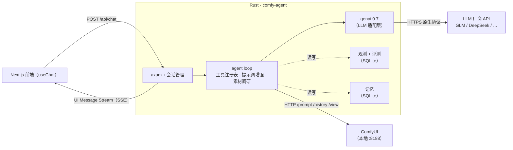

# Rust AI Agent 系列教程：从零到 ComfyUI 本地 Agent

> 系列大纲（v0.1，待讨论定稿）。每篇文章只讲一个小节，跟着做完即得到最终项目。
> LLM 调用层使用 [genai 0.7](../genai-guide.md)，其余所有部分——agent 循环、工具系统、
> 前端协议、评测监控、记忆——全部手写，理解每一层。

## 1. 最终项目：ComfyUI 本地 Agent

一句话：**一个跑在本地的 Rust agent，你用自然语言跟它聊天，它调你已有的 ComfyUI 工作流出图。**

能力清单：

- **对话**：Web 聊天界面（Vercel AI SDK `useChat`），流式打字机输出
- **工作流即工具**：本地已有的 ComfyUI 工作流（文生图、图生图……）被自动包装成 agent 工具，
  模型决定何时调用、填什么参数（提示词、种子、尺寸……）
- **素材调研**：接到"帮我查点参考"类需求时，用 WebSearch 收集素材并整理成提示词素材
- **提示词增强**：把用户口语（"来张赛博朋克的猫"）转成结构化的工作流参数 + 高质量
  正/负提示词，这是核心增值环节
- **评测与监控**：每次运行都有结构化记录（工具轨迹、延迟、token），有指标面板回答
  "这个 agent 设计得对不对"——工具选对了吗？参数填对了吗？用户采纳了吗？
- **记忆**：记住用户偏好（常用风格、负面词禁忌、喜欢的工作流），跨会话生效，
  并且用户的采纳/重生成行为会回流为偏好信号

架构总览：



## 2. 技术选型与理由

| 层 | 选型 | 理由 |
|---|---|---|
| LLM 适配 | genai 0.7.0-rc.1 | 原生协议多厂商（含 GLM/DeepSeek/Kimi），适配层边界干净，源码可读 |
| 异步运行时 | tokio | 事实标准 |
| Web 框架 | axum | tokio 系，SSE 支持好 |
| 前端协议 | AI SDK UI Message Stream（手写编码器，~200 行） | 协议很薄，手写一遍正好理解流式 agent 的本质 |
| 前端 | Next.js + AI SDK `useChat` | 用户指定，前端开发快 |
| ComfyUI 对接 | 直接 HTTP（`/prompt`、`/history`、`/view`） | 进度上报、取消、评测埋点都需要 hook 进执行流程，手写才能埋进去；异步队列执行模型本身是好的教学素材 |
| ComfyUI 伴随工具 | 官方 comfy CLI（`workflow slots` / `validate`） | 只做调试辅助（08 篇引入），不做运行时依赖，避免子进程黑盒 |
| 存储 | SQLite（rusqlite） | 本地单文件，评测数据和记忆共用一个库 |
| 观测 | tracing + 自建 runs 表 | 先结构化落盘，再谈指标 |

## 3. 篇目规划（24 篇）

> 每篇 ≈ 1500–3000 字 + 可运行代码，结构固定：**目标 → 概念 → 动手 → 产出 → 练习 → 下篇预告**。
> 里程碑（M1–M6）处项目整体可运行，可随时停下来把玩。

### Part 0 · 起步 —— 把 LLM 调通

| # | 标题 | 内容一小节 | 产出 |
|---|---|---|---|
| 01 | 项目启动 | 目标回顾、架构总览、`cargo new comfy-agent`、依赖清单、`.env` 管理、项目骨架 | 能跑的空项目 |
| 02 | 第一次调用 | genai `Client` / `exec_chat` / `first_text`；模型名路由与厂商切换（含 GLM 的 `bigmodel::` 接法）；错误处理 | `llm::chat_once()` |
| 03 | CLI 聊天 | `exec_chat_stream` 流式输出；`ChatRequest` 历史累积实现多轮对话 | 终端聊天 REPL **【M1】** |

### Part 1 · Agent 骨架 —— 循环与工具

| # | 标题 | 内容一小节 | 产出 |
|---|---|---|---|
| 04 | 工具调用往返（非流式） | `Tool` 定义 / `into_tool_calls` / 执行 / `ToolResponse` 回填，手动跑通一个往返 | 带工具的对话 demo |
| 05 | 流式 × 工具调用 | `capture_tool_calls` + `End` 事件聚合；打字机与工具调用并存 | 流式工具 demo |
| 06 | Agent Loop | 把往返套成 `while` 循环：步数上限、终止条件、异常路径；`run_agent()` 成型 | 最小 agent **【M2】** |
| 07 | 工具注册表 | `AgentTool` trait（name/description/schema/execute）；注册表动态生成 `with_tools`；玩具工具两个 | 可插拔的工具系统 |

### Part 2 · ComfyUI 工具化 —— 工作流变成工具

| # | 标题 | 内容一小节 | 产出 |
|---|---|---|---|
| 08 | ComfyUI API 扫盲 | 前端格式 vs API 格式工作流；导出 API 格式；`/prompt` `/history` `/view` 三个端点；curl 手动跑通一次出图；comfy CLI 伴随使用（`workflow slots` 槽位发现、`validate` 提交前预检） | `workflows/` 目录 + curl 笔记 |
| 09 | Comfy client 封装 | reqwest 封装提交任务、轮询状态、取回图片；`client_id`、队列与 `prompt_id` 概念 | `comfy::client` |
| 10 | 工作流槽位化 | 旁边文件（sidecar）声明工作流的可变槽位（哪个节点哪个输入是 prompt/seed/尺寸/步数…）；从槽位声明自动生成工具 JSON Schema | `comfy::workflow` 槽位引擎 |
| 11 | `generate_image` 工具 | 槽位注入 → 提交 → 等待 → 图片落盘 → 工具结果描述；接入注册表，CLI 对话出图 | 对话生图 **【M3】** |
| 12 | 提示词增强工具 | 结构化提取（工具调用模式）：口语 → 风格/主体/构图/质量词 + 负面词模板；多工作流时的选择策略 | `enhance_prompt` 工具 |
| 13 | 素材调研工具 | genai 内置 `WebSearch`（模型侧执行）与自执行工具的差别；调研结果如何进入增强环节 | `research` 能力接入 |

### Part 3 · 前端 —— AI SDK 对接

| # | 标题 | 内容一小节 | 产出 |
|---|---|---|---|
| 14 | axum 服务骨架 | `POST /api/chat`、会话状态（`SessionId → ChatRequest`）、CORS、与 CLI 共用 `run_agent` | HTTP 后端 |
| 15 | UI Message Stream 编码器 | 协议详解；手写编码器：`text-delta` / `start-step` / `tool-input-available` / `tool-output-available` / `finish`；SSE 响应头 | `server::aisdk` 编码器 |
| 16 | Next.js 前端 | `useChat` + `DefaultChatTransport`；工具调用卡片（生成中→完成）；图片直接渲染进对话 | Web 聊天生图 **【M4】** |

### Part 4 · 评测与监控 —— 用指标说话

> 原则：先观测、后优化。没有这一部分，后续所有改动都是"感觉变好了"。

| # | 标题 | 内容一小节 | 产出 |
|---|---|---|---|
| 17 | 结构化观测 | tracing span 树；`runs` 表（SQLite）：每步 LLM 调用（模型/token/延迟）、每次工具调用（名/参数/结果摘要/成败） | 全链路落盘 |
| 18 | 指标体系 | 指标定义：工具选择准确率、参数准确率（槽位填对没）、端到端延迟、token 成本、用户采纳率；固定评测集脚本；LLM-as-judge 评提示词增强质量 | `observ::metrics` + 评测 CLI |
| 19 | 指标面板与迭代 | 简单报表页（读取 runs 聚合）；实战：改一版增强提示词，跑评测对比前后指标 | 指标面板 **【M5】** |

### Part 5 · 记忆系统 —— 记住用户

| # | 标题 | 内容一小节 | 产出 |
|---|---|---|---|
| 20 | 短期记忆 | 会话内上下文窗口管理；超长对话的摘要压缩（用 LLM 压缩旧消息） | 上下文管理器 |
| 21 | 偏好记忆 | 会话结束（或回合后）用结构化提取挖掘偏好（风格/负面词/参数习惯）→ `preferences` 表 → 注入 system prompt | 偏好提取与注入 |
| 22 | 偏好闭环 | 前端"采纳/重新生成"按钮 → 信号回流偏好权重；记忆的读取（关键词起步，向量检索作为展望） | 反馈闭环 **【M6】** |

### Part 6 · 收尾

| # | 标题 | 内容一小节 | 产出 |
|---|---|---|---|
| 23 | 工程化 | 错误处理统一、流中断/取消（AI SDK `abort`）、并发出图、配置分层 | 生产可用的细节 |
| 24 | 总结与展望 | 架构回顾；MCP 化（把工具暴露成 MCP server）、多 agent、下一步学习路线 | 完结 |

## 4. 教程项目仓库结构（演进式）

```
comfy-agent/
├── Cargo.toml
├── .env                      # 各厂商 API key（01）
├── src/
│   ├── main.rs               # 01 起，随每篇演进
│   ├── llm.rs                # 02–05  genai 封装（流式/工具）
│   ├── agent/                # 06–07  loop + 工具注册表
│   │   ├── mod.rs
│   │   ├── loop_.rs
│   │   └── tools/
│   ├── comfy/                # 08–11  client + 槽位 + 工具
│   │   ├── client.rs
│   │   ├── workflow.rs
│   │   └── tools.rs
│   ├── server/               # 14–16  axum + AI SDK 编码器 + 会话
│   ├── observ/               # 17–19  runs 表 + 指标 + 面板
│   └── memory/               # 20–22  短期/偏好/闭环
└── workflows/                # 08 起：你的 ComfyUI 工作流 + 槽位 sidecar
    ├── sdxl_txt2img.json
    └── sdxl_txt2img.slots.toml
```

## 5. 评测体系设计（Part 4 的灵魂，先立原则）

回答"agent 设计得对不对"，靠四个层次的数据：

1. **轨迹层**（每次运行自动记录）：调了哪些工具、参数是什么、每步耗时、token 消耗、
   成功/失败。回答"它做了什么"。
2. **任务层**（固定评测集）：准备 20–30 条典型指令（含该调工具的、不该调的、参数各异的），
   断言期望的工具选择和关键参数。回答"它做对了吗"——工具选择准确率、参数准确率。
3. **质量层**（LLM-as-judge，可选）：对提示词增强的输出打分（是否保留了用户意图、
   负面词合理吗），对比不同提示词版本。回答"它做得好吗"。
4. **体验层**（用户信号）：采纳 vs 重新生成、会话长度。回答"用户喜欢吗"——
   这同时是 Part 5 偏好闭环的输入。

## 6. 写作约定

- 每篇独立成文，附完整可运行代码（增量 diff + 关键文件全文）
- **能用库的就用库**：标准能力优先用成熟 crate（schemars 生成 schema、serde 反序列化等），
  手写仅限有明确教学必要的部分（如 AI SDK 编码器——它本身就是教学目标）
- **图统一使用 Mermaid**（架构图、流程图、时序图）；目录结构和协议报文用文本代码块表示
- 版本钉死：Rust edition 2024 / genai 0.7.0-rc.1 / axum 0.8，依赖变更在篇首列出
- 每篇结尾有 1–2 个练习（不做也能进入下一篇）
- 里程碑篇（M1–M6）附验收清单

## 7. 已定决策（2026-10-03 与作者讨论确定）

1. **主力模型：GLM（智谱）**。国内 key 用 `MODEL=bigmodel::glm-4.6` + `BIGMODEL_API_KEY`
   （open.bigmodel.cn 端点）；国际 key 用 `glm-4.6` + `ZAI_API_KEY`。教程默认前者。
   模型名以 bigmodel.cn 控制台实际可用为准。
2. **示例工作流：标准 SDXL/SD1.5 文生图**（Checkpoint → CLIP → KSampler → VAE Decode →
   SaveImage 经典结构）。
3. **前端放在 Part 3（里程碑 M4）**：先 CLI 跑通生图，再上 Web。
4. **评测三件套全做**：固定评测集 + 断言、LLM-as-judge（评提示词增强质量）、
   用户反馈按钮（采纳/重新生成，兼作 Part 5 偏好闭环的输入信号）。
5. **ComfyUI 集成主线：手写 HTTP**，官方 comfy CLI 仅作伴随调试工具（08 篇引入，
   用于槽位发现与提交预检），不做运行时依赖。备选路线（comfy CLI 子进程 / MCP +
   Pixelle 零代码方案）已评估，见 24 篇展望。
6. **MCP 不设正式篇目**：仅在 24 篇展望中提及（rmcp 把自建工具反向暴露为 MCP
   server 的方向），主线聚焦自建工具系统。
