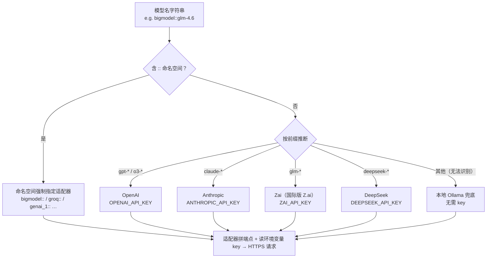

# 02 · 第一次调用

> 系列第 2 篇。前置：[01 · 项目启动](01-项目启动.md)。**本篇新增依赖：无**（01 的清单已覆盖）。
> 参考代码：`src/llm.rs`（本仓库第一个模块）+ `main.rs` 改造。

## 目标

- 发出第一次真正的 LLM 调用，看到模型回答
- 搞懂 genai 的**模型名路由**：一个字符串怎么变成"某个厂商的 HTTPS 请求"
- 封装第一个函数 `chat_once()`——它简单，但函数签名里已经藏着全系列的三要素
- 学会读 genai 的报错（以及 anyhow `context` 为什么值得加）

## 概念

### Client：一次创建，全程复用

```rust
let client = Client::new()?;
```

就这一行。它不绑定任何厂商、任何模型——`Client` 只是"一堆适配器 + HTTP 配置"的载体，
**具体调谁由每次 `exec_chat` 的模型名参数决定**。整个程序用一个 `Client` 就够，后面
agent loop 高频调用时也不用重建。

### 模型名是怎么路由的

genai 拿到模型名字符串后做两件事：有 `::` 命名空间就强制用指定适配器；否则按前缀猜，
猜不中就兜底到本地 Ollama：



对照 01 篇的 `.env`：我们用的是 `MODEL=bigmodel::glm-4.6`——命名空间强制走
**BigModel 适配器**（端点 `open.bigmodel.cn`，key 读 `BIGMODEL_API_KEY`）。如果裸写
`glm-4.6`，会被前缀规则路由到**国际版 Zai 适配器**（key 读 `ZAI_API_KEY`）——两套
端点、两套账号，这是国内用户最常踩的第一个坑。

### 消息模型一瞥

```rust
ChatRequest::new(vec![
    ChatMessage::system(system),  // 设定角色/规则，权重最高
    ChatMessage::user(user),      // 用户输入
])
```

`ChatRequest` 是**纯数据**，发出去就忘——genai 完全无状态。多轮对话的"记忆"要靠你
把历史消息一条条攒在 `ChatRequest` 里（03 篇的主题）。

## 动手

### 1. 新建 `src/llm.rs`

这是仓库的第一个模块。后面直到 05 篇，所有 LLM 相关的东西都住这里：

```rust
use anyhow::{Context, Result};
use genai::chat::{ChatMessage, ChatRequest};
use genai::Client;

/// 最小对话封装：固定 system + 一条 user 消息，返回回答文本。
/// 03 篇会演进为带历史的流式版本，但（client, model, 消息）三要素不变。
pub async fn chat_once(client: &Client, model: &str, system: &str, user: &str) -> Result<String> {
    let req = ChatRequest::new(vec![
        ChatMessage::system(system),
        ChatMessage::user(user),
    ]);

    let res = client
        .exec_chat(model, req, None)
        .await
        .with_context(|| format!("exec_chat 失败（model = {model}）"))?;

    Ok(res.first_text().unwrap_or("<无文本回答>").to_owned())
}
```

四个细节：

1. **`client` 由调用方传入**，而不是函数内部 `Client::new()`。这样 main 持有唯一
   客户端，函数保持纯粹；到 06 篇 agent loop 时，这个签名风格会自然长成依赖注入。
2. **`with_context`** 给错误附加模型名。不加的话，"401 unauthorized"你不知道是哪个
   key 错了；加了之后错误信息自带 `model = bigmodel::glm-4.6`。
3. **`first_text()` 返回 `Option<&str>`（借用！）**。想拿 `String` 必须 `.to_owned()`。
   写 `unwrap_or_else(|| "...".into())` 这种"看起来对"的代码会得到类型错误——因为
   `into()` 被推导成了 `&str` 的恒等转换（作者亲测）。
4. `unwrap_or("<无文本回答>")`——模型完全可能不回文本（比如 04 篠遇到工具调用时），
   从第一天起就别假设回答一定存在。

### 2. 改造 `main.rs`

```rust
mod llm;

use anyhow::{Context, Result};
use genai::Client;

#[tokio::main]
async fn main() -> Result<()> {
    dotenvy::dotenv().ok();
    tracing_subscriber::fmt()
        .with_env_filter(
            tracing_subscriber::EnvFilter::try_from_default_env()
                .unwrap_or_else(|_| "comfy_agent=debug".into()),
        )
        .init();

    let model = std::env::var("MODEL").unwrap_or_else(|_| "glm-4.6".into());

    let client = Client::new().context("创建 genai Client 失败")?;
    let answer = llm::chat_once(
        &client,
        &model,
        "你是一个简洁的助手，回答不超过两句话",
        "用一句话解释什么是 agent？",
    )
    .await
    .with_context(|| format!("调用模型 {model} 失败"))?;

    println!("{answer}");
    Ok(())
}
```

`mod llm;` 让编译器把 `src/llm.rs` 纳入编译。注意 `chat_once(...)` 后面的
**`.await` 必须在 `.with_context(...)` 之前**——漏写 `.await` 时你会在一个
`impl Future` 上调 `with_context`，编译器报"method not found"，新手很容易盯着
`with_context` 找原因而忽略真正的缺口（也是作者亲测）。

### 3. 可选：让 Client 走 Coding Plan 端点（ServiceTargetResolver）

> 场景：你订阅了智谱 **GLM Coding Plan**（包月套餐）。套餐走独立端点
> `https://open.bigmodel.cn/api/coding/paas/v4/`（注意中间多一段 `/coding/`），
> 而 genai 内置的 bigmodel 适配器默认指向标准端点 `.../api/paas/v4/`。
> 想让请求走套餐额度，就要改这个 Client 的请求地址。没有套餐的读者跳过本节，
> 用 `Client::new()` 完全没问题。

genai 把"**适配器**（请求/响应格式、认证）"和"**端点**（URL）"设计成两个独立概念，
改端点不用换适配器。用 `ServiceTargetResolver` 在请求发出前重写 endpoint：

```rust
use genai::resolver::{Endpoint, ServiceTargetResolver};
use genai::{Client, ServiceTarget};

let resolver = ServiceTargetResolver::from_resolver_fn(
    |mut target: ServiceTarget| -> Result<_, genai::resolver::Error> {
        target.endpoint =
            Endpoint::from_static("https://open.bigmodel.cn/api/coding/paas/v4/");
        Ok(target)
    },
);

let client = Client::builder()
    .with_service_target_resolver(resolver)
    .build()?;
```

用它替换 `main.rs` 里的 `let client = Client::new()?;`。四个要点：

1. **只改了 URL**：请求格式仍是 bigmodel 适配器那套，认证仍读 `BIGMODEL_API_KEY`。
   Base URL 写到 `/v4/` 即可，不需要追加 `chat/completions`。
2. **模型名仍要 `bigmodel::` 前缀**（如 `MODEL=bigmodel::glm-5.3-flash`）——
   裸写 `glm-5.3-flash` 会被前缀规则路由到国际版 zai 适配器，跟端点覆盖是两码事。
3. **覆盖范围是这个 Client 的所有请求**。单厂商阶段无所谓；将来多厂商并存时，
   应在闭包里按 `target.model.adapter_kind` 判断"只对 BigModel 改写"，参考官方
   `examples/c06-target-resolver.rs`。
4. **套餐条款提醒**：自写程序能否消耗 Coding Plan 额度受套餐适用范围限制。
   如果报 401/403 而你的 key 明明有效，先怀疑这个。

### 4. 跑起来

```bash
cargo run
```

预期输出类似：

```
Agent 是一个能自主感知环境、做出决策并调用工具来完成目标的软件程序。
```

想看 genai 在幕后怎么解析模型名，开 debug 日志：

```bash
RUST_LOG=comfy_agent=debug,genai=debug cargo run
```

### 5. 故意制造两个错误

错误处理是 agent 开发的日常，先主动撞两次墙：

**错误一：key 不对**。把 `.env` 里 `BIGMODEL_API_KEY` 改成乱码再跑。观察错误输出
末尾的 `model = bigmodel::glm-4.6`——这就是 `with_context` 的价值。

**错误二：模型名打错**。改成 `MODEL=glm4.6`（少了横杠）。前缀规则不认识它，路由
兜底到**本地 Ollama**——如果你没跑 Ollama，会看到连接 `127.0.0.1:11434` 失败。
这不是 bug，是路由表的设计（方便本地模型零配置）。看到"连接本地失败"先检查模型名。

## 产出与验收清单

- [ ] `cargo run` 打印出模型的中文回答
- [ ] 能向别人解释 `bigmodel::glm-4.6` 这个字符串的每个部分分别是什么
- [ ] 复现"错误二"并解释为什么报的是本地连接错误
- [ ] `src/llm.rs` 存在，`chat_once` 签名与文中一致

## 练习

1. 给 `chat_once` 加第五个参数 `temperature: f64`，内部构造
   `ChatOptions::default().with_temperature(temperature)` 传给 `exec_chat` 的第三个
   参数（现在是 `None`）。跑 0.0 和 1.5 各一次，感受差异——12 篇提示词增强会用
   低温度换稳定输出，这里先埋个手感。
2. 切一个厂商跑通：`.env` 换成 `MODEL=deepseek-chat` + `DEEPSEEK_API_KEY=…`，
   代码**一行不改**。体会"适配层"三个字的含金量。

## 下篇预告

**03 · CLI 聊天**：`exec_chat_stream` 让回答一个字一个字地打出来；用 `ChatRequest`
的 `append_message` 攒历史，做出真正能连续对话的终端 REPL——里程碑 M1。

---
*本篇参考代码已在 genai 0.7.0-rc.1 / Rust 1.98.1 下编译验证（零警告）。*
