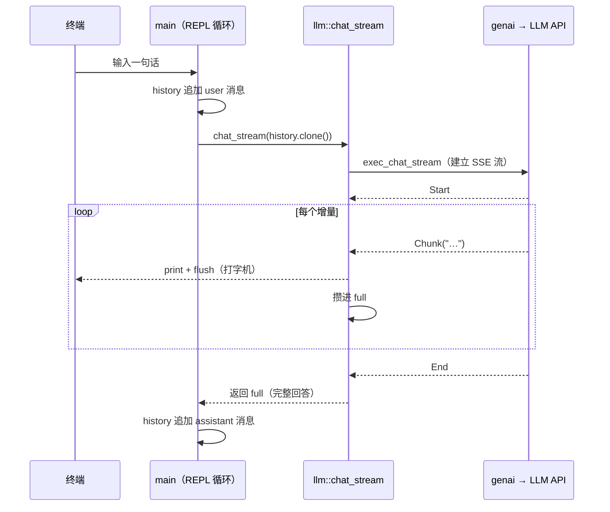

# 03 · CLI 聊天：流式输出与多轮记忆

> 系列第 3 篇。前置：[02 · 第一次调用](02-第一次调用.md)。
> **本篇新增依赖：`futures = "0.3"`**（消费流需要 `StreamExt`）。
> 里程碑：**M1** ——一个能连续对话的终端聊天程序。

## 目标

- 把"一问一答"升级成**持续对话**：模型记得你三句话前说了什么
- 用 `exec_chat_stream` 做**流式输出**——回答逐字打出，而不是憋 5 秒后一次性蹦出来
- 手动消费 `ChatStreamEvent` 事件流（不用 genai 自带的打印工具）——这是 05 篇
  "流式 × 工具调用"和 15 篇"AI SDK 协议编码器"的地基

## 概念

### 为什么 agent 的默认形态是流式

一次非流式调用，用户盯着空屏幕等全部 token 生成完；流式把**首字延迟**从"整段生成
时间"压缩到"第一个 token 时间"，体感差 5–20 倍。到 Part 3 你会看到，前端的打字机、
工具调用进度、多 step 展示，全部共享同一条事件流——所以流式处理从本篇起就是我们的
默认姿势。

### 事件流长什么样

`exec_chat_stream` 返回的不是一个完整回答，而是一个**事件流**，你逐个消费：

| 事件 | 含义 | 本篇怎么处理 |
|---|---|---|
| `Start` | 流开始 | 忽略 |
| `Chunk(chunk)` | **文本增量**（几个字） | 立刻打印 + 攒进完整回答 |
| `ToolCallChunk` | 工具调用参数的分片 | 忽略（04–05 篇主角） |
| `ReasoningChunk` | 推理模型的思考过程 | 忽略 |
| `End(end)` | 流结束（可带聚合内容） | 忽略（05 篇用它取工具调用） |
| `Heartbeat` | 厂商侧 SSE 心跳保活 | 忽略 |

一轮对话的完整流程：



### 多轮记忆的本质：history 攒在 ChatRequest 里

02 篇说过 genai **完全无状态**——所谓"模型记得上文"，是**你的程序**把历史消息
一条条累积进 `ChatRequest`，每次请求都把完整历史重发一遍。`append_message` 就是
累积的动作：

- 用户输入 → `append_message(ChatMessage::user(...))`
- 模型回答 → 流结束后 `append_message(ChatMessage::assistant(完整回答))`

这个模式将贯穿全系列（工具调用轮次也只是往里追加另两种消息），20 篇会处理
"历史太长怎么办"。

## 动手

### 1. 加依赖

```toml
futures = "0.3"
```

### 2. `llm.rs` 新增 `chat_stream`

保留 `chat_once`，在下面追加：

```rust
use futures::StreamExt;              // 文件顶部补
use genai::chat::{ChatStreamEvent};  // chat 导入列表里补上
use std::io::Write;                  // 文件顶部补

/// 流式对话：边收边打印（打字机），结束后返回完整回答供调用方写回历史。
pub async fn chat_stream(client: &Client, model: &str, req: ChatRequest) -> Result<String> {
    let mut stream = client.exec_chat_stream(model, req, None).await?;

    let mut full = String::new();
    while let Some(event) = stream.stream.next().await {
        match event? {
            ChatStreamEvent::Start => {}
            ChatStreamEvent::Chunk(chunk) => {
                print!("{}", chunk.content);
                std::io::stdout().flush()?; // 不刷新的话，终端会攒到换行才显示
                full.push_str(&chunk.content);
            }
            ChatStreamEvent::End(_) => {}
            // ToolCallChunk / ReasoningChunk / Heartbeat：04–05 篇展开
            _ => {}
        }
    }
    println!();
    Ok(full)
}
```

四个细节：

1. **`stream.stream`**：`exec_chat_stream` 返回的响应对象里，事件流在 `.stream`
   字段上，它是标准 `Stream`（所以需要 `futures::StreamExt` 的 `.next()`）。
2. **`flush()` 是打字机的关键**：stdout 默认行缓冲，`print!` 不带换行就不会真正
   上屏。漏掉它你会发现"流式"白做了——字还是一坨出来。
3. **一边打印一边攒 `full`**：打印给用户看，`full` 留给 history。两者职责不同，
   缺一个都会在后面翻车（不攒 full，模型失忆；不打印，用户失明）。
4. **`_ => {}` 兜底**：事件枚举比本篇用到的多，先用兜底过掉，04–05 篇逐个请出来。

### 3. `main.rs` 改成 REPL

整体替换（如果你做了 02 篇的 Coding Plan 端点覆盖，保留那段 `Client::builder()...`
替换下面的 `Client::new()` 即可）：

```rust
mod llm;

use anyhow::{Context, Result};
use genai::chat::{ChatMessage, ChatRequest};
use genai::Client;
use std::io::{BufRead, Write};

#[tokio::main]
async fn main() -> Result<()> {
    dotenvy::dotenv().ok();
    tracing_subscriber::fmt()
        .with_env_filter(
            tracing_subscriber::EnvFilter::try_from_default_env()
                .unwrap_or_else(|_| "comfy_agent=debug".into()),
        )
        .init();

    let model = std::env::var("MODEL").unwrap_or_else(|_| "bigmodel::glm-5.3-flash".into());
    let client = Client::new().context("创建 genai Client 失败")?;

    // 会话历史：整个 REPL 生命周期累积在这一个 ChatRequest 里
    let mut history = ChatRequest::default().with_system(
        "你是 comfy-agent，一个友好的助手。当前处于终端对话模式，回答保持简洁。",
    );

    let stdin = std::io::stdin();
    loop {
        print!("\n你> ");
        std::io::stdout().flush()?;
        let mut line = String::new();
        if stdin.lock().read_line(&mut line)? == 0 {
            break; // EOF（Windows: Ctrl+Z 再回车；类 Unix: Ctrl+D）
        }
        let input = line.trim();
        if input.is_empty() {
            continue;
        }
        if input == "exit" || input == "quit" {
            break;
        }

        history = history.append_message(ChatMessage::user(input));

        print!("AI> ");
        std::io::stdout().flush()?;
        let answer = llm::chat_stream(&client, &model, history.clone())
            .await
            .with_context(|| format!("调用模型 {model} 失败"))?;

        history = history.append_message(ChatMessage::assistant(answer));
    }

    println!("再见！");
    Ok(())
}
```

三个细节：

1. **`history.clone()` 的成本**：clone 会复制全部历史消息（深拷贝）。教学阶段消息
   少，无所谓；这正是 genai 的用法——它需要拥有请求。真正的上下文管理问题留到 20 篇。
2. **stdin 用了同步 `read_line`**，会阻塞 tokio 工作线程。单任务 REPL 无所谓；
   到 14 篇服务器上没有阻塞 stdin，这个问题自然消失，不值得现在上
   `tokio::io::stdin` 的复杂度。
3. **`read_line` 返回 0 表示 EOF**，优雅退出（Windows 是 Ctrl+Z 再回车）。

### 4. 跑起来

```bash
cargo run
```

```
你> 我叫小叶，我最喜欢赛博朋克风格
AI> 认识你很高兴，小叶！赛博朋克是个很有魅力的风格——霓虹、雨夜、高科技低生活。
你> 我刚才说我喜欢什么风格？
AI> 你刚才说你最喜欢赛博朋克风格。
你> exit
再见！
```

第二问就是验收：**模型"记得"**——因为你的程序把第一轮的问答都塞进了这次请求。

### 5. 一个预期内的警告

编译时你会看到 `function chat_once is never used`——03 篇起 REPL 只用 `chat_stream`
了。`chat_once` 已完成 02 篇的教学使命，主线不会再调用它：删掉、留着对照、或加
`#[allow(dead_code)]` 消警告，都随你。

## 产出与验收清单（里程碑 M1）

- [ ] 终端连续对话 ≥ 3 轮，第二轮能引用第一轮内容（多轮记忆生效）
- [ ] 回答是逐字流式出现的，不是整段蹦出（flush 生效）
- [ ] `exit` 或 EOF 能优雅退出
- [ ] 把 `MODEL` 换成另一家厂商（如 `deepseek-chat` + 对应 key），代码零修改仍可聊

M1 达成：**你已经有了一个最小但完整的 LLM 应用**。接下来两篇进入 agent 的分水岭——
让模型"动手"而不只是"动嘴"。

## 练习

1. 给 REPL 加 `/model glm-4.6` 命令：运行时切换模型（提示：`model` 变量改成 `let mut`，
   输入以 `/model ` 开头时解析后面的部分重新赋值）。体会"模型是运行时数据不是编译期常量"。
2. 每轮对话后打印 `history` 里累积的消息条数和总字符数，聊 10 轮观察增长速度——
   这就是 20 篇"上下文窗口管理"要解决的问题，先建立直觉。

## 下篇预告

**04 · 工具调用往返（非流式）**：定义一个 `get_weather` 工具，看模型如何"请求"调用它、
你的代码如何执行并"回填"结果、模型如何基于结果给出最终回答。一个往返跑通，agent
的原理就通了 70%。

---
*本篇参考代码已在 genai 0.7.0-rc.1 / futures 0.3 / Rust 1.98.1 下编译验证
（唯一警告为 `chat_once` 暂未使用，属预期，见 §5）。*
