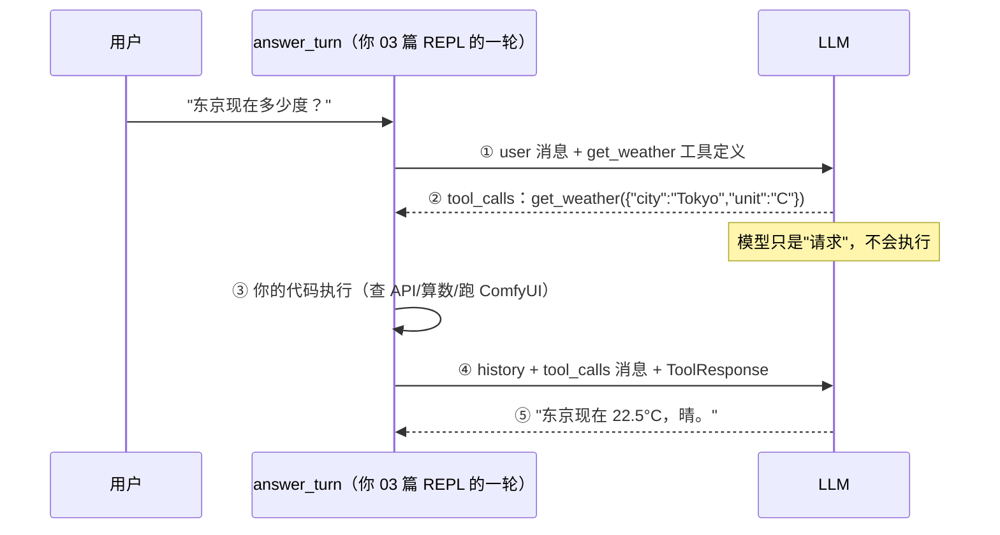

# 04 · 工具调用往返：让模型"动手"

> 系列第 4 篇。前置：[03 · CLI 聊天](03-CLI聊天.md)。
> **本篇新增依赖：`schemars = "1"`（从类型生成 JSON Schema）、`serde = { version = "1", features = ["derive"] }`**。
> 本篇**直接改造 03 篇的 REPL**：每一轮对话支持"最多一次工具往返"。代码连续演进，
> 03 篇的成果一行不丢。（另一种做法——另建 demo 文件从头搭——适合快速试验，
> 但仓库会出现两套入口，本系列不采用。）
> 打字机本篇暂别：非流式更容易看清工具往返的骨架，05 篇把它请回来。

## 目标

- 在 REPL 里**手动跑通一个完整的工具调用往返**：定义工具 → 模型请求调用 → 你执行 →
  回填结果 → 模型给最终回答
- 理解 agent 的核心分工：**模型只"点菜"，你的代码"做菜"**
- 学会**类型驱动的工具定义**：一个 struct 同时生成参数 schema 和解析模型参数（schemars + serde）

## 概念

### 模型不执行工具，它只是"点菜"

这是本系列最重要的一张图。模型从头到尾没执行过任何东西——它看到工具定义和用户问题，
**输出一段结构化的"我想调用 get_weather，参数是…"**；执行发生在你的 Rust 代码里；
执行结果回填后，模型再基于事实组织语言：



把这个往返套上循环、允许模型连续点多道菜，就是 06 篇的 agent loop；把"做菜"换成
ComfyUI 工作流，就是 11 篇的 `generate_image`。原理只此一张图。

### 类型驱动的工具定义（schemars）

工具的参数 schema 是 JSON Schema。genai 官方示例用 `json!` 手写——我们不手写：
**用 schemars 从 Rust 类型生成**，同一个 struct 再配 `serde::Deserialize` 解析模型
回传的参数。一个类型，两个用途，单一事实来源：

| Rust 写法 | 生成的 schema | 对模型的意义 |
|---|---|---|
| 字段的 doc 注释 | `"description"` | 参数怎么填的说明 |
| 非 `Option` 字段 | 列入 `"required"` | 必填 |
| `Option<T>` 字段 | 不列入 `"required"` | 可选 |
| enum | `"type":"string", "enum":[...]` | 只能从中选一 |

### 四种消息角色，history 的完整结构

一次带工具的轮次结束后，`ChatRequest` 里是四种角色（03 篇只见过前两种）：

| # | 角色 | 谁追加的 | 内容 |
|---|---|---|---|
| 1 | `user` | REPL | "东京现在多少度？" |
| 2 | `assistant`（工具调用） | `append_message(tool_calls)` | get_weather({"city":…}) |
| 3 | `tool` | `append_message(tool_response)` | 执行结果 JSON，call_id 对应 ② |
| 4 | `assistant`（文本） | `answer_turn` 收尾时 | "东京现在 22.5°C，晴。" |

## 动手

### 1. 加依赖

```toml
serde = { version = "1", features = ["derive"] }
schemars = "1"
```

### 2. 定义参数类型和工具（main.rs 顶部新增）

```rust
use schemars::JsonSchema;
use serde::Deserialize;

/// get_weather 的参数：schema 由 schemars 生成，解析也用同一个类型
#[derive(JsonSchema, Deserialize)]
struct GetWeatherArgs {
    /// 城市名，例如 Tokyo、上海
    city: String,
    /// 温度单位：C 摄氏度，F 华氏度
    unit: Unit,
}

/// Rust enum → JSON Schema 的 enum 约束
#[derive(JsonSchema, Deserialize, Debug)]
enum Unit {
    C,
    F,
}

fn weather_tool() -> Tool {
    Tool::new("get_weather")
        .with_description("获取指定城市的当前天气。用户询问天气、温度时使用。")
        .with_schema(schemars::schema_for!(GetWeatherArgs).to_value())
}
```

两个注意点：

- **`.to_value()` 不能省**：genai 的 `with_schema` 收 `serde_json::Value`，而
  `schema_for!` 返回 schemars 自己的 `Schema` 类型（作者编译验证踩到）。
- **工具级 `description` 仍要手写**：schemars 管的是参数 schema；"这个工具是干嘛的、
  什么时候该用"是模型决定"调不调"的关键依据，值得认真写。

### 3. 工具实现（假数据版）

```rust
/// 工具的真实实现。本篇用假数据；11 篇之后这里会变成 ComfyUI 调用。
/// 参数已经是强类型：args.city 是 String，args.unit 是 Unit 枚举
fn execute_get_weather(args: &GetWeatherArgs) -> Result<serde_json::Value> {
    Ok(json!({
        "city": args.city,
        "temperature": 22.5,
        "condition": "晴",
        "unit": format!("{:?}", args.unit),
    }))
}
```

### 4. 核心：`answer_turn`——把 03 的"一轮回答"升级成"一次工具往返"

03 篇 REPL 里回答一轮的代码是 `llm::chat_stream(...)` 一行；现在整轮逻辑长成
一个函数（先读懂，完整 main.rs 在下一步）：

```rust
async fn answer_turn(
    client: &Client,
    model: &str,
    mut history: ChatRequest,
) -> Result<(ChatRequest, String)> {
```

它做五件事：

**(a) 第一次调用，带"菜单"**：

```rust
    let req = history.clone().with_tools(vec![weather_tool()]);
    let res = client.exec_chat(model, req, None).await
        .with_context(|| format!("第一次调用失败（model = {model}）"))?;
```

**(b) 拿工具调用——先借后移**：

```rust
    let first_text = res.first_text().map(str::to_owned);   // 借用
    let tool_calls = res.into_tool_calls();                 // 消费（into_ 前缀 = 移动）

    if tool_calls.is_empty() {
        // 模型认为不需要工具，直接回答——这不是异常，是模型的权利
        let answer = first_text.unwrap_or_else(|| "<无回答>".into());
        history = history.append_message(ChatMessage::assistant(answer.clone()));
        return Ok((history, answer));
    }
```

想同时要文本和工具调用，**先 `first_text()`（借用）再 `into_tool_calls()`（移动）**，
顺序反了编译器直接拦你。**0.7 的好消息**：`tc.fn_arguments` 直接就是
`serde_json::Value`，不用 `from_str`（0.6 时代要，老教程会误导）。

**(c) 执行**：

```rust
    let tc = &tool_calls[0];
    println!("  [工具] {}({})", tc.fn_name, tc.fn_arguments);
    let args: GetWeatherArgs = serde_json::from_value(tc.fn_arguments.clone())
        .context("模型给的参数不符合 schema")?;
    let result = execute_get_weather(&args)?;
```

字段名拼错、类型不对、enum 非法值，全部在 `from_value` 这一行被拦截。

**(d) 回填**——两条必守的规矩：

```rust
    let tool_response = ToolResponse::new(tc.call_id.clone(), result.to_string());
    history = history
        .append_message(tool_calls)      // 整个 Vec 追加：历史必须如实反映模型说过什么
        .append_message(tool_response);  // call_id 原样回填：模型靠它配对"请求"和"结果"
```

**(e) 第二次调用，这次不带菜单**：

```rust
    let res = client.exec_chat(model, history.clone(), None).await
        .with_context(|| format!("第二次调用失败（model = {model}）"))?;
    let answer = res.first_text().unwrap_or("<无回答>").to_owned();
    history = history.append_message(ChatMessage::assistant(answer.clone()));
    Ok((history, answer))
}
```

注意两次调用的差别：第一次 `with_tools`，第二次不带——**工具是每次请求的属性**，
不带菜单模型就没法再点菜，必须用文本收尾。"只允许点一次菜"是本篇的人为限制，
放开成完整循环是 06 篇的开场。

### 5. REPL 主循环改动（对照 03 篇，只动一处）

03 篇的这两行：

```rust
let answer = llm::chat_stream(&client, &model, history.clone()).await?;
history = history.append_message(ChatMessage::assistant(answer));
```

替换为：

```rust
let (h, answer) = answer_turn(&client, &model, history).await?;
history = h;
println!("{answer}");
```

工具轮次的消息、最终回答的回填，全部由 `answer_turn` 内部完成——REPL 主循环的结构
没变。**完整 main.rs**（可直接对照你的文件）：

```rust
mod llm;

use anyhow::{Context, Result};
use genai::chat::{ChatMessage, ChatRequest, Tool, ToolResponse};
use genai::Client;
use schemars::JsonSchema;
use serde::Deserialize;
use serde_json::json;
use std::io::{BufRead, Write};

/// get_weather 的参数：schema 由 schemars 生成，解析也用同一个类型
#[derive(JsonSchema, Deserialize)]
struct GetWeatherArgs {
    /// 城市名，例如 Tokyo、上海
    city: String,
    /// 温度单位：C 摄氏度，F 华氏度
    unit: Unit,
}

#[derive(JsonSchema, Deserialize, Debug)]
enum Unit {
    C,
    F,
}

fn weather_tool() -> Tool {
    Tool::new("get_weather")
        .with_description("获取指定城市的当前天气。用户询问天气、温度时使用。")
        .with_schema(schemars::schema_for!(GetWeatherArgs).to_value())
}

/// 工具的真实实现。本篇用假数据；11 篇之后这里会变成 ComfyUI 调用。
fn execute_get_weather(args: &GetWeatherArgs) -> Result<serde_json::Value> {
    Ok(json!({
        "city": args.city,
        "temperature": 22.5,
        "condition": "晴",
        "unit": format!("{:?}", args.unit),
    }))
}

/// 回答一轮：允许最多一次工具往返（06 篇放开成完整 agent loop）。
async fn answer_turn(
    client: &Client,
    model: &str,
    mut history: ChatRequest,
) -> Result<(ChatRequest, String)> {
    let req = history.clone().with_tools(vec![weather_tool()]);
    let res = client
        .exec_chat(model, req, None)
        .await
        .with_context(|| format!("第一次调用失败（model = {model}）"))?;

    let first_text = res.first_text().map(str::to_owned);
    let tool_calls = res.into_tool_calls();

    if tool_calls.is_empty() {
        let answer = first_text.unwrap_or_else(|| "<无回答>".into());
        history = history.append_message(ChatMessage::assistant(answer.clone()));
        return Ok((history, answer));
    }

    let tc = &tool_calls[0];
    println!("  [工具] {}({})", tc.fn_name, tc.fn_arguments);
    let args: GetWeatherArgs = serde_json::from_value(tc.fn_arguments.clone())
        .context("模型给的参数不符合 schema")?;
    let result = execute_get_weather(&args)?;

    let tool_response = ToolResponse::new(tc.call_id.clone(), result.to_string());
    history = history
        .append_message(tool_calls)
        .append_message(tool_response);

    let res = client
        .exec_chat(model, history.clone(), None)
        .await
        .with_context(|| format!("第二次调用失败（model = {model}）"))?;
    let answer = res.first_text().unwrap_or("<无回答>").to_owned();
    history = history.append_message(ChatMessage::assistant(answer.clone()));
    Ok((history, answer))
}

#[tokio::main]
async fn main() -> Result<()> {
    dotenvy::dotenv().ok();
    tracing_subscriber::fmt()
        .with_env_filter(
            tracing_subscriber::EnvFilter::try_from_default_env()
                .unwrap_or_else(|_| "comfy_agent=debug".into()),
        )
        .init();

    let model = std::env::var("MODEL").unwrap_or_else(|_| "bigmodel::glm-5.3-flash".into());
    let client = Client::new().context("创建 genai Client 失败")?;

    let mut history = ChatRequest::default().with_system(
        "你是 comfy-agent，一个友好的助手。当前处于终端对话模式，回答保持简洁。",
    );

    let stdin = std::io::stdin();
    loop {
        print!("\n你> ");
        std::io::stdout().flush()?;
        let mut line = String::new();
        if stdin.lock().read_line(&mut line)? == 0 {
            break;
        }
        let input = line.trim();
        if input.is_empty() {
            continue;
        }
        if input == "exit" || input == "quit" {
            break;
        }

        history = history.append_message(ChatMessage::user(input));

        print!("AI> ");
        std::io::stdout().flush()?;
        let (h, answer) = answer_turn(&client, &model, history).await?;
        history = h;
        println!("{answer}");
    }

    println!("再见！");
    Ok(())
}
```

`llm.rs` 本篇**不动**（`chat_stream` 05 篇回归；`chat_once` 已完成 02 篇的使命，
主线不再使用。两者暂时报 unused 警告——留着、删掉或加 `#[allow(dead_code)]` 均可）。

### 6. 跑起来

```bash
cargo run
```

```
你> 东京现在多少度？用摄氏度告诉我
AI>   [工具] get_weather({"city":"Tokyo","unit":"C"})
东京现在 22.5°C，天气晴。
你> 刚才我问的是哪个城市的天气？
AI> 东京。
你> 你好
AI> 你好！有什么可以帮你的？
你> exit
```

三段各验证一件事：第一段走完整往返（看到 `[工具]` 日志）；第二段验证**工具轮次
也进了 history、多轮记忆没坏**；第三段走"不点菜直接回答"分支。

## 常见坑

- **把 tool_calls 只回填执行过的那个**：模型请求了 2 个工具你只回填 1 个，下一轮请求
  直接被服务端拒绝或模型行为错乱。全部回填，哪怕某个是错误结果。
- **工具失败 ≠ 程序崩溃**：解析失败或执行出错时，把**错误说明**作为 ToolResponse 回填
  （如 `{"error": "city 不支持"}`），模型会自己向用户解释——这是 23 篇错误处理的正确姿势。
- **doc 注释偷懒**：schemars 时代参数描述就是 doc 注释，"城市名"三个字不如
  "城市名，例如 Tokyo、上海"——模型按描述填参数，描述越具体参数越准。
- **忘了 `.to_value()`**：`schema_for!` 返回的是 `Schema` 不是 `Value`，直接传会
  E0308 类型错误。

## 产出与验收清单

- [ ] 问天气：看到 `[工具]` 日志，走完整往返
- [ ] 问"你好"：走 empty 分支，无 `[工具]` 日志
- [ ] 工具轮之后继续追问（"刚才我问的哪个城市"），记忆仍然生效
- [ ] 打印过一次 `schema_for!(GetWeatherArgs).to_value()`，亲眼确认 doc 注释变成了
      `description`、`Unit` 变成了 `enum`
- [ ] 不看文章能说出 history 四条消息的角色和顺序

## 练习

1. 加第二个工具 `get_time`：参数类型只放一个 `/// 时区，如 Asia/Tokyo；不填默认本地时间`
   的 `timezone: Option<String>`（体验 `Option` → 非必填）。问"东京几点了？"看模型
   怎么选——**多工具选择**是 18 篇"工具选择准确率"指标的最小原型。
2. 在 `execute_get_weather` 里对某个城市返回 `{"error": "该城市暂不支持查询"}`，看模型
   如何向用户转述失败。工具失败不等于程序崩溃，这是 agent 韧性的起点。

## 下篇预告

**05 · 流式 × 工具调用**：把打字机请回来——`with_capture_tool_calls` 让工具调用在
流式模式下也能拿到完整聚合结果，为 06 篇的 agent loop 铺平最后一块砖。

---
*本篇参考代码已在 genai 0.7.0-rc.1 / schemars 1 / Rust 1.98.1 下编译验证
（仅 2 个预期 unused 警告：`chat_once`、`chat_stream` 待后续篇目回归）。*
