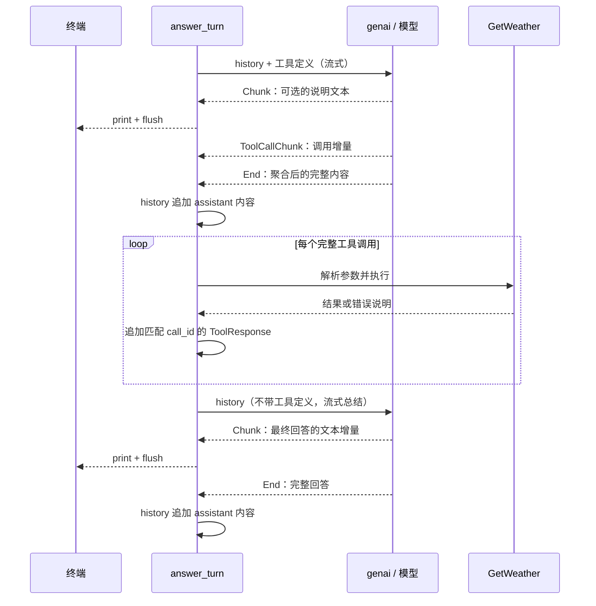

# 05 · 流式 × 工具调用：把打字机请回来

> 系列第 5 篇。前置：[04 · 工具调用往返](04-工具调用往返.md)。
> **本篇不新增依赖**，沿用 genai `0.7.0-rc.1`、futures `0.3`、serde `1`、schemars `1`。
> 以你已完成的第 04 步为起点：`GetWeather` 在 `src/tools.rs`，`answer_turn` 在
> `src/llm.rs`。本文提供参考实现，仓库的 `src/` 留给你自己动手演进。

## 目标

- 普通回答与工具结果的总结都能实时打印，不必等整段生成完。
- 用 `ChatOptions` 开启工具调用捕获，在 `End` 时取得完整参数。
- 一次模型响应里的所有工具调用都有对应结果，并保留完整历史。

本篇仍然只允许**一次工具往返**。同一响应可以要求查两个城市，但查完结果再决定
调用另一个工具，是 06 篇的 agent loop；两个层次不要混淆。

## 概念

### 1. 流式改变的是接收方式

04 篇的 `exec_chat` 一次返回完整响应；现在换成 `exec_chat_stream`，边接收边展示。
模型决定调用、Rust 执行、结果回填这三个动作的顺序没有变：



不需要工具时，第一条流就直接给出答案，后面的执行和总结全部跳过。

### 2. Chunk 用来展示，End 用来交接

| 事件或选项 | 本篇用途 |
|---|---|
| `Chunk(chunk)` | 收到文本就打印，`flush` 保证及时显示 |
| `ToolCallChunk(_)` | 本篇不执行、不自行拼接，让 genai 聚合 |
| `End(end)` | 本次模型响应完成，取回完整内容 |
| `with_capture_content(true)` | 捕获文本，供历史消息使用 |
| `with_capture_tool_calls(true)` | 捕获工具调用，供完整参数解析与执行使用 |

工具参数可能分多次到达。收到一段参数增量，不能假定 JSON 已经完整；提前执行还
可能把同一个调用执行多次。本篇把 **End 当作交接点**，执行时机明确，也不用手写
字符串拼接、调用编号分组等逻辑。

这里有一个版本细节：genai `0.7.0-rc.1` 的 `StreamEnd` **没有公开的
`captured_tool_calls` 字段**。它有 `captured_content: Option<MessageContent>`，以及
`captured_tool_calls()`、`captured_into_tool_calls()` 两个方法。旧示例中的字段访问
写法不能照搬。本文以本机锁定版本的源码和编译结果为准；也可阅读
[上游实现](https://github.com/jeremychone/rust-genai/blob/main/src/chat/chat_stream.rs)，
但主分支可能继续演进。

我们直接取 `captured_content`：它同时容纳文本和工具调用，回填为一条 assistant
消息。这样模型说“我查一下东京天气”后又请求工具时，这段说明也保留在历史中。

### 3. End 只代表这次模型响应结束

一次用户提问可能需要两条流：第一条让模型决策，第二条让模型结合工具结果总结。
第一条流出现 `End`，不代表整个用户回合已经结束；还要检查有没有工具调用。

另一方面，流耗尽却没有收到 `End`，也不能当作成功。本篇显式报错，避免把半截
参数交给工具。网络中断的恢复与重试留到 23 篇；本篇遇到流错误会退出 REPL。

## 动手

### 1. 先核对你第 04 步的文件

本文沿用仓库现在的结构：

- `src/tools.rs`：已有 `GetWeather::tool()` 与 `GetWeather::run()`，保持原样。
- `src/lib.rs`：已导出 `llm` 和 `tools`，保持原样。
- `src/llm.rs`：新增 `stream_response`，替换 `answer_turn`。
- `src/main.rs`：继续调用 `answer_turn`，去掉重复打印答案的那一行。

天气仍是固定假数据，不会访问真实天气服务，也没有实际温度换算。
本篇验证的是工具调用协议。

### 2. 新增一个“消费一次流”的函数

先不急着改工具往返，在 `llm.rs` 想清楚这个函数的责任：

```rust
async fn stream_response(
    client: &Client,
    model: &str,
    req: ChatRequest,
) -> anyhow::Result<MessageContent>
```

它只负责一次模型请求：开启捕获 → 消费事件 → 实时打印文本 → 返回完整内容。
它不执行工具、不修改历史，也不知道这是第一条流还是总结流。

关键配置放在调用的第三个参数：

```rust
let options = ChatOptions::default()
    .with_capture_content(true)
    .with_capture_tool_calls(true);
let mut response = client.exec_chat_stream(model, req, Some(&options)).await?;
```

`Chunk` 到来时打印；`End` 到来时返回 `end.captured_content`。别再把 End 的文本
打印一次，否则用户会看到整段回答重复出现。

### 3. 改造 answer_turn

原来的第一次 `exec_chat` 改为：

```rust
let req = history.clone().with_tools(vec![GetWeather::tool()]);
let content = stream_response(client, model, req).await?;
let answer = content.texts().join("");
let tool_calls = content.tool_calls();
```

`tool_calls()` 返回借用，参数已经是 `serde_json::Value`。没有调用时，保存整条
assistant 内容并返回；有调用时，按顺序执行**每一个**，收集 `ToolResponse`。

这同时补齐你第 04 步的一个边界：以前只执行 `tool_calls.first()`，却把全部调用
写进历史。如果一次要求查两个城市，就可能缺一个结果。现在每个 `call_id` 都配对
一条结果；解析失败、未知工具等也回填错误 JSON，让模型能向用户说明。

最后再发起一次流式请求，但明确清空工具定义：

```rust
let req = history.clone().with_tools(Vec::<genai::chat::Tool>::new());
let content = stream_response(client, model, req).await?;
```

这里写出 `Tool` 类型，是因为 `with_tools` 接受泛型迭代器，空 `vec![]` 没有元素
可供编译器推断类型。显式创建 `Vec<Tool>` 才能编译通过。

这是本篇控制“最多一次往返”的办法，不是通用 agent 循环。06 篇会在每次请求中
继续提供工具，并用终止条件决定何时结束。

### 4. 完整 src/llm.rs 参考实现

可先自己写，再对照这里。前两篇的 `chat_once`、`chat_stream` 保留用于回顾；
当前 REPL 走下面的 `answer_turn`。

```rust
use std::io::Write;

use anyhow::{Context, bail};
use futures::StreamExt;
use genai::{
    Client,
    chat::{ChatMessage, ChatOptions, ChatRequest, ChatStreamEvent, MessageContent, ToolResponse},
};

use crate::tools::GetWeather;

pub async fn chat_once(
    client: &Client,
    model: &str,
    system: &str,
    prompt: &str,
) -> anyhow::Result<String> {
    let request = ChatRequest::from_user(prompt).with_system(system);
    let res = client
        .exec_chat(model, request, None)
        .await
        .with_context(|| format!("exec_chat 失败（model = {model}）"))?;
    Ok(res.first_text().unwrap_or("<无文本回答>").to_owned())
}

pub async fn chat_stream(client: &Client, model: &str, req: ChatRequest) -> anyhow::Result<String> {
    let mut response = client.exec_chat_stream(model, req, None).await?;
    let mut full = String::new();
    while let Some(event) = response.stream.next().await {
        if let ChatStreamEvent::Chunk(chunk) = event? {
            print!("{}", chunk.content);
            std::io::stdout().flush()?;
            full.push_str(&chunk.content);
        }
    }
    println!();
    Ok(full)
}

/// 消费一次完整响应：打印增量，返回聚合内容。
async fn stream_response(
    client: &Client,
    model: &str,
    req: ChatRequest,
) -> anyhow::Result<MessageContent> {
    let options = ChatOptions::default()
        .with_capture_content(true)
        .with_capture_tool_calls(true);
    let mut response = client
        .exec_chat_stream(model, req, Some(&options))
        .await
        .with_context(|| format!("创建流失败（model = {model}）"))?;

    while let Some(event) = response.stream.next().await {
        match event.context("读取流事件失败")? {
            ChatStreamEvent::Chunk(chunk) => {
                print!("{}", chunk.content);
                std::io::stdout().flush()?;
            }
            ChatStreamEvent::End(end) => {
                println!();
                return end.captured_content.context("流结束，但未捕获到内容");
            }
            // 工具增量交给 genai 聚合；本篇不展示推理、签名和心跳。
            _ => {}
        }
    }
    bail!("流提前结束，未收到 End；本次响应不执行工具")
}

/// 回答一个用户回合，最多一次工具往返，两次模型响应均使用流式。
pub async fn answer_turn(
    client: &Client,
    model: &str,
    mut history: ChatRequest,
) -> anyhow::Result<(ChatRequest, String)> {
    let req = history.clone().with_tools(vec![GetWeather::tool()]);
    let content = stream_response(client, model, req).await?;
    let answer = content.texts().join("");
    let tool_calls = content.tool_calls();

    if tool_calls.is_empty() {
        history = history.append_message(ChatMessage::assistant(content));
        return Ok((history, answer));
    }

    let mut responses = Vec::new();
    for tc in tool_calls {
        println!("  [工具] {}({})", tc.fn_name, tc.fn_arguments);
        let result: anyhow::Result<serde_json::Value> = (|| {
            if tc.fn_name != "get_weather" {
                bail!("未知工具：{}", tc.fn_name);
            }
            let args: GetWeather = serde_json::from_value(tc.fn_arguments.clone())
                .context("模型给的天气参数不符合 schema")?;
            args.run()
        })();
        let value = match result {
            Ok(value) => value,
            Err(error) => serde_json::json!({ "error": format!("{error:#}") }),
        };
        responses.push(ToolResponse::new(tc.call_id.clone(), value.to_string()));
    }

    // 先记录模型整条消息（含可选的说明文本），再记录所有工具结果。
    history = history.append_message(ChatMessage::assistant(content));
    for response in responses {
        history = history.append_message(response);
    }

    let req = history.clone().with_tools(Vec::<genai::chat::Tool>::new());
    let content = stream_response(client, model, req).await?;
    if !content.tool_calls().is_empty() {
        bail!("总结阶段仍返回了工具调用；本篇仅支持一次工具往返");
    }
    let answer = content.texts().join("");
    history = history.append_message(ChatMessage::assistant(content));
    Ok((history, answer))
}
```

借用与移动顺序再看一遍：`content.tool_calls()` 借出调用 → 循环收集拥有所有权的
结果 → 借用不再使用 → `ChatMessage::assistant(content)` 移动整条内容。
Rust 的非词法生命周期允许这种写法，不需要克隆整段历史之外的每个响应。

### 5. main.rs 的增量修改

顶部只导入当前用到的函数：

```diff
-use comfy_agent::llm::{answer_turn, chat_once, chat_stream};
+use comfy_agent::llm::answer_turn;
```

回合末尾去掉二次打印；返回值仍保留给后续观测或 UI 使用：

```diff
-let (h, answer) = answer_turn(&client, &model, history).await?;
+let (h, _answer) = answer_turn(&client, &model, history).await?;
 history = h;
-println!("{answer}");
```

REPL 里的 `print!("AI> ")` 和 `flush` 保留。客户端构造、模型名、API Key 与接口地址
继续沿用你第 04 步能运行的配置，不要换回旧示例里的 `Client::new()`。
自定义地址只决定请求发到哪里，套餐是否适用仍以服务商的规则为准。

### 6. 编译，再手动验收

```powershell
cargo check --locked
cargo run
```

依次输入下面三种问题。示例内容是预期形态，工具是否调用由模型决定，措辞可能不同：

```text
你> 你好，用两句话介绍你自己
AI> 你好！我是 comfy-agent，可以和你聊天并按需调用工具……

你> 请调用天气工具查询东京的天气，用摄氏度告诉我
AI>
  [工具] get_weather({"city":"Tokyo","unit":"C"})
东京现在 22.5°C，天气晴。

你> 刚才查的是哪个城市？
AI> 刚才查的是东京。
```

观察的是**生成过程中有文字陆续出现**，不是每个字符都有一个事件。缓存、网络缓冲
和短回答可能让打字机效果不明显；可以让模型详细解释天气结果来观察。

再试“分别查询东京和上海的天气，都用摄氏度”。如果这次响应返回两个调用，应该
看到两条工具日志；模型也可能只返回一个，不应把自然语言提示当作数量保证。

## 常见坑

- **End 里拿不到调用**：检查第三个参数是否传了 `Some(&options)`，以及是否开启
  `with_capture_tool_calls(true)`。End 是聚合入口，不会替你自动开启捕获。
- **把参数增量当完整参数**：不要在 `ToolCallChunk` 里直接执行工具；等 End。
- **文本重复出现**：增量已经打印，main 再 `println!(answer)` 就会重复。
- **总结流没有工具调用，却仍只忽略 End**：历史需要完整内容；两条流都用同一个
  捕获函数，避免一个阶段记录、另一个阶段漏记。
- **只回填一个结果**：每个调用都要匹配自己的 `call_id`，错误也是一个结果。
- **看到工具日志就以为是真实天气**：`GetWeather::run()` 目前只返回固定假数据。

## 产出与验收清单

- [ ] 普通对话和工具后的总结都使用流式，答案没有打印两遍。
- [ ] 能指出 `Chunk` 的展示职责和 `End` 的交接职责。
- [ ] 工具调用发生在收到 End 之后，参数用 `from_value` 解析。
- [ ] 工具回合后继续追问，上下文仍然完整。
- [ ] 同一响应有多个调用时，逐个执行或回填错误，call_id 一一配对。
- [ ] 能解释“同一响应多个调用”和“连续多轮工具决策”的区别。

## 练习

1. 给 `options` 加上 `.with_capture_usage(true)`，在 End 分支用 `tracing::debug!`
   打印 `end.captured_usage`。观察两次模型请求各有自己的统计；厂商可能不返回用量，
   所以字段仍是 Option，不要直接 unwrap。
2. 在 `GetWeather::run()` 中让某个城市返回 `anyhow::bail!("暂不支持这个城市")`，
   观察错误如何成为 ToolResponse，再由模型解释给用户。不要把这个错误伪装成天气。

## 下篇预告

**06 · Agent Loop**：保留每次请求的工具定义，让模型看到结果后还能继续请求工具。
把本篇固定的“两次请求”改成循环，加上步数上限、终止条件和失败路径，形成
`run_agent()`。你已经写好的流式消费函数和工具结果回填都能继续复用。

---
本篇完整 `llm.rs` 和 `main.rs` 增量在临时项目中通过 `cargo check --locked --offline`
与 `cargo build --locked --offline`。本地模拟 OpenAI 兼容 SSE 接口验证了：文本与参数
分片、同一响应两个调用、非法参数的错误回填、混合文本与调用的历史保存、追问历史、
答案不重复打印。验证未调用真实模型；在线对话与厂商兼容性仍需按上面的步骤手动验收。
