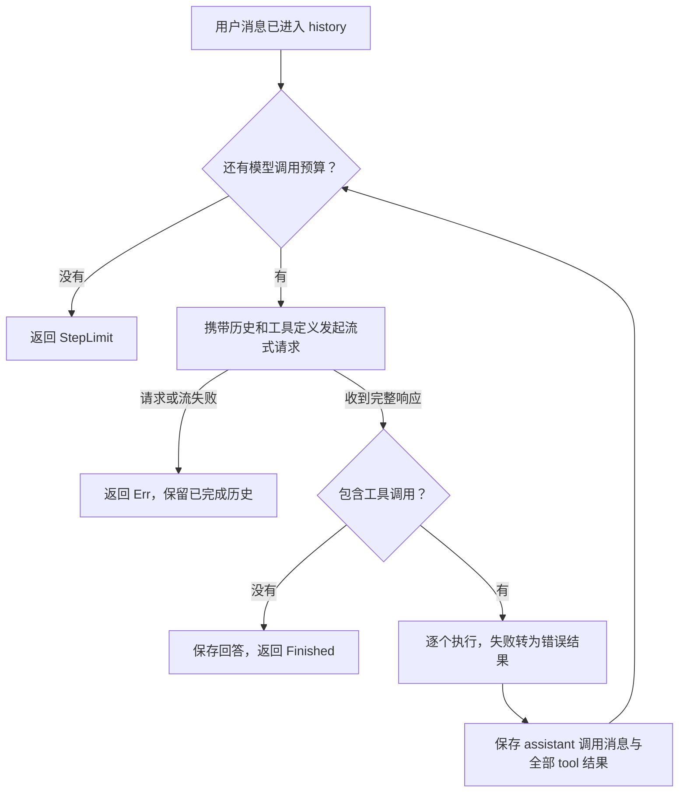

# 06 · Agent Loop：让模型根据结果继续行动

> 系列第 6 篇。前置：[05 · 流式工具调用](05-流式工具调用.md)。
> **本篇不新增依赖**：genai `0.7.0-rc.1`、futures `0.3`、serde `1`、schemars `1`。
> 里程碑 **M2**：一个具有连续工具决策能力、能明确停止的最小 agent。
> 本文以你第 05 步的代码为起点。参考代码在文中，仓库 `src/` 留给你动手实现。

## 目标

- 把固定的一次工具往返改为循环：模型可以看完结果，再决定下一步。
- 区分正常完成、步数耗尽和请求失败，避免把“停止”误报成“完成”。
- 无论工具成功还是失败，保持工具调用与结果一一对应。
- 把循环放进 `src/agent/mod.rs`，让 REPL 只负责输入和展示。

## 概念

### 1. 循环的核心是再次决策

第 05 篇有两次固定请求：第一次带工具，第二次清空工具，只让模型总结。
第 06 篇的变化很小：**每次请求都提供工具，并把上一次结果放进历史**。

模型看到结果后，既可以再请求工具，也可以直接回答。你的程序负责接收响应、执行
工具、记录结果、检查停止条件。循环控制权在代码里，下一步行动的选择权在模型。



例如“先查东京天气，如果温度超过 20°C，再查上海，否则查北京”：

1. 模型请求东京天气。
2. Rust 执行，返回假数据 22.5°C。
3. 模型看到这个结果，决定请求上海天气。
4. Rust 执行，再回填结果。
5. 模型不再请求工具，给出回答。

这是三次模型响应、两轮工具决策。第 05 篇一次响应里查两个城市，只算**一轮决策**。
自然语言提示不保证模型严格采用这条轨迹，验收时要看实际工具日志。

### 2. 一步到底是什么？先规定计数单位

本篇 `max_steps` 指**一次用户回合允许的最大模型请求次数**，最终回答也占一次。

| 轨迹 | 消耗的步数 |
|---|---|
| 模型直接回答 | 1 |
| 模型请求两个工具 → 一次执行完 → 模型总结 | 2 |
| 查东京 → 再查上海 → 最终回答 | 3 |

设为 6 时，最多发起 6 次模型请求。第 6 次若直接回答，仍是正常完成；若继续请求
工具，本篇执行并回填这批结果，然后返回 `StepLimit`，不会偷偷多请求一次总结。

这个限制防止模型无限请求，却不限制总 token、工具数量或执行时长。
真正的超时、取消和工具执行预算留到后续工程化章节。

### 3. 三种退出情况不能混在一起

| 返回结果 | 含义 | REPL 怎么处理 |
|---|---|---|
| `Ok(Finished { .. })` | 收到非空文本，且响应没有工具调用 | 回答已流式打印，等待下一条输入 |
| `Ok(StepLimit { .. })` | 本回合模型请求预算耗尽 | 显示停止提示，保留历史 |
| `Err(error)` | 无效配置、模型请求失败、流中断或空响应 | 显示错误，保留已完成历史 |

`Finished` 只表示循环按规则结束，不证明模型已正确完成任务。质量和工具选择的
验证会在评测章节展开。

工具的参数解析错误、未知工具、执行失败，和模型请求失败也不同：前者可以作为
`{"error":"..."}` 回填，让模型修正参数或解释失败；后者没有完整响应可供继续执行。

### 4. 为什么改为借用 history？

第 05 篇的函数取得 history 所有权，成功时再返回。如果中途失败，调用方拿不到
已经记录的历史。现在改为：

```rust
pub async fn run_agent(
    client: &Client,
    model: &str,
    history: &mut ChatRequest,
    max_steps: usize,
) -> anyhow::Result<AgentOutcome>
```

history 仍由 REPL 持有。循环每处理完一个响应，就把完整消息记录进去；下一次请求
失败也不会丢失上一步的工具结果。未收到 End 的响应不写入历史、不执行工具。

这不是数据库事务，也不会撤销已执行工具的副作用。本篇只有返回假数据的天气工具；
将来提交 ComfyUI 任务时，重试与幂等需要单独设计。

## 动手

### 1. 复用第 05 篇的流式消费函数

`src/llm.rs` 的 `stream_response` 已经完成：打印 Chunk、等待 End、返回完整
`MessageContent`。循环直接复用它，只需把可见性改为：

```diff
-async fn stream_response(
+pub(crate) async fn stream_response(
```

`pub(crate)` 表示同一 crate 内的其他模块可调用，无需把这个辅助函数公开给外部。
保留 `chat_once`、`chat_stream`、`answer_turn` 作为前几篇的学习记录；REPL 从本篇
开始改用 `run_agent`。`src/tools.rs` 保持原样，天气依旧是固定假数据。

### 2. 创建 agent 模块并导出

新建 `src/agent/mod.rs`。在 `src/lib.rs` 增加一行，完整文件为：

```rust
pub mod agent;
pub mod llm;
pub mod tools;
```

先只用一个 `mod.rs`，不急着抽象工具 trait。07 篇再把工具选择逻辑换成注册表。

### 3. 完整 src/agent/mod.rs

先读循环中的三处动作：每次都 `with_tools`；没有调用则返回；有调用则回填后继续。
其余代码是给边界行为一个明确的名字。

```rust
use anyhow::{Context, bail};
use genai::{
    Client,
    chat::{ChatMessage, ChatRequest, ToolCall, ToolResponse},
};

use crate::{llm::stream_response, tools::GetWeather};

#[derive(Debug)]
pub enum AgentOutcome {
    Finished { answer: String, steps: usize },
    StepLimit { steps: usize },
}

/// 目前只有天气工具。07 篇把这个 match 换成工具注册表。
fn execute_tool(tc: &ToolCall) -> anyhow::Result<serde_json::Value> {
    match tc.fn_name.as_str() {
        "get_weather" => {
            let args: GetWeather = serde_json::from_value(tc.fn_arguments.clone())
                .context("天气工具参数不符合 schema")?;
            args.run()
        }
        name => bail!("未知工具：{name}"),
    }
}

/// 用户消息已由调用方追加。每一步 = 一次模型请求。
pub async fn run_agent(
    client: &Client,
    model: &str,
    history: &mut ChatRequest,
    max_steps: usize,
) -> anyhow::Result<AgentOutcome> {
    if max_steps == 0 {
        bail!("max_steps 必须大于 0");
    }

    for step in 1..=max_steps {
        println!("  [步骤 {step}/{max_steps}]");
        // 每次都提供工具，让模型根据已经回填的结果继续决策。
        let req = history.clone().with_tools(vec![GetWeather::tool()]);
        let content = stream_response(client, model, req)
            .await
            .with_context(|| format!("第 {step} 步模型响应失败"))?;
        let tool_calls = content.tool_calls();

        if tool_calls.is_empty() {
            let answer = content.texts().join("");
            if answer.trim().is_empty() {
                bail!("第 {step} 步没有工具调用，也没有可用文本回答");
            }
            history.messages.push(ChatMessage::assistant(content));
            return Ok(AgentOutcome::Finished { answer, steps: step });
        }

        let mut responses = Vec::new();
        for tc in tool_calls {
            println!("  [工具] {}({})", tc.fn_name, tc.fn_arguments);
            let value = match execute_tool(tc) {
                Ok(value) => value,
                Err(error) => serde_json::json!({ "error": format!("{error:#}") }),
            };
            responses.push(ToolResponse::new(tc.call_id.clone(), value.to_string()));
        }

        // 保留完整 assistant 内容，不能只保存它的文本。
        history.messages.push(ChatMessage::assistant(content));
        for response in responses {
            history.messages.push(ChatMessage::from(response));
        }
        // 不再清空工具并强制总结，下一次迭代让模型自己决定。
    }

    Ok(AgentOutcome::StepLimit { steps: max_steps })
}
```

这里为什么直接 `history.messages.push(...)`？因为 `ChatRequest.messages` 是公开的
`Vec<ChatMessage>`，而 `append_message` 取得整个请求的所有权。对于 `&mut ChatRequest`，
直接 push 更自然，也不需要每追加一条消息就克隆整个历史。

先收集结果，再移动 `content`，仍是第 05 篇的借用处理：`content.tool_calls()`
返回引用。也可以先复制调用、保存 assistant 消息，然后执行一条追加一条。
协议只要求 assistant 调用消息在前、对应的 tool 结果在后；下一次模型请求前必须配齐。

### 4. REPL 的增量修改

替换导入：

```diff
-use comfy_agent::llm::answer_turn;
+use comfy_agent::agent::{AgentOutcome, run_agent};
```

原来的 `let (h, _) = answer_turn(...); history = h;` 替换成下面的 match。
**不要在 Finished 分支再次打印 answer**，它已经在流消费时展示过。

完整 `src/main.rs` 参考如下，客户端构造沿用你现有配置：

```rust
use std::io::{BufRead, Write};

use anyhow::Result;
use comfy_agent::agent::{AgentOutcome, run_agent};
use genai::{
    Client,
    chat::{ChatMessage, ChatRequest},
    resolver::{Endpoint, ServiceTargetResolver},
};

#[tokio::main]
async fn main() -> Result<()> {
    dotenvy::dotenv().ok();
    tracing_subscriber::fmt()
        .with_env_filter(
            tracing_subscriber::EnvFilter::try_from_default_env()
                .unwrap_or_else(|_| "comfy_agent=debug".into()),
        )
        .init();

    let model = std::env::var("MODEL").unwrap_or_else(|_| "bigmodel::glm-5.3-flash".into());
    let resolver = ServiceTargetResolver::from_resolver_fn(|mut target: genai::ServiceTarget| {
        target.endpoint = Endpoint::from_static("https://open.bigmodel.cn/api/coding/paas/v4/");
        Ok(target)
    });
    let client = Client::builder()
        .with_service_target_resolver(resolver)
        .build()?;

    let mut history = ChatRequest::default().with_system(
        "你是 comfy-agent。按需调用工具，根据工具结果继续行动，获得足够信息后回答。\
         天气工具返回的是演示假数据，请说明这一点。回答保持简洁。",
    );
    let stdin = std::io::stdin();
    loop {
        print!("\n你> ");
        std::io::stdout().flush()?;
        let mut line = String::new();
        if stdin.lock().read_line(&mut line)? == 0 {
            break;
        }
        let input = line.trim();
        if input.is_empty() {
            continue;
        }
        if input == "exit" || input == "quit" {
            break;
        }

        history = history.append_message(ChatMessage::user(input));
        println!("AI>");
        match run_agent(&client, &model, &mut history, 6).await {
            Ok(AgentOutcome::Finished { steps, .. }) => {
                tracing::debug!(steps, "本回合完成");
            }
            Ok(AgentOutcome::StepLimit { steps }) => {
                println!("[停止] 已用完 {steps} 次模型请求，尚未获得最终回答。");
            }
            Err(error) => {
                eprintln!("[错误] {error:#}");
            }
        }
    }
    println!("\nBye!");
    Ok(())
}
```

这份代码保留现有的自定义地址。请使用你已验证可用的模型、密钥和服务配置；
接口地址能自定义，不意味着服务商的套餐一定覆盖自写程序。

异常分支不会用 `?` 退出整个 REPL，方便查看已完成历史并继续输入。
不过它没有自动重试失败的请求，也没有把半截输出写入历史。用户追问时，模型只能
看到已成功记录的响应。这种边界要明确，不能把“继续运行”当成“自动恢复”。

### 5. 编译与手动验证

```powershell
cargo check --locked
cargo run
```

先走最短路径：输入“你好”。应只有一个步骤，模型直接回答，无工具日志。

再输入“调用天气工具查询东京，用摄氏度告诉我”。通常出现一次工具调用，下一步总结。
这证明第 05 篇的行为没有丢失。

最后测试连续决策：

```text
你> 先调用工具查东京的摄氏温度。拿到结果之后，如果超过20度，再查上海，否则查北京。最后说明查询过程和结果。
AI>
  [步骤 1/6]
  [工具] get_weather({"city":"Tokyo","unit":"C"})
  [步骤 2/6]
  [工具] get_weather({"city":"Shanghai","unit":"C"})
  [步骤 3/6]
东京的演示温度为22.5°C，因此继续查询了上海……
```

这是预期轨迹示例，不是实测结果或模型行为保证。检查第二次请求是否发生在第一次
结果回填之后；如果第一步就请求两个城市，只证明了批量调用，没有证明连续决策。

然后追问“刚才为什么查上海？”检查工具历史与回答仍然保留。

## 边界实验

### 步数上限

临时把 REPL 的 `max_steps` 改为 1，再明确要求调用天气工具。
如果模型第一步请求工具，会执行并回填，然后提示预算耗尽；不会生成第二步总结。
若模型第一步直接回答，则仍正常完成。验收的是控制流，不能只看最终提示。

### 参数失败与修正

让工具对某个城市返回 `anyhow::bail!("暂不支持查询")`，看错误如何回填。
模型可能解释失败，也可能换参数再尝试，两种路径都允许。若它不断重试，步数上限
应使本回合停止。不要为了触发实验而反复调用真实付费服务。

### 请求失败

暂时使用本地不可达接口地址，检查错误提示包含“第 1 步模型响应失败”，且 REPL
仍能接受下一条输入。测试后恢复原来的配置。

## 常见坑

- **仍有第二次请求清空工具的代码**：那还是固定工具往返，模型无法连续行动。
- **有说明文本就提前返回**：工具调用和说明文本可以同时存在，优先检查工具调用。
- **把工具个数当步数**：一次响应包含三个调用，本篇只消耗一次模型请求预算。
- **达到上限后再请求一次总结**：会超过你声明的预算，本篇直接返回 StepLimit。
- **只保存 `answer`**：必须保存完整 assistant 内容，否则后面的 tool 结果找不到调用记录。
- **工具失败直接 `?`**：会跳过结果回填，本篇把可描述的工具错误转换为 JSON。
- **把 StepLimit 当作完成**：状态应该显示“停止且未获得最终回答”，不能输出成功提示。

## 产出与验收清单（M2）

- [ ] REPL 调用 `run_agent`，循环代码放在 agent 模块。
- [ ] 直接回答、一次工具往返、连续工具决策都能运行。
- [ ] 同一响应的多个调用都有匹配 call_id 的结果。
- [ ] 工具失败会回填错误，模型可以继续决策。
- [ ] 每次模型请求都带工具定义，说明文本不会导致过早结束。
- [ ] 明确区分 Finished、StepLimit、Err，最终回答不重复打印。
- [ ] 步数上限严格按模型请求次数计数，max_steps 为 0 时不会发请求。
- [ ] 请求失败仍保留此前完整的 assistant/tool 消息。

## 练习

1. 在 `AgentOutcome` 中增加 `tool_calls: usize` 统计字段。比较“三个工具一次调用”
   和“三次模型响应各调用一个工具”的统计，验证你理解了计数边界。
2. 临时让工具返回一条可修正的参数错误，观察模型是否换参数。如果没有修正，也
   记录它的行为；agent 能循环不代表它一定会选择正确行动。

## 下篇预告

**07 · 工具注册表**：本篇把 `get_weather` 写死在工具定义与 execute_tool 中。
下一篇用 `AgentTool` trait 和注册表统一名称、描述、schema、执行逻辑，新增工具时
不必修改循环。循环负责调度，工具负责能力，分工从这里开始稳定下来。

---
参考模块、完整 main.rs 和第 05 篇流式函数的可见性改动已在临时项目中通过
`cargo check --locked --offline`。离线驱动程序通过 `cargo build --locked --offline`，
本地模拟 SSE 接口验证了七种场景：直接回答、连续两轮工具决策、同一响应多个调用
及参数/未知工具错误回填、严格的步数上限、第二步请求失败后保留历史、零步数配置
不发请求、空响应报错。测试没有使用真实密钥或调用外部模型；在线行为仍需手动验收。
