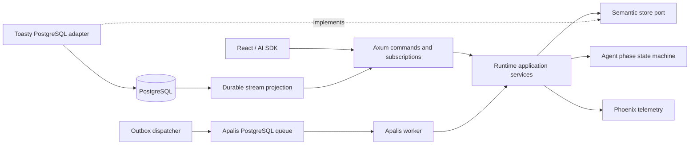
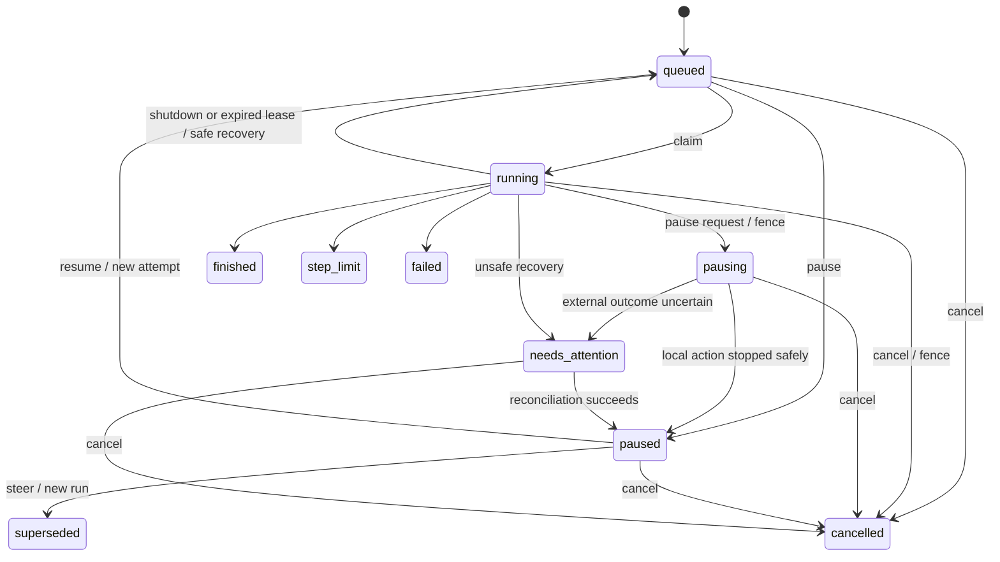

# Design

## Context

动机与范围见 proposal.md。目前 `agent.rs` 的模型决策、工具响应和步数计数都在一次 future 内；多个工具全部完成后才回填历史。`server/stream.rs` 用同步回调连接有界 SSE 队列，消费者关闭或队列满会取消 Agent。消息 ID 在连接创建时生成。前端依赖本地 `useChat` 历史和 `stop()`；评测超时也只中断 HTTP。这些机制不能直接作为持久化检查点和任务控制。

已有工具接口没有副作用恢复声明，模型响应还可能包含提供商专用信息。只保存 UIMessage 或增加一张聊天表无法可靠恢复执行。

## Goals / Non-Goals

**Goals:** 以一个共享执行核心支持现有简单入口和持久化执行；使持久化事务成为推进阶段的边界；让 HTTP、队列、ORM 和 UI 编码成为可替换适配器。首版 API 与 worker 在同一进程启动，但正确性依赖数据库执行权，可测试两个 worker 的竞争。

**Non-Goals:** 不引入通用工作流引擎、通用 CRUD 仓库、任意历史编辑或完整事件溯源；不把 Phoenix 当作执行数据库；不承诺恢复同一次模型网络流或撤销外部动作。首版只保留分支关联字段，编辑历史的交互另做 change。

## Decisions

### 1. Toasty 管业务数据，Apalis 管任务投递

已验证的发布组合（2026-10-04）：`toasty = 0.11.0`、`toasty-driver-postgresql = 0.11.0`、`apalis = 1.0.0-rc.10`、`apalis-postgres = 1.0.0-rc.9`、`sqlx = 0.9.0`。Toasty 声明 MSRV 1.95，Apalis 未声明；本机 Rust 1.98.1 编译通过，不能据此宣称 Apalis 的最低版本。PostgreSQL 17.6 镜像固定 digest。隔离数据库的四项 compatibility 测试通过，覆盖 commit/error/drop 原子性、future 取消回滚、竞争条件更新和 Apalis 重复投递/孤儿回收。

发布源 API：Toasty `Db::transaction`、`Transaction::commit/rollback`、`sql::statement/query` 均在事务连接上执行；Apalis `PostgresStorage::setup` 显式迁移，`queries::fetch_next/reenqueue_orphaned` 对持久化队列恢复。孤儿检测依赖 worker heartbeat，仍需业务 run 租约与代次，不能依赖队列实现副作用去重。

采用 Toasty + PostgreSQL 与 Apalis PostgreSQL backend；不增加 Redis。队列载荷只保存 run ID 和调度代次，业务状态、重试判定与完成事实在业务表。Apalis 的成功/重试状态不能替代 run 状态。

先验证并锁定相互兼容的发布版本、MSRV、事务、条件更新、取消回滚与队列恢复行为，记录最小集成测试。官方 main/nightly 文档不等于已发布 API。Toasty 的迁移能力也按所选版本验证；不在启动时调用破坏性的 schema reset。需要的显式 SQL 限制在 PostgreSQL 适配器内，并由同一个事务连接执行整个原子命令，不能拼接独立 Toasty/SQL 连接假装原子事务。若发布版本不能满足基本事务约束，先报告具体兼容性阻碍，不能降级一致性或静默换 ORM。

业务事务保存消息、run 与 outbox。dispatcher 发布 Apalis 任务后标记 outbox；发布成功但标记失败允许重复投递。worker 用 run 的状态、generation 和租约条件领取，终态或旧调度直接确认。恢复扫描处理到期租约和未发布 outbox，补充调度；已暂停任务不会因队列重试自动继续。相比直接在 HTTP 处理中先写库再入队，这避免提交与调度之间的任务丢失；无需让两套库共享事务。

### 2. 单一阶段状态机和聚焦的端口

建议新增 `crates/runtime` 和 `crates/persistence`：前者负责用例、执行与端口，后者实现 Toasty/PostgreSQL 仓库和 Apalis 调度适配器；server 负责装配。模块名称可随实际依赖调整，不能形成循环依赖。

核心输出模型请求、工具请求和状态迁移；application 异步等待动作、提交检查点、发布进度。使用 State Machine、Ports and Adapters、语义 Repository/Unit of Work、Outbox；抽象只放在有外部依赖或事务边界的位置。仓库暴露接受提交、领取执行、提交阶段、控制任务等语义命令，避免 `save<T>` 让调用方自行拼接一致性。

保留 `run_agent` 的参数与返回类型，作为同一阶段核心的内存驱动器。持久化驱动器使用可等待的阶段输出，不依赖同步 `FnMut` 做数据库 IO，也不复制一套 Agent Loop。现有 observer 回调继续用于通知；回调不是可靠检查点。

### 3. 数据模型和事务边界

| 记录 | 关键内容 |
| --- | --- |
| conversation | ID、history revision、active run、可选 parent/branch 来源 |
| message | 稳定 ID、顺序、UI 展示投影、来源 run；草稿与有效内容分开 |
| run | assistant ID、状态/version、配置快照、步骤预算/计数、检查点、generation、租约、supersedes 来源 |
| attempt | 尝试 ID、代次、开始/结束、原因、trace 关联、实际调用统计 |
| tool execution | 原调用 ID、输入、恢复策略、状态、幂等键/外部 ID、结果/安全错误 |
| progress event | run/attempt、递增序号、片段归属、版本化负载、是否有效 |
| command receipt / outbox | 幂等键、规范化请求摘要、接受结果；调度代次、发布状态 |

模型检查点保存版本化、可无损恢复的规范消息/响应，包括工具 ID 和提供商专用字段；UIMessage 是展示投影而非唯一模型存储。运行时保存模型、提示词和工具 schema 标识，恢复时校验兼容性；不保存凭据，凭据仍由进程配置提供。配置不兼容进入 needs-attention，不悄悄使用新工具解释旧检查点。

三类原子事务：接受输入并创建 run/outbox；提交模型决策或单个工具结果并推进检查点、消息和事件；控制任务并修改执行权、状态及必要的 outbox。条件更新校验 run version/generation/租约，使用唯一约束保障消息 ID、调用 ID、命令键和事件序号。同会话 active run 用事务条件更新实现排他，paused/needs-attention 也占用它。history revision 在可用历史改变时增加，不随每个文本 delta 增加；run version 用于独立控制竞争。

### 4. 恢复粒度是动作阶段

阶段为 `AwaitModel → ModelCommitted → AwaitTool(index) → ToolCommitted(index) → StepCommitted`。无工具回答在模型完整决策提交后终结。工具错误也提交为真实结果，随后允许继续模型步骤。

完整模型决策提交后才执行工具；每个工具结果提交后才执行下一项。流式文本以有界批次保存，存储确认后才供订阅读取。它可以展示，但在完整模型决策提交前仍是草稿。暂停后废弃该未完成片段的有效投影；恢复重新请求模型，不拼接两次回答。已完成的文本/模型决策和工具结果保留，原调用 ID 不变。

首次启动模型阶段时保留该逻辑步骤编号并消耗预算；恢复未完成模型阶段沿用编号，实际模型调用另计。恢复已经提交的工具决策继续剩余工具，不重新请求模型。`max_steps`、已消耗步骤与实际调用统计跨 attempt 保留；恢复次数另有有界策略，不能无限自动重试。业务模型错误仍为失败，不能因 Apalis 重试反复付费请求；仅可恢复的进程/调度中断按检查点接管。

### 5. 控制状态与并发

控制接口先原子记录意图并递增执行代次，再唤醒本地取消 token；worker 也定期读取控制状态并续租，覆盖丢失通知。暂停请求立即发出取消，HTTP 返回接受状态；`pausing` 表示尚未确认停稳。只有执行已停止或租约过期并完成安全检查后才进入 paused。停止通过丢弃 model/tool future 实现，不宣称外部进程已停止。每次下一动作前检查执行权；旧 future 的迟到结果在存储层被拒绝。

原样 resume 只接受 paused 状态，同 run 新 attempt。steer 只接受没有未知副作用的 paused run：在一个事务内 supersede 旧 run、保存追加用户消息、创建新 run/outbox 并换 active run。旧决策剩余调用不执行；为了形成合法模型上下文，它们投影为明确的“未执行，被追加指令取代”工具结果，与真实成功结果区分。审计仍保留完整原决策。终止可对任意未终结 run 执行，释放 active run；外部可能发生的动作保留不确定性记录，不自动恢复。

租约使用数据库时间，续租间隔小于失效时间；写入和接管校验代次。停止续租即失去执行权，不能靠内存锁保证正确性。跨进程取消通过持久化意图加有界轮询，不承诺远程动作零延迟取消。首版同进程可立即取消本地等待。

### 6. 工具恢复策略

工具元信息增加轻量恢复声明和执行上下文；现有工具默认 conservative。checked arithmetic 加法标为 safe-to-retry。上下文提供稳定幂等键和保存外部操作 ID 的能力；工具适配器决定查询/取消方式，核心不依赖 ComfyUI。

| 策略 | 未完成阶段恢复行为 |
| --- | --- |
| safe-to-retry | 重做；已提交结果绝不重做 |
| idempotent | 复用原操作键，外部需保证去重 |
| reconcilable | 使用已保存外部 ID 查询原任务，必要时继续等待 |
| conservative | 不明结果进入 needs-attention |

“调用返回成功，但提交检查点前崩溃”仍是未知区间。幂等工具必须使用原键；外部任务 ID 在继续等待前持久化，但提交外部任务与保存 ID 之间仍有窗口，需供应方幂等键或保守停下。用本地假外部任务验证这些路径，本 change 不添加真实 ComfyUI 工具，也不做通用人工审批界面。

### 7. HTTP 合约与前端集成

| 接口 | 行为 |
| --- | --- |
| POST /api/conversations | 创建会话；可选 initialMessages 仅导入严格校验的完整历史，服务端分配顺序 |
| GET /api/conversations | 分页会话摘要 |
| GET /api/conversations/{id} | 同一快照内返回 revision、messages、activeRun 与运行状态 |
| POST /api/chat | `{id, message, expectedRevision, requestId, trigger: "submit-message"}`；接受新增用户文本并返回 SSE |
| GET /api/chat/{id}/stream?runId=... | 指定会话/run 的有效前缀重放和实时订阅；指定 run 无可用流返回 204，不隐式改订阅新任务 |
| GET /api/runs/{id} | 状态、version、检查点摘要、关联标识及安全错误 |
| POST /api/runs/{id}/pause | `{requestId, expectedVersion}`；返回 pausing/paused 或冲突 |
| POST /api/runs/{id}/resume | 同上，创建新调度；返回 run/attempt 获取方式 |
| POST /api/runs/{id}/cancel | 同上，返回 cancelled；重复同命令返回原结果 |
| POST /api/runs/{id}/steer | 另含新增 message、expectedRevision；原子创建新 run |

格式错误为 400，不存在为 404，版本/状态/幂等内容冲突为 409，接受前存储不可用为 503。保留请求体 2 MiB、现有 CORS 和 trace headers；GET /health 仍只报告存活。regenerate-message 首版明确拒绝。POST 接受后客户端即使丢失 SSE，也能以 command receipt 或会话查询找回 run。

使用 DefaultChatTransport 的 prepareSendMessagesRequest 只提交新增消息，prepareReconnectToStreamRequest 固定 run；resumeStream 仅重连流，业务 resume 由控制接口完成。SDK stop 只结束本地订阅，按钮“暂停”和“终止”显式调用后端。前端会话 ID 写入 URL，刷新加载服务端快照；控制期间禁用互斥操作，冲突重新加载。任务状态来自服务端，不从 SDK `status` 推断。

### 8. 持久化事件与重放

assistant ID 在 run 创建时生成；块 ID 按 run/阶段/片段生成。progress events 是检查点的展示附属数据，不能替代模型和工具事实，也不扩张为通用事件溯源系统。模型草稿按 attempt 标记；重连投影选择已提交前缀与当前有效片段，放弃草稿仍可审计。

首版从响应起点重放，不承诺任意 SSE 字节游标续传。加载会话时传给 useChat 的 messages 排除正在重放的同一 assistant，再由稳定 ID 生成一次响应；完成后重新取快照。不能同时预填部分 assistant 又把完整前缀追加到它。新 attempt 先清除该 assistant 的旧草稿投影，再重放有效前缀。

订阅从数据库顺序读取；捕获高水位后先重放到该点，再读取更大的序号。内存通知仅用于唤醒，定期查询补偿丢失通知。每订阅有界缓存，慢消费者只断开自己；数据库写入失败/持久化进度队列溢出停止 attempt 并留下安全恢复诊断，不能继续无检查点执行。文本批次和每 run 事件字节上限可配置，达到上限明确失败；不删除活动任务需要的事件。首版不自动清理历史，文档说明备份与容量管理。

协议保留 `x-vercel-ai-ui-message-stream: v1`、禁缓存、注释心跳、工具结果/错误和 `[DONE]`。暂停/终止/被接替关闭块并使用官方 abort 事件，`data-run-state` 提供状态提示；状态接口仍是权威。正常结束保留 finish outcome/steps 并增加 run/attempt 关联。全部以仓库已固定的 AI SDK 解析器验证，不能只检查原始字符串。

### 9. 观测与评测

一个 attempt 对应一次 AGENT span 与模型/工具子 span，不把一个跨数天、跨重启的内存 span 当作 run。初次 attempt 延续接受请求的 W3C 上下文；恢复可新 trace 并以 run/attempt、前序 trace 链接关联。传播上下文持久化为受限字段，不存认证头。run 累计逻辑步骤和各 attempt 的实际调用；中断模型仍可能收费，usage 不可得时保持未知。订阅重放不创建新的模型调用统计。

保留默认关闭内容采集、脱敏截断和 best-effort 导出。业务数据库会保存完整会话内容，这是执行数据，与 Phoenix 内容采集开关分开说明；数据库仅本地暴露并备份，不记录凭据。重启发现失联 attempt 标为 interrupted，不能伪造崩溃前已完成的 span。

评测每 trial 创建独立会话，多轮只提交新增用户输入；初始系统/历史 fixture 通过创建会话的严格导入接口。超时需显式 cancel run 并在有界清理时间内确认，否则报告 cleanup failure。官方协议脚本覆盖 replay、pause/resume、steer；Phoenix 实验记录 run 及所有 attempt/trace，保持质量评分与技术状态分离。

## Risks / Trade-offs

- [ORM/队列发布版本变化] → 首项验证兼容版本、事务和恢复语义；锁定依赖，不根据 nightly 猜测 API。
- [数据库写入频率与空间增加] → 文本批次、有界队列/事件容量；检查点先于动作，重要边界不批量延后。
- [动作无法撤销或结果未知] → 恢复策略、原幂等键、外部任务查询；默认 needs-attention，不承诺 exactly-once 外部执行。
- [旧 worker 与新执行竞争] → 数据库条件领取、租约、generation 检查；故意注入迟到结果测试。
- [整体迁移涉及核心与前端] → 先做事务和阶段核心，再接 API/流/UI；每层保留可独立验证的模拟测试。
- [首版全前缀重放耗费带宽] → 有界事件和规范重放，后续再优化快照+游标，不在首版加入 Redis。
- [旧客户端和评测请求不兼容] → 同一 change 更新所有调用方；旧格式显式拒绝，不悄悄接受不可靠覆盖。

## Migration Plan

1. 验证版本组合，增加独立 PostgreSQL compose 配置、业务和 Apalis 分离的表/迁移管理；保留现有 Phoenix 数据卷。
2. 新增 schema/versioned codecs、事务仓库与可回滚迁移测试；启动检查 schema 版本，迁移由显式命令执行。
3. 重构共享阶段核心、接入 outbox/worker，再迁移 SSE、前端及评测。此前浏览器内存历史不自动导入；只通过显式严格校验的 initialMessages 导入。
4. 执行模拟模型、真实 PostgreSQL、多进程故障测试、官方协议与前端构建以及 workspace 检查。真实模型评测仍需显式启动。
5. 本地升级先停服务、备份数据库并迁移，再启新版本。回滚时保留数据库/新表，停止 worker 后回退代码；旧版不会继续新 run，不能宣称无缝降级。禁止自动删表或清空数据卷。

## References

- [Toasty 官方仓库](https://github.com/tokio-rs/toasty) 与 [schema management 文档](https://tokio-rs.github.io/toasty/nightly/guide/schema-management.html)：确认 PostgreSQL 和版本对应的迁移/事务能力；nightly 仅作线索。
- [Apalis 官方仓库](https://github.com/apalis-dev/apalis)：后台任务与数据库 backend；具体领取和恢复行为以锁定版本集成测试为准。
- [AI SDK useChat](https://ai-sdk.dev/docs/reference/ai-sdk-ui/use-chat)、[恢复流](https://ai-sdk.dev/docs/ai-sdk-ui/chatbot-resume-streams) 和 [流协议](https://ai-sdk.dev/docs/ai-sdk-ui/stream-protocol)：HTTP transport 与协议参考。本设计用数据库重放适配 Rust 后端，未照搬示例的 Redis 部署。

## 实施验证补充

真实测试发现文本 append 与控制命令的会话/任务锁顺序可造成 PostgreSQL 死锁，现已统一会话先、任务后；连续两次暂停恢复的实际数据库用例覆盖该竞争。后台驱动显式捕获 tracing Dispatch。生产 Phoenix 门禁还发现 OpenTelemetry layer 的按 target 过滤与 fmt EnvFilter 组合会丢失显式根父关系；现在使用单个不按 target 过滤的 OTel layer，由 RoutedExporter 仅发送有 OpenInference kind 的 span，保留源项目与内容策略。内存 exporter 测试和真实 Phoenix 父 trace 校验共同覆盖，不能仅凭内存导出通过判定实际关联成功。
