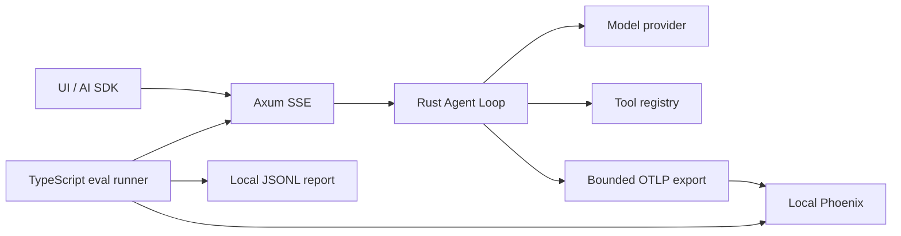

# Design

## Context

动机见 `proposal.md`。现有 `crates/agent` 的 `run_agent` 已输出步骤、文本和工具事件；`llm.rs` 只保留流结束时的内容，尚未启用 usage capture。`crates/server/stream.rs` 使用容量 128 的事件队列和后台任务，断连分支直接返回，因此仅包装 HTTP handler 无法覆盖实际 SSE 生命周期。现有协议验证脚本固定 `ai@7.0.127`，可以复用其官方解析方式。

本变更跨核心库、服务生命周期、部署和独立评测工具，需要单独设计。进行中的前端变更不作为依赖，也不修改其文件。当前 Docker CLI/Compose 已安装，但容器引擎须系统重启后验证。

## Goals / Non-Goals

**Goals:** 核心库只创建观测数据，服务入口负责 exporter；保持现有 `run_agent` 参数、结果和 SSE parts 兼容；关闭观测时仍可运行；默认不采集原始内容。评测与交互路径使用相同 Agent 实现。

**Non-Goals:** 首版不提供自动内容重放、跨断线恢复、线上用户反馈 UI、价格表维护或基础设施 metrics 服务。Phoenix span 指标与实验报告足够支撑当前诊断，后续容量监控另行设计。

## Decisions

### 1. 固定本地 Phoenix 部署

新增 `compose.phoenix.yaml`，使用 `arizephoenix/phoenix:20.19.0`，记录已核实的镜像 digest `sha256:d240d8d4e364ee3483ed2de41ec12b760cc90bb0d4c6e2f190388772aba6fe1f`，提交时再次验证拉取。只映射 `127.0.0.1:6006:6006`，使用 SQLite 与 named volume，`PHOENIX_WORKING_DIR=/mnt/data`。设置 `PHOENIX_TELEMETRY_ENABLED=false`、`PHOENIX_ALLOW_EXTERNAL_RESOURCES=false`；不开放未使用的 gRPC 4317。文档包含 `up -d`、`down`、日志和备份/删除卷说明。

选择 SQLite 是因为当前单人本地开发足够；PostgreSQL 留待共享部署。默认无认证仅适用于回环绑定，共享网络部署需要另行加入认证。关闭 Phoenix 外部资源不会阻止用户主动配置的远程模型请求。

### 2. 标准 OTLP 与直接 OpenInference 属性

新增 `crates/telemetry`，提供 span 属性、内容策略、终态记录和初始化辅助；agent 使用轻量 span helper，server/main 持有 provider 和 shutdown guard。依赖采用相互兼容的 OpenTelemetry 0.33 / tracing-opentelemetry 0.34 系列，workspace 管理并由锁文件固定；OTLP HTTP/protobuf 导出到 `http://localhost:6006/v1/traces`。

配置建议：`OTEL_ENABLED=false`、`OTEL_EXPORTER_OTLP_TRACES_ENDPOINT`、`OTEL_SERVICE_NAME=comfy-agent-server`、`PHOENIX_PROJECT_NAME=comfy-agent-local`、`OBS_CAPTURE_CONTENT=false`、`OBS_CONTENT_MAX_BYTES=16384`。非法配置启动时明确报错；合法配置下 exporter 网络故障采用 best effort。导出使用有界 batch queue、有限超时，不逐请求 flush。

直接写入 `openinference.span.kind`、`llm.model_name`、`llm.token_count.*`、`tool.name`、`session.id` 等官方语义；自定义字段统一 `agent.*`。Rust 暂无官方 OpenInference 自动插桩，首版不引入社区包装。备选仅使用通用 GenAI 属性依赖 Phoenix 转换，兼容性更隐式，因此不采用。

### 3. 完整异步执行树与关联

每次通过输入验证的聊天生成独立 UUID `run_id`；客户端 `id` 映射 `session.id`，仅作关联而非存储会话。HTTP span 接收合法 `traceparent`/`tracestate`，忽略任意 baggage；其下创建 AGENT span，步骤为 CHAIN，模型为 LLM，工具为 TOOL。每 token 仅更新计时/文本累积，不创建 span。

span 属性保存 run ID、步骤索引、模型/工具标识、已完成步数和工具调用次数。工具名选择 TOOL，call ID 用于关联；原始参数/结果受内容策略控制。服务任务显式携带 `.instrument(...)` 和父上下文；不得在跨 `await` 生命周期持有 `.enter()` guard。

finish metadata 增加 camelCase `runId`、观测开启时的 `traceId`。保持现有 `outcome`/`steps` 和错误 SSE 行为。CORS 允许 `traceparent`、`tracestate` 及受限评测项目 header；不信任 UIMessage metadata 作为服务端观测配置。

评测 runner 使用 `runExperiment` 当前 task 的活动 trace context 构造 HTTP headers，并验证与 Rust trace 的实际关联。`X-Agent-Run-Source: eval` 只能选择预配置 `comfy-agent-evals` 项目，缺省使用交互项目；拒绝未知值，避免任意项目注入。它是本地关联提示，不是权限凭据，未来公开服务需另加认证。两个项目名通过服务配置固定。

实施验证补充：Phoenix 20.19 返回服务生成的 `Experiment-*` 项目，但 trace 的项目由首次到达的 span 决定。快速 mock 的 task span 先到，真实慢模型的 Rust span 则可能先进入固定 eval 项目；后到的 span 合并到既有 trace。runner 查询实验项目与服务固定 eval 项目两处，保存实际 traceProject 并验证 task/Rust parent ID，不强制改名。两种项目均与交互项目分离，满足规格中的统计隔离；已有完整实验支持只重新查询并生成 verified 报告，不重复模型调用。

### 4. 终态 guard 覆盖取消和错误

后台任务拥有执行 guard，只有一个终态提交入口。模型正常返回、步数耗尽、模型失败、消费者关闭、服务关闭和队列溢出分别记录独立 outcome；Drop 兜底为 `internal-error`，显式取消原因先提交后丢弃 Agent future。并发触发多个完成条件时，只保留实际选中的终态。

工具失败标记工具 span error，但若 Agent 恢复成功，根 span 为成功；步数耗尽标记独立 outcome 与非正常任务完成。取消与 shutdown 标为中断，避免混入模型故障率。禁止导出原始提供商错误 body，错误分类和安全简述进入轨迹，详细诊断须同样避免凭据。

spawned task 持有 span 至执行终结，不能在 handler 返回响应时结束。服务关闭先取消活动请求，待任务结束，再在有限时间（默认 5 秒）内 flush/shutdown provider。导出故障和 span 丢弃记录在本地日志，最终 trace 持久化不作强保证。备选仅在 success/error 分支手动结束 span 会漏掉 disconnect 和 future drop，故使用 guard。

### 5. 保留模型统计，区分指标语义

`llm.rs` 启用 `with_capture_usage(true)`，内部模型响应保留 captured content、usage、stop reason，无需改变公共 AgentOutcome/AgentEvent。每次 LLM span 写入 provider 返回的 prompt/completion/total，以及可选 cache/reasoning 明细；root 的统计使用明确的 `agent.*` 聚合字段，不复用 token 属性造成重复统计。任一调用 usage 缺失时，记录完整性状态和已知小计，不宣称完整总量。

`agent.request_ttft_ms` 从已接受请求至首个面向用户 TextDelta；LLM 的首文本延迟从该模型调用开始计算。纯工具调用或提前取消的首文本值不存在。记录 request/model/tool duration 与完成步骤数；实验汇总 p50/p95、工具错误率、终态分布和可用 token 统计。Coding Plan 订阅不等于按 token 付费，首版不产生美元成本指标。

### 6. 默认 metadata-only 内容策略

核心库不读取 `.env`；server/main 从进程环境创建策略。关闭内容采集时，不导出原始提示、历史、回答、工具参数或结果；长度、schema 标识和安全错误类别仍可记录。开启后统一处理所有 span 的 input/output：结构化敏感字段脱敏、常见凭据模式屏蔽、UTF-8 安全截断并记录原字节数/截断标志，不采集 HTTP auth headers 和二进制/base64。

自由文本脱敏无法保证覆盖所有敏感信息，因此默认关闭；合成评测需要全文时显式启用，并使用无真实隐私的 fixtures。截断 trace 不作为完整 replay 来源。备选无条件采集便于调试但不满足当前数据边界。

### 7. 独立 TypeScript 评测包

新增 `scripts/evals`（Node >=22），固定 `ai@7.0.127` 与已核实的 `@arizeai/phoenix-client@7.16.0`，提交 lockfile。通过官方 DefaultChatTransport/readUIMessageStream 读取真实后端，使用 Phoenix 数据集和 `runExperiment` 发布实验；不用 Phoenix UI playground 替代 Rust 工具循环。

fixtures 使用稳定 ID 的 JSONL，保存 UI messages、预期工具/参数/结果、答案匹配规则、最大步骤及可选多轮 follow-ups。先提供 20–30 个加法领域用例，覆盖无需工具、必须工具、参数边界、溢出恢复、多轮历史；不存在工具、无限重复、模型中途失败和取消由 mock model 可靠触发，作为技术测试而非依赖真实模型随机触发。

默认 3 trials、并发 2、单 trial 60 秒、最多 100 个聊天请求（多轮每轮计数）；可显式覆盖且记录配置。请求超时 AbortController 取消；预算不足的 trial 显式跳过。每个 trial 独立 chat ID，并持有一条对应实验 task 父 trace；多轮子请求均链接到该 task。

确定性 scorer 输出 pass/fail/not-applicable 与 reason，覆盖答案正确性、工具选择/参数/结果、步骤约束；结构解析失败、错误 SSE、网络错误和超时保存独立 execution status，不丢弃用例。质量报告同时展示条件分数和含执行失败的任务成功率，避免幸存样本偏差。

数据集 fixture 哈希作为版本标识；每次实验保存 Git SHA/dirty 状态、模型配置、system prompt hash、tool schema hash、grader 版本和 trial 配置。后端 schema/prompt 指纹由统一代码路径计算，启动日志或安全配置清单可供 runner读取，禁止手工复制另一套定义。评测输出逐项 JSONL 与 JSON/Markdown 汇总至 gitignored 目录；上传失败保留本地报告并返回明确非零状态。只在版本兼容时比较 baseline，否则说明不可比较。真实模型命令显式 opt-in，初始报告变化而不臆定通过率阈值。

## Risks / Trade-offs

- [系统重启前 Docker 不可用] → 代码/mock 检查可先执行，Phoenix 真正收 trace 和实验的验收需引擎通过检查；不可写成已通过。
- [SDK 实验上下文与 exporter 生命周期接口差异] → 固定版本，先做一条 mock SSE 到 Phoenix 的端到端关联验证，再扩展用例；检查后端 trace 和实验 task 的真实 parent/link。
- [best-effort 导出丢失] → 有界队列、本地故障诊断和 eval 本地报告；不把“已结束 span”表述为“已持久化”。
- [隐私内容及 provider error 泄漏] → 默认关闭内容、统一安全处理、专门敏感字段/截断测试；不承诺通用文本脱敏绝对可靠。
- [模型质量及 token 可见性不稳定] → 重复 trials、显示失败/缺失分母，模拟测试独立于真实模型；不把未知用量计为零。
- [前端变更同时进行] → 只追加 metadata/CORS，不修改 frontend 文件或其 OpenSpec artifacts；继续跑官方协议兼容测试。

## Migration Plan

1. 添加部署与可关闭的观测模块，默认不开启导出，现有用户无需迁移。
2. 接入核心 spans、统计及服务器终态管理，mock 验证后打开本地 exporter。
3. 重启并启动 Docker 引擎/Compose，验证普通聊天、工具、取消轨迹，再验证 eval 实验关联。
4. 导入初始 fixtures 并运行 mock 与可选真实模型基线；文档记录版本和实测结果。
5. 回滚可关闭 `OTEL_ENABLED`，停止 Phoenix 并保留数据卷。代码回退不需要清除历史 trace 或数据集。

## Research References

- [Phoenix 20.19.0 release](https://github.com/Arize-ai/phoenix/releases/tag/arize-phoenix-v20.19.0)；[Docker 部署](https://arize.com/docs/phoenix/self-hosting/deployment-options/docker)。
- [固定版本配置定义](https://github.com/Arize-ai/phoenix/blob/arize-phoenix-v20.19.0/src/phoenix/config.py)；[OpenInference 语义](https://github.com/Arize-ai/openinference/blob/main/spec/semantic_conventions.md)。
- [TypeScript 数据集与实验](https://arize.com/docs/phoenix/get-started/ts-get-started-datasets-and-experiments)；[trace 指标](https://arize.com/docs/phoenix/tracing/llm-traces/metrics)。
